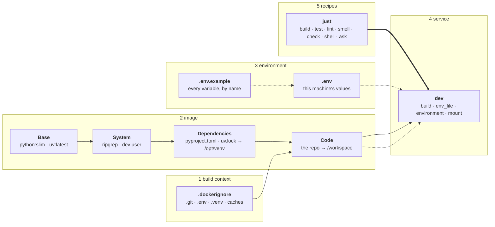

# Docker Infra TCA

Whenever you change infrastructure, always ask these three questions:

1. Remove every command. Do the base, the lockfile and the declared inputs alone still say what runs? If what remains is a script, nothing is declared.
2. Which stage, service or recipe is named for a step of the build? Each is a script inhabiting a name, and the thing it builds has no name. Rename it for the thing, or delete it.
3. Does every input have exactly one source, and is nothing known at build time that belongs to run time? If not, the environment is wrong. Move the input to its layer; do not patch around it.

Every line you write sits in one of these layers, and builds only on the layers above it; a line you cannot place in a layer is a script.

```text
Base
↓
System
↓
Dependencies
↓
Code
↓
Configuration
↓
Entry
```

The base and every tool are named by a moving tag for the newest release; nothing is pinned by version or digest. Dependencies come only from the lockfile, installed with `uv sync --frozen` in a layer of their own, before the code is copied. Code is copied into the image and mounted over it in development, at the same path; the environment the dependencies live in sits outside the mounted code. The container runs as the host's user, never as root. Nothing known only at run time is in the image: no secret and no deployment setting. Configuration enters only from the environment, through the service's `env_file`, and every variable it may hold is named in `.env.example`. The build context holds only what the image needs. Every action is exactly one recipe, each one command run in the service; there is no other way in.

## A whole environment



Every box is a declaration in the page its group names.
A solid arrow is a layer: the head is built on the tail.
A dotted arrow is given at run time: the head receives the tail when the container starts.
A thick arrow is a recipe: it runs one command in the head.

## Its files, in dependency order

```text
1  .dockerignore    build-context.md
2  Dockerfile       image.md
3  .env.example     environment.md
4  compose.yaml     service.md
5  justfile         recipe.md
```

A file depends only on the files above it. Its constructs are on the pages beside it.
