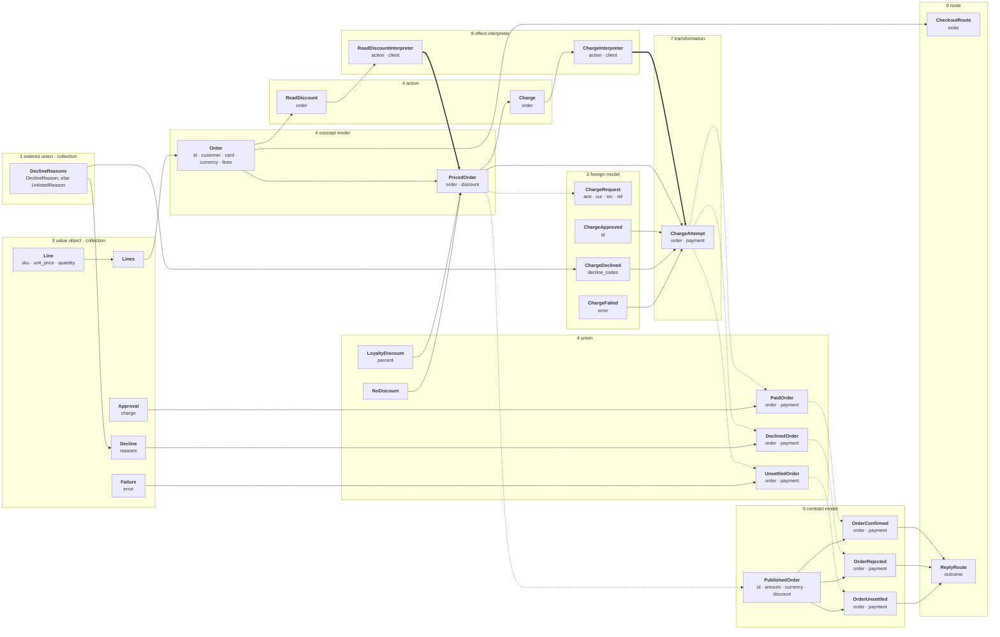

# Python Dev TCA

## A whole program



Every box is a class in the page its group names.
A solid arrow is a field: the head holds the tail.
A dotted arrow is construction by shared names: the head is constructed from the tail.
A thick arrow is an effect: the interpreter's `execute` returns the head.
A step you are about to write is a class you have not named.
What differs between the variants of a union is one derivation, under one name, on each variant.
The text at every edge of this program is in [program.md](program.md).

## Its files, in the order they are written

```text
 1  domain/<context>/type.py               semantic-scalar.md  ordered-union.md  collection.md
 2  integration/<system>/model.py          foreign-model.md
 3  domain/<context>/value.py              value-object.md  collection.md
 4  domain/<context>/<concept>.py          union.md  concept-model.md  action.md
 5  domain/<context>/api.py                contract-model.md
 6  config.py                              config.md
 7  integration/<system>/<meaning>.py      transformation.md
 8  integration/<system>/interpreter.py    effect-interpreter.md
 9  api/<context>.py                       route.md
10  main.py                                composition-root.md
```

A file imports only files written before it. The page beside a file is read immediately before that file is written.
