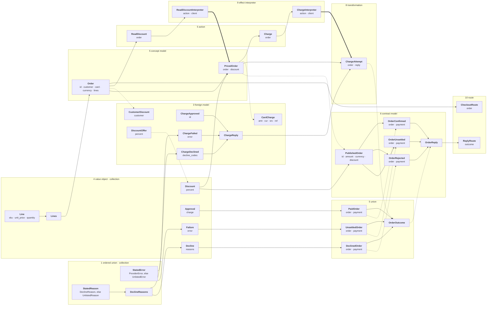

# Python Dev TCA

Whenever you do development, always ask these three questions:

1. Remove every body. Do the types alone still specify the domain? If what remains is a pipeline, there is no model.
2. Which types are named for a stage of the run? Each is workflow inhabiting a class, and the domain thing under it has no type. Delete it.
3. Are the inhabitants of the types in bijection with the states of the domain? If not, the model is wrong. Remodel from the domain; do not patch the type.

Every type you write sits on one of these levels, and its fields hold only types from the levels above it; a type you cannot place by its fields is procedure.

```text
Scalar
↓
Value
↓
Thing
↓
Alternative
↓
Crossing
```

Every class you write is a `BaseModel`, a `RootModel` or a `StrEnum`. Every field is typed as one of your own classes, a union of them, or a tuple of them; a primitive appears only as the root of a `RootModel`. There is no `dict`, `list`, `set`, `Any`, `None` or `Optional` anywhere: not in a field, a root, an argument or an expression. The only functions are one `interpret` on each interpreter and the callback in `main.py`, each a single returned expression, and the reading and writing of a format in `parser/`; anything else a class knows is a property with a single returned expression. An interpreter also holds its client, and config is a `BaseSettings`; nothing else is held that is not one of your classes. Construction is the only operation: a step you are about to write is a class you have not named.

What arrives is a dictionary or JSON and constructs a model by `model_validate` or `model_validate_json`; what leaves is `model_dump` or `model_dump_json`.
A format that is neither is read by a maintained library that yields a dictionary or JSON, and is then the line above.
Only a format no library yields a dictionary or JSON from is read by a format type in `parser/`, and nothing outside `parser/` reads a format.

## A whole program



Every box is a class in the page its group names.
A solid arrow is a field: the head holds the tail.
A dotted arrow is construction by shared names: the head is constructed from the tail.
A thick arrow is an effect: the interpreter's `interpret` returns the head.
What differs between the variants of a union is one derivation, under one name, on each variant.

## Its files, in dependency order

```text
 1  domain/<context>/type.py               semantic-scalar.md  ordered-union.md  collection.md
 2  parser/<format>.py                     parser.md
 3  integration/<system>/model.py          foreign-model.md
 4  domain/<context>/value.py              value-object.md  collection.md
 5  domain/<context>/<concept>.py          union.md  concept-model.md  action.md
 6  domain/<context>/api.py                contract-model.md
 7  config.py                              config.md
 8  integration/<system>/<meaning>.py      transformation.md
 9  integration/<system>/interpreter.py    effect-interpreter.md
10  api/<context>.py                       route.md
11  main.py                                composition-root.md
```

A file imports only the files above it. Its constructs are on the pages beside it.
