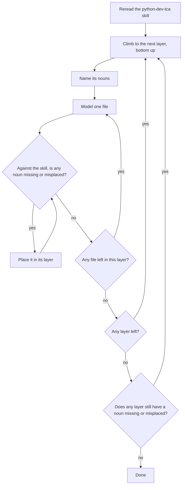

# AGENTS.md

This repository develops and documents Type Construction Architecture. It holds no application code.

You MUST use the python-dev-tca skill to make every decision. You are FORBIDDEN from deciding by your own reasoning.

You are FORBIDDEN from returning any decision to me unless that decision is paired with an explicit explanation of why the skill does not provide the context, the information, or the answer for it.

Before reporting any Python build complete, run the `smell-check` skill; a nonzero exit is not complete.

## The loop

You are modeling a domain, not building a program: the nouns you name are the whole system.

1. Reread the `python-dev-tca` skill.
2. Climb the layers bottom up: Scalar, Value, Thing, Alternative, Crossing.
3. At each layer, name its nouns.
4. Model one file at a time.
5. After each file, ask, against the skill, which noun is missing or misplaced.
6. Place it in its layer, then ask again, even after filling a gap.
7. Stop only when no layer has a noun missing or misplaced.

