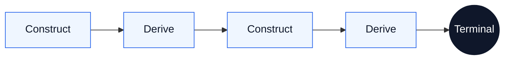

# Type Construction Architecture

**Pydantic is a programming language. Python is its runtime.**

A Pydantic model is not a schema. It is a machine with a four-layer construction pipeline that fires every time data enters it. If the object exists, every constraint declared in its type was satisfied. If construction fails, no object exists. There is no third outcome.

Pydantic-as-compute gives you the structural power of algebraic type systems — discriminated unions, product types, newtypes, total construction, compositional reasoning — expressed in Python's vocabulary instead of FP notation. The rigor is the same. The notation is natural language and type annotations, not a symbolic calculus. Any developer can read it. Any neural consumer that works in language can participate in it.

Type Construction Architecture is the discipline of writing programs in these construction semantics. Define the types. Compose proven models as fields. Let projections derive further truth. Let declared dispatch, staged lifting, and `model_validate` execute the graph. Construction is proof. Derivation extends proof. The program is the construction graph — not the procedural glue around it.

---

## Why TCA Exists

Most software hides the program in a service layer. Raw data arrives, service code interprets it, helper functions map it, branching code classifies it, and passive domain objects carry the results. TCA inverts that arrangement. The program moves into the domain types, and the surrounding layers thin out.

What disappears when the program moves into the types:

| Conventional artifact | Why it disappears |
|:---|:---|
| Mapper classes, DTO converters, and adapter layers | Foreign schema mirroring and foreign-to-domain lifting turn translation into staged construction |
| `if/elif` chains that classify inputs | Declared dispatch routes structurally during construction |
| Service methods that compute from model fields | Composition and projection let models own and derive semantics directly |
| Intermediate dictionaries and uncertain states | Frozen construction replaces partial translation artifacts with proven objects |

The domain types are not passive. They carry the construction logic. They own classification, derivation, and boundary translation. Services shrink to almost nothing because the models already did the work. The app interior is railroaded by constructed certainty.

---

## The Mental Model

**Construction is proof.** A `model_validate` call fires the full pipeline: translation, interception, coercion, integrity. If the object comes back, it satisfies every constraint its type declares. No separate validation step.

**Frozen snapshots.** Every TCA model is frozen. It captures one instant — the state of the world at construction time, proven and sealed. A frozen model never goes stale because it never claims to be current.

**Derivation belongs on the machine.** If a computation depends only on a model's own proven fields, it belongs on that model as a projection — `@computed_field`, `@cached_property`, or `@property`.

**Construction drives further construction.** A projection that calls `model_validate` extends the proof graph. This construction-derivation loop is the evaluation model of a TCA program:

The loop is lazy, deterministic, and compositional.

**Procedure has a proper place.** Some boundaries resist pure construction — live transport edges, positional data structures, and untyped external surfaces. At those boundaries, a small piece of procedure catches the junk and normalizes it into owned truth. These seams must be irreducible, contained, and terminal. See **[`docs/irreducible-seams.md`](docs/irreducible-seams.md)**.

---

## Evidence-Based Development Scaffold

This repository includes a Claude Code scaffold that constrains AI-assisted development to a closed evidence vocabulary. Instead of instructing the model to "think in TCA," the scaffold defines concrete structural shapes that are always wrong, shapes that are allowed per gate, and shapes that are disallowed — then enforces them through hooks on every prompt, edit, and stop.

### Hooks

Five hooks form a pipeline from prompt to completion:

| Hook | When | Type | What it does |
|:---|:---|:---|:---|
| `UserPromptSubmit` | Every prompt | Command | Loads the 11 fast-fail invariants and program layer structure into context |
| `PreToolUse` | Before each edit | Prompt | Pattern-matches the proposed edit against 11 structural invariants. DENY or PASS |
| `PostToolUse` | After each edit | Agent (Sonnet) | Adjudicates the edit against three gate rubrics. PASS, FAIL, or ESCALATE |
| `Stop` | Before stopping | Prompt | Checks whether the response recommended any disallowed shapes |
| `SubagentStop` | Before subagent stops | Prompt | Same check for delegated work |

### Gate Rubrics

Three gates evaluate every edit against independent dimensions. Each gate has a single question, a list of allowed evidence shapes, disallowed evidence shapes, approved mechanisms (legitimate exceptions), and escalation triggers (genuine ambiguities). The full rubric is in [`.claude/rules/gate-rubrics.md`](.claude/rules/gate-rubrics.md).

| Gate | Question |
|:---|:---|
| **Type Integrity** | Is every type well-formed — scalars own values, models are frozen, unions are discriminated, constraints are declarative? |
| **Construction Carries Meaning** | Does model construction, composition, and derivation do the work — not services, adapters, or coordinator scripts? |
| **Program Shape** | Does code live where it belongs — domain types in domain, services are thin transport shims, types flow domain toward edge? |

### Path-Scoped Rules

Six rule files inject layer-specific constraints when editing files at that layer:

| Rule | Scoped to | What it defines |
|:---|:---|:---|
| [`domain-type.md`](.claude/rules/domain-type.md) | `**/domain/**/type.py` | Scalar shape, import constraints |
| [`domain-value.md`](.claude/rules/domain-value.md) | `**/domain/**/value.py` | Value object shape, import constraints |
| [`domain.md`](.claude/rules/domain.md) | `**/domain/**` | Frozen models, derivation, naming |
| [`api.md`](.claude/rules/api.md) | `**/api/**` | Route contracts, no computation |
| [`service.md`](.claude/rules/service.md) | `**/service/**` | Transport shim shape |
| [`main.md`](.claude/rules/main.md) | `**/main.py` | Composition root, nothing else |

### Bounded Adjudication

The gates, rubrics, invariants, and hooks were generated by the [bounded adjudication skill](.claude/skills/bounded-adjudication/SKILL.md) — a structured worksheet that walks through six questions: structural invariants, axes of judgment, evidence shapes, approved mechanisms, genuine ambiguities, and authority topology. The completed worksheet is the proof artifact for the scaffold's design decisions.

### Reuse

The scaffold is designed to be portable. To adapt it to another TCA project: copy `CLAUDE.md` and the `.claude/` directory, rewrite the project identity in `CLAUDE.md`, and run the bounded adjudication skill to generate domain-specific evidence shapes. See [`CLAUDE.md`](CLAUDE.md) for the full adaptation protocol.

---

## What's In This Repo

### Start Here

- **[`docs/manifesto.md`](docs/manifesto.md)**: Why TCA exists, what we believe, what we reject
- **[`docs/overview.md`](docs/overview.md)**: Front door to the specification — thesis, evaluation model, navigation

### Core Theory

- **[`docs/program-architecture.md`](docs/program-architecture.md)**: Where the program lives — the application shape
- **[`docs/construction-machine.md`](docs/construction-machine.md)**: The four-layer pipeline, projection surface, and trust conditions
- **[`docs/roots-and-proof-obligations.md`](docs/roots-and-proof-obligations.md)**: What constitutes a root, how to find proof obligations
- **[`docs/principles.md`](docs/principles.md)**: Governing rules — structural discipline, ownership, naming
- **[`docs/irreducible-seams.md`](docs/irreducible-seams.md)**: Where procedure belongs — the governing test for seams
- **[`docs/semantic-index-types.md`](docs/semantic-index-types.md)**: When the compilation target reads natural language
- **[`docs/failure-modes.md`](docs/failure-modes.md)**: Catalog of TCA failures — every error is a design error

### Patterns, Topology, and Example

- **[`docs/build-patterns.md`](docs/build-patterns.md)**: 13 before/after build patterns in dependency order — the moves an architect reaches for
- **[`docs/program-topology.md`](docs/program-topology.md)**: Where each file belongs in a TCA program — the dependency graph and file roles
- **[`docs/mechanisms.md`](docs/mechanisms.md)**: Core mechanisms — wiring, dispatch, and orchestration beneath the pattern language
- **[`docs/building-block-classifier.md`](docs/building-block-classifier.md)**: Advanced worked example showing mechanisms and seams in a dense recursive program
- **[`tca/building_block.py`](tca/building_block.py)**: The classifier implementation — a recursive Pydantic type tree walker that demonstrates many core patterns

### Development Scaffold

- **[`CLAUDE.md`](CLAUDE.md)**: Always-on Claude charter for TCA projects
- **[`.claude/settings.json`](.claude/settings.json)**: Hooks configuration — five hooks forming the enforcement pipeline
- **[`.claude/rules/`](.claude/rules/)**: Path-scoped rules and gate rubrics
- **[`.claude/skills/bounded-adjudication/`](.claude/skills/bounded-adjudication/)**: The skill that built this scaffold

---

## Read Next

**I want the why.** Start with **[`docs/manifesto.md`](docs/manifesto.md)**.

**I want the theory.** Start with **[`docs/overview.md`](docs/overview.md)** — the front door to the specification.

**I want the build patterns.** Read **[`docs/build-patterns.md`](docs/build-patterns.md)** — 13 before/after pairs showing how construction replaces procedure.

**I want the program topology.** Read **[`docs/program-topology.md`](docs/program-topology.md)** — where each file belongs and why.

**I want the code.** Read **[`tca/building_block.py`](tca/building_block.py)** — one file showing many patterns working together in a recursive type classifier.

**I want the development scaffold.** Read **[`CLAUDE.md`](CLAUDE.md)** for the charter, then **[`.claude/rules/gate-rubrics.md`](.claude/rules/gate-rubrics.md)** for the evidence vocabulary.

**I care about LLM semantics.** Read **[`docs/semantic-index-types.md`](docs/semantic-index-types.md)**, then the companion project **[Semantic Index Types](https://github.com/kylejtobin/sit)**.

---

## Requirements

- Python 3.12+
- Pydantic 2.12+

## License

[MIT](LICENSE)
