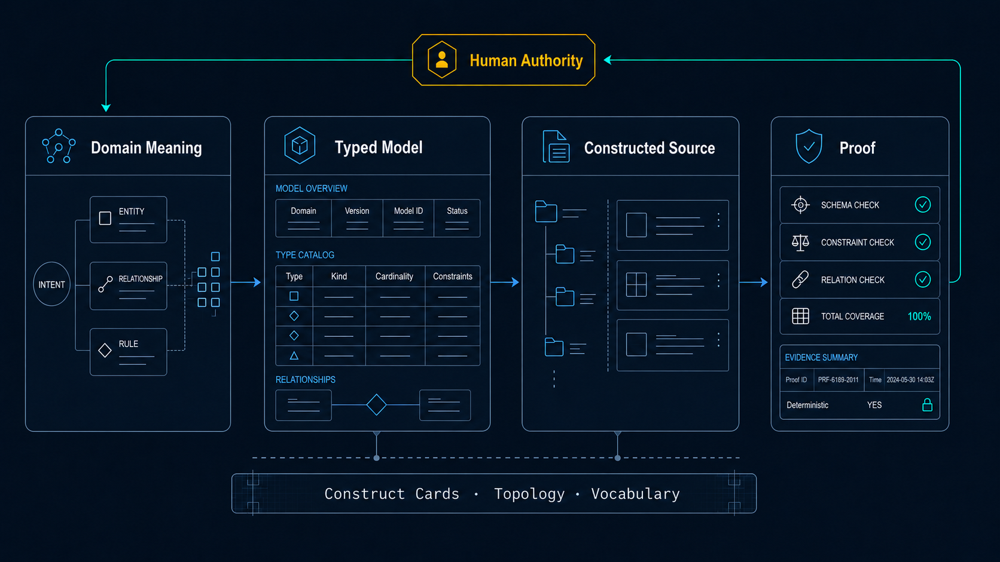

<h1 align="center">Type Construction Architecture</h1>

<strong>Your software's meaning lives in its types. Construction is its proof. Every meaning has one structural home. Every structure carries one meaning. Fifteen constructs. No sixteenth.</strong>

---

For decades, the best engineers argued that meaning belongs in the types:

> Model the domain, make illegal states impossible to construct, and let a value's existence prove its own correctness instead of bolting validation on after the fact.

They were right. That didn't matter. Because project management runs on one rule it rarely says out loud:

> We separate the cost of finishing the first task from the lifetime cost of what we build.

Make the first task look 75% faster, move the real cost into every month that follows, and call that delivery. That is what imperative procedural code inside a poorly typed architecture really is: not speed, but cost displacement. A loan drawn on day one and repaid for the life of the system in bug-interest toil.

AI changes that math. Radically.

Not by making the shortcut safe. By taking away the shortcut's only advantage.

The deferred-cost path had one thing to sell: visible first-day movement. It let the team arrive at "done" before the system had to prove anything. But now an LLM can read your field names, your variants, and your type structure en masse. It can help you name the domain, shape the cases, close the gaps, and build the modeled design at speed.

So the bad trade loses its cover story.

The disciplined path now gets the early movement the shortcut used to sell, without inheriting the hidden tax the shortcut always carried. You get the fast start and the durable architecture. The path they called slow and expensive becomes the one that ships cleanly, changes safely, and ages cheaply.

That is the smaller half of it.

The larger half is that a type is an instruction.

The same declaration that proves your code correct to the compiler now tells a model what is allowed to exist, and what is not. One structure carries two jobs at once:

- The constraint that stops a generator from inventing
- The context that tells it what you meant

Your types are no longer just implementation detail. They become the shared language between the compiler, the AI, and the next engineer who has to live inside the system.

That changes the center of gravity. Design, code, and documentation stop drifting apart as separate copies of intent. The domain model becomes the place intent lives. The compiler enforces it. The AI reads it. The engineer extends it.

The rigor that used to be good taste is now the thing that makes AI-built software worth trusting.

---

## The Test

Every meaning has exactly one structural home, and every structure carries exactly one meaning. That correspondence is the whole of TCA, applied continuously as a test.

It is one-to-one, so it fails in exactly four ways:

- **Escaped.** A meaning with no structure: it lives in a comment, a procedure, or a convention the type does not carry.
- **Duplicated.** A meaning with more than one structure: a second copy kept in agreement by hand.
- **Vacuous.** A structure with no meaning: a type minted to save repetition, a name that says nothing real.
- **Fused.** A structure with more than one meaning: several domain axes in one field, so the type tells none of them cleanly.

There is no fifth. Every forbidden pattern is one of these four, and every approved structure holds one meaning, once, proven by construction. The full statement is [`wiki/doctrine/definition.md`](wiki/doctrine/definition.md).

---

## Fifteen Shapes, No Sixteenth

You build your whole domain from fifteen constructs. Each carries one meaning and rejects the shapes that bury it: the bare primitive, the `if/elif` ladder, the mapper, the stray helper.

Each construct has one page: definition, required form, sorting rules, the forms it replaces, and what it forbids. Every example shares one domain, venue fills, positions, and orders, and is correct to copy verbatim. The set is [`wiki/constructs/`](wiki/constructs/index.md).

---

## Two Readers, Two Documents

The doctrine is written twice, once for each reader, and the two are kept in agreement.

**For people:** [`wiki/`](wiki/index.md), an [Open Knowledge Format](https://github.com/GoogleCloudPlatform/open-knowledge-format) bundle. One concept per page, an index at every level, plain markdown that renders where it sits.

| Directory | Question it answers |
|-----------|---------------------|
| [`doctrine/`](wiki/doctrine/index.md) | What the test is, and why it binds now |
| [`constructs/`](wiki/constructs/index.md) | What the fifteen legal shapes are |
| [`topology/`](wiki/topology/index.md) | Where each shape lives, and which way dependencies flow |
| [`practice/`](wiki/practice/index.md) | How to design from a proof obligation and read a construction graph |

**For the agent:** the `python-development` skill under [`.agents/skills/`](.agents/skills/python-development/SKILL.md). It loads when a model is about to write Python and holds the same test, the same fifteen constructs, and the required form of each. [`AGENTS.md`](AGENTS.md) is the one-line law that binds an agent to it.

---

## Almost None of This Is New, and That Is the Point

It is the good half of typed functional programming, domain-driven design, and a few older schools, pulled together and made to hold under one test. Two camps spent decades saying the domain's structure should come first. They were right, and ignored, because the systems that ran the work never read what they wrote. A model reads it now, and the gap they were marginalized for is the gap that costs you on every run. The schools, and what TCA keeps and refuses from each, are in [`wiki/doctrine/definition.md`](wiki/doctrine/definition.md#lineage).

---

## Start Here

- **The whole idea**, the one rule and the four ways it breaks: [`wiki/doctrine/definition.md`](wiki/doctrine/definition.md)
- **Why the domain belongs in the running code now**: [`wiki/doctrine/programs-are-ontologies.md`](wiki/doctrine/programs-are-ontologies.md)
- **How the wiki fits together, and what to read first**: [`wiki/practice/learning-path.md`](wiki/practice/learning-path.md)
- **The fifteen constructs**: [`wiki/constructs/`](wiki/constructs/index.md)
