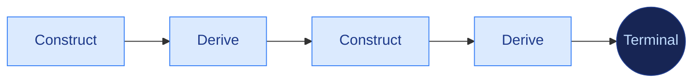

# Type Construction Architecture

[](https://www.python.org/downloads/)
[](https://docs.pydantic.dev/)
[](LICENSE)
[](https://github.com/DetachHead/basedpyright)

**Pydantic is a programming language. Python is its runtime.**

A Pydantic model is not a schema. It is a machine with a four-layer construction pipeline that fires every time data enters it. If the object exists, every constraint declared in its type was satisfied. If construction fails, no object exists. There is no third outcome.

Pydantic-as-compute gives you the structural power of algebraic type systems — discriminated unions, product types, newtypes, total construction, compositional reasoning — expressed in Python's vocabulary instead of FP notation. The rigor is the same. The notation is natural language and type annotations, not a symbolic calculus. Any developer can read it. Any neural consumer that works in language can participate in it.

Type Construction Architecture is the discipline of writing programs in these construction semantics. Define the types. Compose proven models as fields. Let projections derive further truth. Let declared dispatch, staged lifting, and `model_validate` execute the graph. Construction is proof. Derivation extends proof. The program is the construction graph — not the procedural glue around it.

---

## Why TCA Exists

Most software hides the program in a service layer. Raw data arrives, service code interprets it, helper functions map it, branching code classifies it, and passive domain objects carry the results. TCA inverts that arrangement. The program moves into the domain types, and the surrounding layers thin out.

What disappears when the program moves into the types:

| Conventional artifact | Why it disappears |
|:---|:---|
| Mapper classes, DTO converters, and adapter layers | Foreign schema mirroring and foreign-to-domain lifting turn translation into staged construction |
| `if/elif` chains that classify inputs | Declared dispatch routes structurally during construction |
| Service methods that compute from model fields | Composition and projection let models own and derive semantics directly |
| Intermediate dictionaries and uncertain states | Frozen construction replaces partial translation artifacts with proven objects |

The domain types are not passive. They carry the construction logic. They own classification, derivation, and boundary translation. Services shrink to almost nothing because the models already did the work. The app interior is railroaded by constructed certainty.

---

## The Mental Model

**Construction is proof.** A `model_validate` call fires the full pipeline: translation, interception, coercion, integrity. If the object comes back, it satisfies every constraint its type declares. No separate validation step.

**Frozen snapshots.** Every TCA model is frozen. It captures one instant — the state of the world at construction time, proven and sealed. A frozen model never goes stale because it never claims to be current.

**Derivation belongs on the machine.** If a computation depends only on a model's own proven fields, it belongs on that model as a projection — `@computed_field`, `@cached_property`, or `@property`.

**Construction drives further construction.** A projection that calls `model_validate` extends the proof graph. This construction-derivation loop is the evaluation model of a TCA program:



The loop is lazy, deterministic, and compositional.

**Procedure has a proper place.** Some boundaries resist pure construction — live transport edges, positional data structures, and untyped external surfaces. At those boundaries, a small piece of procedure catches the junk and normalizes it into owned truth. These seams must be irreducible, contained, and terminal. See **[`docs/irreducible-seams.md`](docs/irreducible-seams.md)**.

---

## Construction Across Processes

Inside a process, the construct→derive loop is the program. A composed model's `@cached_property` constructs the next proven object. But the loop doesn't stop at the process boundary.

A domain event is a frozen model. It is a proven fact about something that happened, sealed at construction time. When a service publishes that event onto an event bus, it is transmitting a proven object. When another service receives those bytes and calls `model_validate_json`, the same guarantee fires — construction succeeds and the consumer holds a proven fact, or construction fails and they know. The proof transfers.

This means TCA and event-driven architecture are the same idea at different scales. Inside a process, construction produces facts and derivation produces further facts. Across processes, services produce facts and other services consume and construct from them. The construct→derive loop becomes the event graph. The transport — whatever it is — makes the boundary between those scales disappear.

What follows from this:

- **Services don't call each other.** They publish proven events and subscribe to proven events. There is no HTTP contract to version, no REST schema to maintain, no client library to generate. The subject namespace on the bus is the contract.
- **Service mesh becomes pointless.** Istio and Linkerd exist to manage services calling services — retries, circuit breaking, mTLS, traffic shaping. If services don't call each other, there is nothing to mesh.
- **The only REST is at the edge.** External consumers (browsers, mobile) still need an HTTP surface. Internally, the API between services is event subjects carrying typed events.

Without event-driven transport, TCA's construction graph terminates at the process boundary — and you are back to the request/response architecture that TCA's internal design already rejected. The example application in this repo (under `app/`, with `compose.yml`, `justfile`, and a sidecar in `nats/`) realizes this pattern with NATS JetStream; the paradigm does not prescribe a specific transport.

---

## Program Topology

A TCA program has gravitational structure. The densest layer — the scalars — sits at the bottom. Everything above composes from below. Nothing below depends on what is above.

```bash
├── main.py                  # composition root
├── config.py                # typed settings
├── api/
│   └── catalog.py           # route: imports contracts from domain
├── service/
│   └── catalog.py           # transport shim: binds transport to active model
└── domain/
    └── catalog/
        ├── type.py          # scalars: dependency root, imports nothing
        ├── value.py         # value objects: composes scalars
        ├── product.py       # frozen model: a proven domain concept
        ├── catalog.py       # active model: single convergence point
        └── api.py           # contracts: domain-owned boundary types
```

Each layer sees only downward. Every file in `domain/` is named for a domain concept — never for a technology pattern, never for a dumping ground. Open the domain directory and read the domain. The file listing is the vocabulary.

See **[`docs/program-topology.md`](docs/program-topology.md)** for file roles, cross-context composition rules, and the full dependency graph.

---

## Making LLMs Write TCA

LLMs fail at TCA by default. Their training data is overwhelmingly procedural Python — services, mappers, dict-builders, if/elif routers. Ask an LLM to write TCA code and it will articulate the principles perfectly in conversation, then generate the opposite in code. It writes validators instead of narrowed types. Services instead of model derivations. Mapper classes instead of `model_validate`. It reaches for the most common pattern from training, not the correct architectural shape.

This repository includes a [Claude Code](https://claude.ai/code) scaffold that solves this problem. Instead of instructing the model to "think in TCA" (which doesn't survive contact with code generation), the scaffold enforces TCA structurally — blocking wrong shapes before they're written and loading correct shapes before generation starts.

### The Problem: Training Gravity

An LLM asked to build a composed model will default to six `model_validator` methods, then rationalize each one as "cross-field." It does this because validators are the obvious Pydantic tool in training data. It won't consider narrowed scalar types with `Field(gt=2.0)` that carry the proof structurally — because that pattern barely exists in its training corpus.

The same applies everywhere TCA diverges from typical Python:

| What you ask for | What the LLM generates | What TCA requires |
|:---|:---|:---|
| Domain logic | Service class with methods | Frozen model with `@cached_property` derivations |
| Gate checking | `model_validator` on one field | Narrowed scalar with `Field()` — type IS proof |
| Data transformation | Mapper class between models | `model_validate(source, from_attributes=True)` |
| Input classification | if/elif chain on a string | Discriminated union with `Field(discriminator=...)` |
| Shared computation | `utils.py` helper functions | `@computed_field` on the owning model |

Instructions alone don't fix this. The LLM reads the instruction, agrees, and then writes procedural code anyway — because the instruction occupies one paragraph of context while training data occupies billions of tokens. The fix has to be structural.

### The Solution: Three Layers of Constraint

**Layer 1 — Deterministic enforcement.** An [AST-based Python script](.claude/scripts/smell.py) runs as a *post-edit* hook on every file write — after the file is on disk, where the full source can be parsed (decorator stacks, method bodies, derivation internals aren't visible in a partial Edit diff). It walks the AST via `match`/`case` dispatch — Python's `ast` module is a sum type, and pattern matching is the right dispatch primitive for it. It mechanically detects known-wrong patterns: `json.loads()` + `model_validate`, `@computed_field` + `@property`, private methods in domain models, technology-named files in `domain/`, import direction violations, `try/except` on frozen models, void `-> None` methods, `@staticmethod`/`@classmethod` on models, multi-value `Literal[string]` (use StrEnum), 3+ parallel tuple fields, mutables inside `@cached_property`/`@computed_field`. No LLM judgment. AST match. Exit 2 blocks. The agent gets stderr feedback naming the exact invariant, class, method, and line that failed.

**Layer 2 — LLM enforcement.** A prompt hook fires before each edit; an agent hook fires after. They adjudicate against three [gate rubrics](.claude/rules/gate-rubrics.md) — Type Integrity, Construction Carries Meaning, and Program Shape. The pre-edit prompt fast-fails on structural patterns visible in the diff (filenames, bare-primitive field types, dict params, mapper/adapter class names). The post-edit agent (Sonnet) reads the rubrics and classifies the full file against allowed/disallowed evidence shapes. The two LLM hooks bracket the deterministic check: structural patterns up front, body-level structure deferred to grep, semantic gating last.

**Layer 3 — Intervention skills.** Three skills fire *before* code is written, preventing the wrong design from forming:

| Skill | What it prevents | When it fires |
|:---|:---|:---|
| [`/proof-design`](.claude/skills/proof-design/SKILL.md) | Reaching for validators before considering narrowed types | Before writing any model that proves invariants |
| [`/shape-match`](.claude/skills/shape-match/SKILL.md) | Generating procedural Python instead of the correct TCA shape | Before writing any domain file |
| [`/construction-voice`](.claude/skills/construction-voice/SKILL.md) | Procedural language infecting docs and plans, producing procedural code | Before writing any instruction or plan |

The layers work in concert. The skills prevent wrong designs. The deterministic hook catches mechanical violations instantly. The LLM hooks catch everything else. Nothing ships without passing all three.

### What the Pipeline Looks Like

```
User prompt
  → Agent works, attempts an edit
    → PreToolUse prompt: LLM fast-fails on structural patterns visible in the diff
    → [edit executes if pre-edit passes]
    → PostToolUse smell.py: deterministic AST match on the full file (instant, no LLM)
    → PostToolUse agent: Sonnet adjudicates against three gate rubrics
```

The pre-edit LLM catches what's visible in the diff. The post-edit script catches body-level structure the LLM can't reliably infer from a partial edit. The post-edit agent does final gate adjudication on the full file. Three layers, each catching what the others can't.

### Gate Rubrics

Three gates evaluate every edit against independent questions. Each gate has allowed evidence, disallowed evidence, approved mechanisms (legitimate exceptions), and escalation triggers. The full rubric is in [`.claude/rules/gate-rubrics.md`](.claude/rules/gate-rubrics.md).

| Gate | Question |
|:---|:---|
| **Type Integrity** | Is every type well-formed — scalars own values, models are frozen, unions are discriminated, constraints are declarative? |
| **Construction Carries Meaning** | Does model construction, composition, and derivation do the work — not services, adapters, or coordinator scripts? |
| **Program Shape** | Does code live where it belongs — domain types in domain, services are thin transport shims, types flow domain toward edge? |

### Path-Scoped Rules

Six [rule files](.claude/rules/) inject layer-specific constraints when editing files at that layer — what each file IS, what it CONTAINS, what it MUST NOT contain. Rules exist for `type.py`, `value.py`, `domain/`, `api/`, `service/`, and `main.py`.

### Building Your Own Scaffold

The entire scaffold — gates, rubrics, invariants, hooks, and skills — was generated by the [`/bounded-adjudication`](.claude/skills/bounded-adjudication/SKILL.md) skill. It walks through a structured worksheet: structural invariants, axes of judgment, evidence shapes, approved mechanisms, genuine ambiguities, and authority topology. The worksheet is the proof artifact for the scaffold's design decisions.

To adapt this scaffold to another project: copy `CLAUDE.md` and the `.claude/` directory, rewrite the project identity, and run `/bounded-adjudication` to generate domain-specific evidence shapes. See [`CLAUDE.md`](CLAUDE.md) for the full protocol.

---

## What's In This Repo

### Theory

- **[`docs/manifesto.md`](docs/manifesto.md)**: Why TCA exists, what we believe, what we reject, and the intellectual lineage
- **[`docs/pydantic-machinery.md`](docs/pydantic-machinery.md)**: How each Pydantic mechanism is load-bearing — the engine under the paradigm
- **[`docs/roots-and-proof-obligations.md`](docs/roots-and-proof-obligations.md)**: What constitutes a root, how to find proof obligations
- **[`docs/irreducible-seams.md`](docs/irreducible-seams.md)**: Where procedure belongs — the governing test for seams
- **[`docs/semantic-index-types.md`](docs/semantic-index-types.md)**: When the compilation target reads natural language

### Patterns, Topology, and Example

- **[`docs/build-patterns.md`](docs/build-patterns.md)**: 13 before/after build patterns in dependency order — the moves an architect reaches for
- **[`docs/program-topology.md`](docs/program-topology.md)**: Where each file belongs in a TCA program — the dependency graph and file roles
- **[`docs/building-block-classifier.md`](docs/building-block-classifier.md)**: Advanced worked example showing construction, dispatch, and seams in a dense recursive program
- **[`tca/building_block.py`](tca/building_block.py)**: The classifier implementation — a recursive Pydantic type tree walker

### Development Scaffold

- **[`CLAUDE.md`](CLAUDE.md)**: Cognitive mode instructions — proof hierarchy, failure modes, wrong/right examples
- **[`.claude/scripts/smell.py`](.claude/scripts/smell.py)**: Deterministic post-edit enforcement — AST-based, no LLM, instant, unforgeable, runs on the full file after write
- **[`.claude/settings.json`](.claude/settings.json)**: Hook pipeline — pre-edit LLM fast-fail, post-edit deterministic script, post-edit LLM gate adjudication
- **[`.claude/rules/`](.claude/rules/)**: Path-scoped rules and gate rubrics
- **[`.claude/skills/proof-design/`](.claude/skills/proof-design/)**: Forces invariant classification through proof hierarchy before writing models
- **[`.claude/skills/shape-match/`](.claude/skills/shape-match/)**: Loads correct TCA shape before generation to counteract training gravity
- **[`.claude/skills/construction-voice/`](.claude/skills/construction-voice/)**: Rewrites procedural language into structural declarations
- **[`.claude/skills/bounded-adjudication/`](.claude/skills/bounded-adjudication/)**: The skill that generates the scaffold from a structured worksheet

---

## Read Next

**I want the why.** Start with **[`docs/manifesto.md`](docs/manifesto.md)**.

**I want to understand the Pydantic engine.** Read **[`docs/pydantic-machinery.md`](docs/pydantic-machinery.md)** — how each mechanism is load-bearing, not a convenience wrapper.

**I want the build patterns.** Read **[`docs/build-patterns.md`](docs/build-patterns.md)** — 13 before/after pairs showing how construction replaces procedure.

**I want the program topology.** Read **[`docs/program-topology.md`](docs/program-topology.md)** — where each file belongs and why.

**I want the code.** Read **[`tca/building_block.py`](tca/building_block.py)** — one file showing many patterns working together in a recursive type classifier.

**I want to constrain an LLM to write TCA.** Read the [Making LLMs Write TCA](#making-llms-write-tca) section above, then **[`CLAUDE.md`](CLAUDE.md)** for the cognitive mode instructions, then **[`.claude/rules/gate-rubrics.md`](.claude/rules/gate-rubrics.md)** for the evidence vocabulary.

**I care about LLM semantics.** Read **[`docs/semantic-index-types.md`](docs/semantic-index-types.md)**, then the companion project **[Semantic Index Types](https://github.com/kylejtobin/sit)**.

---

## Requirements

- Python 3.12+
- Pydantic 2.12+

## License

[MIT](LICENSE)
