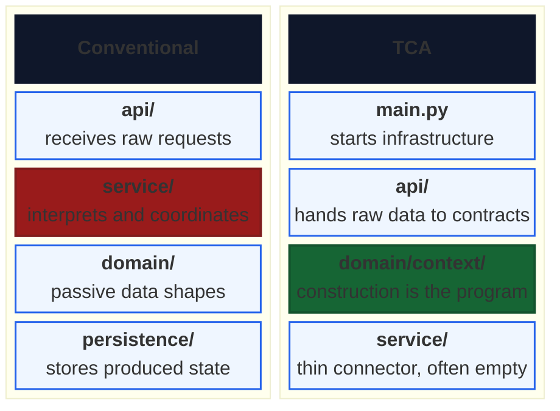
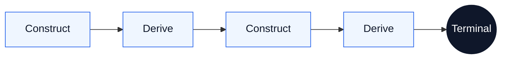
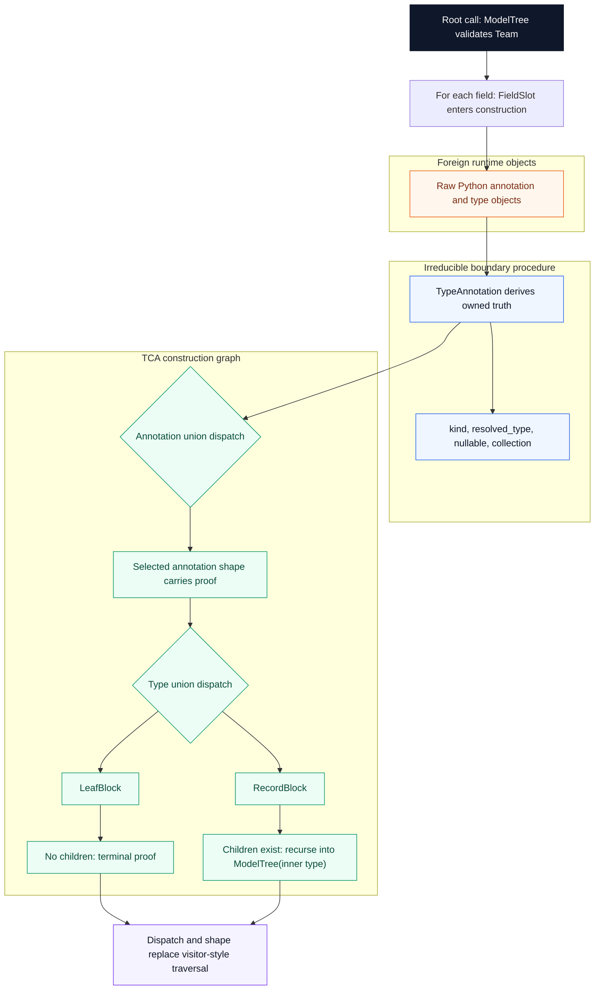

# Type Construction Architecture

[](https://www.python.org/downloads/)
[](https://docs.pydantic.dev/)
[](LICENSE)
[](https://github.com/DetachHead/basedpyright)

**Pydantic is a programming language. Python is its runtime.**

A Pydantic model is not a schema. It is a machine with a four-layer construction pipeline that fires every time data enters it. If the object exists, every constraint declared in its type was satisfied. If construction fails, no object exists. There is no third outcome.

Type Construction Architecture is the discipline of writing programs in these construction semantics. Define the types. Compose proven models as fields. Let projections derive further truth. Let declared dispatch, staged lifting, and `model_validate` execute the graph. Construction is proof. Derivation extends proof. The program is the construction graph — not the procedural glue around it.

---

## Why TCA Exists

Most software hides the program in a service layer. Raw data arrives, service code interprets it, helper functions map it, branching code classifies it, and passive domain objects carry the results. TCA inverts that arrangement.

Read the diagram as two columns. In the conventional column, the program lives in the service layer. In the TCA column, it moves into the domain types, and the surrounding layers thin out.



What disappears when the program moves into the types:

| Conventional artifact | Why it disappears |
|:---|:---|
| Mapper classes, DTO converters, and adapter layers | Foreign schema mirroring and foreign-to-domain lifting turn translation into staged construction |
| `if/elif` chains that classify inputs | Declared dispatch routes structurally during construction |
| Service methods that compute from model fields | Composition and projection let models own and derive semantics directly |
| Intermediate dictionaries and uncertain states | Frozen construction replaces partial translation artifacts with proven objects |

The domain types are not passive. They carry the construction logic. They own classification, derivation, and boundary translation. Services shrink to almost nothing because the models already did the work. The app interior is railroaded by constructed certainty.

---

## The Mental Model

**Construction is proof.** A `model_validate` call fires the full pipeline: translation, interception, coercion, integrity. If the object comes back, it satisfies every constraint its type declares. No separate validation step. No "invalid but present" state.

**Frozen snapshots.** Every TCA model is frozen. It captures one instant — the state of the world at construction time, proven and sealed. A frozen model never goes stale because it never claims to be current. It claims to be correct as of the moment it was built.

**Derivation belongs on the machine.** If a computation depends only on a model's own proven fields, it belongs on that model as a projection — `@computed_field`, `@cached_property`, or `@property`. If calling code computes an intrinsic derivation externally, that is a projection defect.

**Construction drives further construction.** A projection that calls `model_validate` extends the proof graph. This construction-derivation loop is the evaluation model of a TCA program:



The loop is lazy (projections fire on first access), deterministic (frozen models guarantee evaluation-order independence), and compositional (each model's proof is independent of how it was demanded).

**Procedure has a proper place.** Some boundaries resist pure construction — live transport edges, positional data structures, and untyped external surfaces. At those boundaries, a small piece of procedure catches the junk, normalizes it into owned truth, or stages it into a foreign model that can then be lifted into domain semantics. The discipline is that these seams must be irreducible, contained, and terminal — they bridge into the graph, never spread through it. See **[`docs/irreducible-seams.md`](docs/irreducible-seams.md)**.

---

## If You Are Thinking In Workflows

Many architects arrive here while trying to solve a hard operational problem: multiple systems, uncertain outcomes, ordering constraints, retries, checkpointing, human-in-the-loop review, or third-party APIs that can fail halfway through a journey. The default reaction is to reach for an orchestrator, controller, saga coordinator, workflow engine, or queue topology and make that the semantic center of the design.

TCA does not deny that those operational concerns are real. It denies that they should be where the program lives.

The first move is not "how do I coordinate this procedure?" The first move is "what are the representable states, foreign contracts, and owned domain truths in this world?" Unknown outcome does not mean unknown structure. A classifier may emit one case or many. A third-party call may succeed, fail, or pend. A human may approve, reject, or request correction. Those are still cases. Those are still states. Those are still modellable.

Once that world is modeled, the architecture changes shape:

- Foreign systems get explicit boundary models.
- Owned semantics get explicit domain models.
- Known cases become declared unions, enums, and composed states.
- Irreducible effects shrink to seams that trigger or resume construction.

What disappears is the need for a giant semantic controller that "keeps track of what everything means." The type system becomes the semantic layer. The construction graph becomes the workflow's meaning. Active infrastructure may still exist, but it becomes transport, persistence, triggering, or checkpoint support around the graph, not the place where the program's truth is improvised.

If your first instinct is to design the bus, the orchestrator, or the controller, pause and model the world first. In TCA, you do not begin by coordinating uncertainty. You begin by constraining reality into representable states, then let construction carry as much of the journey as it can.

---

## How To Build In TCA

These patterns describe how construction computes, but more importantly they describe how to actually build in TCA. They are not a closed taxonomy. They are the moves an architect actually needs to reach for, in dependency order: name the domain vocabulary, let fields prove themselves at construction, own the foreign schema, absorb transport wrappers on that same boundary, hand live input to it, lift into domain truth, build richer semantic worlds, let other models read declared surfaces, derive intrinsic facts, route structurally, and finally render a terminal result from owned proof.

To keep the build path legible, the examples below all use the same world: a stock exchange feed entering a trading domain.

### Name The Domain Scalars First

First, own the domain values themselves before any larger model starts using them.

**🚫 Bad Procedural Pattern**

```python
class TradeRecord(BaseModel, frozen=True):
    trade_id: str
    symbol: str
    price: Decimal
    quantity: int
    venue: str
```

**Why it is bad:** The model has field names, but the values are still flat unowned primitives, so the domain is only half modeled.

**✅ TCA Pattern**

```python
class Symbol(RootModel[str], frozen=True):
    root: str

class Price(RootModel[Decimal], frozen=True):
    root: Decimal

class Quantity(RootModel[int], frozen=True):
    root: int

class DomainTrade(BaseModel, frozen=True, from_attributes=True):
    symbol: Symbol
    price: Price
    quantity: Quantity
```

This is correct because the domain vocabulary exists as owned scalar types before larger models start composing with it, and the first composed model closes the contrast pair completely. The same scalar move is what later legitimizes `VenueName`, `Spread`, `BasketName`, and the closed vocabulary `HaltReason`.

### Let Fields Declare Their Own Constraints

Once the domain fields exist, let their declarations carry as much proof as possible before you reach for procedure.

**🚫 Bad Procedural Pattern**

```python
class TradePayloadNormalizer:
    def normalize(self, raw_trade: dict[str, object]) -> dict[str, object]:
        normalized_trade: dict[str, object] = {}

        symbol = str(raw_trade["symbol"]).strip().upper()
        if not symbol:
            raise ValueError("symbol is required")
        normalized_trade["symbol"] = symbol

        price = Decimal(str(raw_trade["price"]))
        if price <= 0:
            raise ValueError("price must be positive")
        normalized_trade["price"] = price

        quantity = int(raw_trade["quantity"])
        if quantity <= 0:
            raise ValueError("quantity must be positive")
        normalized_trade["quantity"] = quantity

        return normalized_trade
```

**Why it is bad:** Field-level proof has escaped into a procedural normalizer layer, so every new field becomes more parser code, more staging dicts, and more hand-written cleanup before the model gets to own its own boundary.

**✅ TCA Pattern**

```python
class Symbol(RootModel[str], frozen=True):
    root: str = Field(min_length=1, pattern=r"^[A-Z]+$")

class Price(RootModel[Decimal], frozen=True):
    root: Decimal = Field(gt=0)

class Quantity(RootModel[int], frozen=True):
    root: int = Field(gt=0)

class DomainTrade(BaseModel, frozen=True, from_attributes=True):
    symbol: Symbol
    price: Price
    quantity: Quantity
```

This is correct because the constraints now live directly on the fields that own them, and Pydantic enforces them at construction without forcing the program to grow a separate normalizer service. Reach for validators later only when the proof cannot be expressed declaratively on the field itself.

### Mirror The Foreign Schema

Next, own the foreign payload shape declaratively at the boundary instead of translating it procedurally.

**🚫 Bad Procedural Pattern**

```python
class NasdaqTradeAdapter:
    def translate_trade_message(
        self, payload: dict[str, object]
    ) -> dict[str, object]:
        symbol = str(payload["sym"]).strip().upper()
        price = Decimal(str(payload["px"]))
        quantity = int(payload["qty"])

        translated_payload: dict[str, object] = {}
        translated_payload["symbol"] = symbol
        translated_payload["price"] = price
        translated_payload["quantity"] = quantity
        return translated_payload
```

**Why it is bad:** The foreign field translation is now trapped in a procedural adapter layer that rebuilds an unowned payload shape by hand.

**✅ TCA Pattern**

```python
class NasdaqTradeWire(BaseModel, frozen=True, populate_by_name=True):
    symbol: Symbol = Field(alias="sym")
    price: Price = Field(alias="px")
    quantity: Quantity = Field(alias="qty")

# Same move, different exchange schema.
class NyseTradeWire(BaseModel, frozen=True, populate_by_name=True):
    symbol: Symbol = Field(alias="ticker")
    price: Price = Field(alias="last")
    quantity: Quantity = Field(alias="size")
```

This is correct because the seam models foreign truth faithfully while the rest of the program keeps speaking owned domain language. This is still foreign ownership, not domain truth yet.

### Normalize The Payload

After mirroring the foreign schema, absorb any outer transport wrapper on that same boundary model.

**🚫 Bad Procedural Pattern**

```python
class NasdaqFeedRouter:
    def route_trade(self, message: dict[str, object]) -> None:
        payload = message["payload"]
        self._trade_service.handle_trade(payload)

    def route_correction(self, message: dict[str, object]) -> None:
        payload = message["payload"]
        self._correction_service.handle_trade_correction(payload)
```

**Why it is bad:** The wrapper-removal logic now leaks into procedural handlers, so the seam stops being terminal and the outer transport shape keeps spreading.

**✅ TCA Pattern**

```python
class NasdaqTradeWire(BaseModel, frozen=True, populate_by_name=True):
    # Same boundary model as above, now grown to absorb the wrapper too.
    symbol: Symbol = Field(alias="sym")
    price: Price = Field(alias="px")
    quantity: Quantity = Field(alias="qty")

    @model_validator(mode="before")
    @classmethod
    def unwrap_payload(cls, data: dict[str, object]) -> dict[str, object]:
        return data["payload"] if "payload" in data else data
```

This is correct because the same boundary model now absorbs the outer wrapper once instead of forcing procedural code to peel it open over and over.

### Capture Live Input

Once that boundary model is ready, keep the live seam thin: catch raw transport input and hand it off immediately.

**🚫 Bad Procedural Pattern**

```python
async for raw_message in nasdaq_socket:
    envelope = json.loads(raw_message)
    payload = envelope["payload"]

    if payload["event_type"] != "trade":
        continue

    trade = {
        "symbol": payload["sym"],
        "price": Decimal(payload["px"]),
        "quantity": int(payload["qty"]),
    }
    trade_store.publish(trade)
```

**Why it is bad:** The socket loop now owns parsing, wrapper access, field extraction, and business meaning instead of handing raw transport reality off immediately.

**✅ TCA Pattern**

```python
async for raw_message in nasdaq_socket:
    trade = NasdaqTradeWire.model_validate_json(raw_message)
    yield trade
```

This is correct because the live edge does one job only: catch unstable input and hand it straight to the boundary model that already knows how to absorb the wrapper and own the payload. The socket loop is now just an intake edge.

### Lift Into Domain Truth

Once the foreign object is proven, cross directly into owned domain truth by construction.

**🚫 Bad Procedural Pattern**

```python
class TradeTranslator:
    def __init__(self, symbol_formatter) -> None:
        self._symbol_formatter = symbol_formatter

    def to_domain_trade(self, exchange_trade: NasdaqTradeWire) -> DomainTrade:
        translated_payload: dict[str, object] = {}
        translated_payload["symbol"] = self._symbol_formatter.format(
            exchange_trade.symbol
        )
        translated_payload["price"] = exchange_trade.price
        translated_payload["quantity"] = exchange_trade.quantity
        return DomainTrade(**translated_payload)
```

**Why it is bad:** The foreign-to-domain crossing is now trapped in a procedural translation step that manually rebuilds domain values one field at a time.

**✅ TCA Pattern**

```python
exchange_trade = NasdaqTradeWire.model_validate_json(raw_message)
domain_trade = DomainTrade.model_validate(exchange_trade)
```

This is correct because the foreign object is already proven, and because the foreign model already exposes domain names, the crossing into owned semantics stays declarative and becomes another construction step instead of a mapper layer. This is the first point where owned domain truth begins.

### Compose Proven Models

Now construct a richer semantic world by owning already-proven models as fields.

**🚫 Bad Procedural Pattern**

```python
class SpreadService:
    def build_context(
        self,
        nasdaq_trade: DomainTrade,
        nyse_trade: DomainTrade,
        nasdaq_quote: VenueQuote,
        nyse_quote: VenueQuote,
    ) -> dict[str, object]:
        context_payload: dict[str, object] = {}
        context_payload["nasdaq_trade"] = nasdaq_trade
        context_payload["nyse_trade"] = nyse_trade
        context_payload["nasdaq_quote"] = nasdaq_quote
        context_payload["nyse_quote"] = nyse_quote
        context_payload["alert_threshold"] = Decimal("0.50")
        return context_payload
```

**Why it is bad:** The semantic world gets rebuilt procedurally on demand instead of existing as one owned proven object.

**✅ TCA Pattern**

```python
class VenueQuote(BaseModel, frozen=True):
    venue: VenueName
    symbol: Symbol
    bid: Price
    ask: Price

class CrossVenueContext(BaseModel, frozen=True):
    nasdaq_trade: DomainTrade
    nyse_trade: DomainTrade
    nasdaq_quote: VenueQuote
    nyse_quote: VenueQuote
```

This is correct because the richer semantic world now exists as one proven object instead of a temporary coordination payload. `VenueQuote` is introduced here in its final shape, and `CrossVenueContext` is the first actual semantic world in the story.

### Read Another Model's Surface

Once a model exposes a declared surface, let downstream construction read it directly instead of rebuilding it.

**🚫 Bad Procedural Pattern**

```python
class QuoteSummaryDTO(BaseModel, frozen=True):
    venue: VenueName
    symbol: Symbol
    best_bid: Price
    best_ask: Price

class QuoteSummaryMapper:
    def from_quote(self, quote: VenueQuote) -> QuoteSummaryDTO:
        return QuoteSummaryDTO(
            venue=quote.venue,
            symbol=quote.symbol,
            best_bid=quote.bid,
            best_ask=quote.ask,
        )
```

**Why it is bad:** The mapping layer duplicates a surface that already exists, so the program pays procedural cost to restate what one model was already declaring.

**✅ TCA Pattern**

```python
class QuoteSummary(BaseModel, frozen=True, from_attributes=True):
    venue: VenueName
    symbol: Symbol
    best_bid: Price = Field(alias="bid")
    best_ask: Price = Field(alias="ask")

summary = QuoteSummary.model_validate(quote)
```

This is correct because the next model reads the declared surface that already exists instead of forcing the program to rebuild it procedurally. This is borrowed truth, not newly derived truth.

### Derive On The Model

Once a model owns enough proven structure, extend that same model with a named intrinsic fact that belongs to it.

**🚫 Bad Procedural Pattern**

```python
class SpreadAlertService:
    def maybe_publish(self, context: CrossVenueContext) -> None:
        edge = context.nyse_quote.bid - context.nasdaq_quote.ask

        if edge > Decimal("0.50"):
            self._publisher.publish(
                {
                    "symbol": context.nasdaq_quote.symbol,
                    "edge": edge,
                }
            )
```

**Why it is bad:** The derivation is not owned at all. It is just inline arithmetic at the call site, so the program keeps rediscovering intrinsic truth instead of naming and owning it.

**✅ TCA Pattern**

```python
class CrossVenueContext(BaseModel, frozen=True):
    nasdaq_trade: DomainTrade
    nyse_trade: DomainTrade
    nasdaq_quote: VenueQuote
    nyse_quote: VenueQuote

    @property
    def cross_venue_edge(self) -> Spread:
        return Spread(self.nyse_quote.bid - self.nasdaq_quote.ask)
```

This is correct because the same `CrossVenueContext` now owns the intrinsic fact that can be derived from the fields it already proved.

### Declare Cases Instead Of Branching

Once the domain world exists, let type selection replace branch-based control flow.

**🚫 Bad Procedural Pattern**

```python
class ExchangeEventRouter:
    def route(self, raw_event: dict[str, object]) -> None:
        if raw_event["event_type"] == "trade":
            event = {
                "event_type": "trade",
                "symbol": raw_event["symbol"],
                "price": raw_event["price"],
                "quantity": raw_event["quantity"],
            }
            self._trade_handler.handle(event)
        elif raw_event["event_type"] == "halt":
            event = {
                "event_type": "halt",
                "symbol": raw_event["symbol"],
                "reason": raw_event["reason"],
            }
            self._halt_handler.handle(event)
        else:
            event = {
                "event_type": "auction",
                "symbol": raw_event["symbol"],
                "auction_price": raw_event["auction_price"],
            }
            self._auction_handler.handle(event)
```

**Why it is bad:** The procedure is doing dispatch that structure already knows how to do, so the case logic lives in branch code instead of in the types that own the cases.

**✅ TCA Pattern**

```python
class TradeEvent(BaseModel, frozen=True):
    event_type: Literal["trade"] = "trade"
    symbol: Symbol
    price: Price
    quantity: Quantity

class HaltEvent(BaseModel, frozen=True):
    event_type: Literal["halt"] = "halt"
    symbol: Symbol
    reason: HaltReason

class AuctionEvent(BaseModel, frozen=True):
    event_type: Literal["auction"] = "auction"
    symbol: Symbol
    auction_price: Price

ExchangeEvent = Annotated[
    TradeEvent | HaltEvent | AuctionEvent,
    Field(discriminator="event_type"),
]

event = TypeAdapter(ExchangeEvent).validate_python(raw_event)
```

This is correct because the cases are declared once as types, and construction selects the right one structurally. Construction is now the switch statement.

### Unfold Composite Inputs

Some declared cases are complete immediately, while others continue construction because their own shape still contains more of the same world.

**🚫 Bad Procedural Pattern**

```python
class InstructionBuilder:
    def build(self, raw: dict[str, object]) -> object:
        if raw["kind"] == "basket":
            built_orders = []
            for child in raw["orders"]:
                built_orders.append(self.build(child))
            return {
                "kind": "basket",
                "name": raw["name"],
                "orders": built_orders,
            }

        return {
            "kind": "market",
            "symbol": raw["symbol"],
            "quantity": int(raw["quantity"]),
        }
```

**Why it is bad:** Traversal code is now deciding the program's shape procedurally instead of letting the selected variant declare whether construction stops or continues.

**✅ TCA Pattern**

```python
class MarketOrder(BaseModel, frozen=True):
    kind: Literal["market"] = "market"
    symbol: Symbol
    quantity: Quantity

class BasketOrder(BaseModel, frozen=True):
    kind: Literal["basket"] = "basket"
    name: BasketName
    orders: tuple["TradeInstruction", ...]

TradeInstruction = Annotated[
    MarketOrder | BasketOrder,
    Field(discriminator="kind"),
]

class TradingSession(BaseModel, frozen=True):
    instructions: tuple[TradeInstruction, ...]
```

This is correct because the selected variant's shape determines whether construction is complete now or must continue into children. This is declared dispatch plus recursive continuation by shape.

### Let One Construction Trigger The Next

Once the seam and domain path are stable, introduce a dedicated root object whose job is to let one proven result trigger the next.

**🚫 Bad Procedural Pattern**

```python
class TicketWorkflowService:
    def __init__(self, parser, normalizer, translator, ticket_factory) -> None:
        self._parser = parser
        self._normalizer = normalizer
        self._translator = translator
        self._ticket_factory = ticket_factory

    def build_ticket(self, raw_message: str) -> TradeTicket:
        parsed_message = self._parser.parse(raw_message)
        normalized_payload = self._normalizer.normalize(parsed_message)
        domain_trade = self._translator.to_domain_trade(normalized_payload)
        return self._ticket_factory.create(domain_trade)
```

**Why it is bad:** The coordinator now owns the semantic path of the program, so construction becomes a script instead of a graph that extends itself through proven objects.

**✅ TCA Pattern**

```python
class TradeTicket(BaseModel, frozen=True, from_attributes=True):
    symbol: Symbol
    price: Price
    quantity: Quantity

class CapturedNasdaqTrade(BaseModel, frozen=True):
    raw_message: str

    @cached_property
    def foreign_trade(self) -> NasdaqTradeWire:
        return NasdaqTradeWire.model_validate_json(self.raw_message)

    @cached_property
    def domain_trade(self) -> DomainTrade:
        return DomainTrade.model_validate(self.foreign_trade)

    @cached_property
    def ticket(self) -> TradeTicket:
        return TradeTicket.model_validate(self.domain_trade)
```

This is correct because each proven result becomes the natural source for the next construction, and the path lives on the model instead of in a coordinator script. The new root type is justified here because the lesson is orchestration-by-construction.

### Render The Final Shape

Finally, let the terminal human-facing or machine-facing surface emerge from owned truth.

**🚫 Bad Procedural Pattern**

```python
class OpportunityPresenter:
    def render(self, context: CrossVenueContext) -> str:
        parts: list[str] = []
        parts.append(f"buy venue={context.nasdaq_quote.venue}")
        parts.append(f"buy ask={context.nasdaq_quote.ask}")
        parts.append(f"sell venue={context.nyse_quote.venue}")
        parts.append(f"sell bid={context.nyse_quote.bid}")
        parts.append(f"edge={context.nyse_quote.bid - context.nasdaq_quote.ask}")
        return " | ".join(parts)
```

**Why it is bad:** The output layer is rebuilding truth it does not own, so the final artifact is no longer emerging directly from the proof source.

**✅ TCA Pattern**

```python
class SpreadOpportunity(BaseModel, frozen=True, from_attributes=True):
    buy_from: VenueQuote = Field(alias="nasdaq_quote")
    sell_to: VenueQuote = Field(alias="nyse_quote")
    edge: Spread = Field(alias="cross_venue_edge")

    @computed_field
    @cached_property
    def line(self) -> str:
        return (
            f"Buy on {self.buy_from.venue} at {self.buy_from.ask}; "
            f"sell on {self.sell_to.venue} at {self.sell_to.bid}; "
            f"edge={self.edge}"
        )

opportunity = SpreadOpportunity.model_validate(context)
```

This is correct because the terminal artifact now emerges directly from the semantic world already established above instead of being reconstructed in a presenter layer. The program is now emitting its final surface.

---

## What This Looks Like In Practice

One `model_validate` at the root. The entire classification cascades through construction:

```python
tree = ModelTree.model_validate(Team)
print(TreeReport.model_validate(tree))
```

What fires inside that single call:

Read top to bottom through three zones: foreign runtime objects enter, boundary procedure normalizes them into owned truth, then the construction graph dispatches and recurses.



No `if` chains. No visitor pattern. No traversal function. Two discriminated unions fire during construction — one classifies the annotation form, one classifies the type itself. The variant's `Literal` fields carry the answer. Dispatch replaces computation.

**[`tca/building_block.py`](tca/building_block.py)** is the full implementation: a recursive Pydantic type classifier that demonstrates many of the core mechanisms and broader construction patterns, works on any `BaseModel`, and serves as both a teaching resource and a practical tool.

---

## Why This Matters For LLM Systems

When the consumer of a type schema is a language model, something changes. Field names stop being addresses and become instructions. `churn_risk_tier` tells the model to assess voluntary departure risk. `x7` does not. The structural output is the same type. The semantic output diverges completely.

This is not prompt engineering. A prompt gives instruction. A type in a construction system gives instruction, constraint, and proof simultaneously:

| Artifact | Instructs | Constrains | Proves |
|:---|:---:|:---:|:---:|
| Prompt | Yes | No | No |
| Schema text alone | Sometimes | Weakly | No |
| Type in a construction system | Yes | Yes | Yes |

TCA already preserves names, descriptions, and enum members as first-class structural elements. Adding an LLM consumer activates a semantic dimension without architectural change. The same types that structure the construction graph become instructions to the model.

The tighter the type, the less room the name has to matter. The looser the type, the more the name carries. Every TCA principle that tightens the type simultaneously tightens the information bound on the LLM.

LLM output is another foreign boundary where the same seam pattern applies: structured output crosses the boundary, a `model_validate` call normalizes it into proven context, and the construction graph continues.

This phenomenon is formalized as **[Semantic Index Types](https://github.com/kylejtobin/sit)** — a companion research project that defines what happens when the compilation target reads natural language.

---

## What's In This Repo

### Start Here

- **[`docs/manifesto.md`](docs/manifesto.md)**: Why TCA exists, what we believe, what we reject
- **[`docs/overview.md`](docs/overview.md)**: Front door to the specification — thesis, evaluation model, navigation

### Core Theory

- **[`docs/program-architecture.md`](docs/program-architecture.md)**: Where the program lives — the application shape
- **[`docs/construction-machine.md`](docs/construction-machine.md)**: The four-layer pipeline, projection surface, and trust conditions
- **[`docs/roots-and-proof-obligations.md`](docs/roots-and-proof-obligations.md)**: What constitutes a root, how to find proof obligations
- **[`docs/principles.md`](docs/principles.md)**: Governing rules — structural discipline, ownership, naming
- **[`docs/irreducible-seams.md`](docs/irreducible-seams.md)**: Where procedure belongs — the governing test for seams
- **[`docs/semantic-index-types.md`](docs/semantic-index-types.md)**: When the compilation target reads natural language
- **[`docs/failure-modes.md`](docs/failure-modes.md)**: Catalog of TCA failures — every error is a design error

### Patterns And Example

- **[`docs/mechanisms.md`](docs/mechanisms.md)**: Core mechanisms — wiring, dispatch, and orchestration beneath the broader pattern language
- **[`docs/building-block-classifier.md`](docs/building-block-classifier.md)**: Advanced worked example showing those mechanisms and seams in a dense recursive program
- **[`tca/building_block.py`](tca/building_block.py)**: The classifier implementation — one file, heavily annotated

### Reusable Claude Scaffolding

- **[`CLAUDE.md`](CLAUDE.md)**: Reusable always-on Claude charter for TCA projects
- **[`.claude/README.md`](.claude/README.md)**: Reusable Claude architecture for resisting TCA drift during generation

---

## Read Next

**I want the why.** Start with **[`docs/manifesto.md`](docs/manifesto.md)** — what we believe, what we reject, and what we build.

**I want the Claude scaffolding.** Read **[`CLAUDE.md`](CLAUDE.md)** for the charter, then **[`.claude/README.md`](.claude/README.md)** for the reusable anti-drift architecture.

**I want the theory.** Start with **[`docs/overview.md`](docs/overview.md)** — the front door to the specification.

**I want the architecture.** Read **[`docs/program-architecture.md`](docs/program-architecture.md)** — where the program lives and why services disappear.

**I want the code.** Read **[`tca/building_block.py`](tca/building_block.py)** — one file showing many of the patterns in the spec working together.

**I need to know where procedure belongs.** Read **[`docs/irreducible-seams.md`](docs/irreducible-seams.md)** — how to tell a real seam from a modeling failure.

**I care about LLM semantics.** Read **[`docs/semantic-index-types.md`](docs/semantic-index-types.md)** for the TCA implications, then **[Semantic Index Types](https://github.com/kylejtobin/sit)** for the formal treatment.

---

## Requirements

- Python 3.12+
- Pydantic 2.12+

## License

[MIT](LICENSE)
