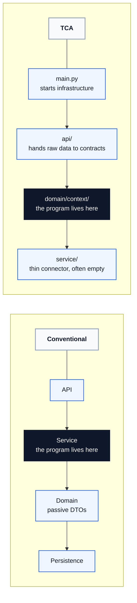
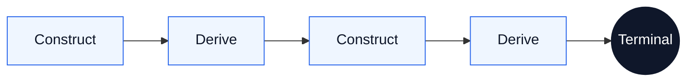
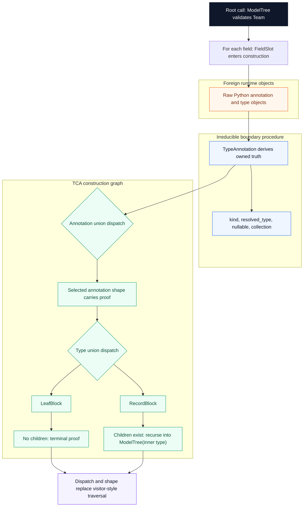

# Type Construction Architecture

[](https://www.python.org/downloads/)
[](https://docs.pydantic.dev/)
[](LICENSE)
[](https://github.com/DetachHead/basedpyright)

**Pydantic is a programming language. Python is its runtime.**

A Pydantic model is not a schema. It is a machine with a four-layer construction pipeline that fires every time data enters it. If the object exists, every constraint declared in its type was satisfied. If construction fails, no object exists. There is no third outcome.

Type Construction Architecture is the discipline of writing programs in these construction semantics. Define the types. Compose proven models as fields. Let projections derive further truth. Let declared dispatch, staged lifting, and `model_validate` execute the graph. Construction is proof. Derivation extends proof. The program is the construction graph — not the procedural glue around it.

---

## Why TCA Exists

Most software hides the program in a service layer. Raw data arrives, service code interprets it, helper functions map it, branching code classifies it, and passive domain objects carry the results. TCA inverts that arrangement.

The question to hold while reading the diagram is simple: **where does the program live?** On the left, it lives in the service layer. On the right, it moves into the domain types, and everything around it gets thinner.



What disappears when the program moves into the types:

| Conventional artifact | Why it disappears |
|:---|:---|
| Mapper classes, DTO converters, and adapter layers | Foreign schema mirroring and foreign-to-domain lifting turn translation into staged construction |
| `if/elif` chains that classify inputs | Declared dispatch routes structurally during construction |
| Service methods that compute from model fields | Composition and projection let models own and derive semantics directly |
| Intermediate dictionaries and uncertain states | Frozen construction replaces partial translation artifacts with proven objects |

The domain types are not passive. They carry the construction logic. They own classification, derivation, and boundary translation. Services shrink to almost nothing because the models already did the work. The app interior is railroaded by constructed certainty.

---

## The Mental Model

**Construction is proof.** A `model_validate` call fires the full pipeline: translation, interception, coercion, integrity. If the object comes back, it satisfies every constraint its type declares. No separate validation step. No "invalid but present" state.

**Frozen snapshots.** Every TCA model is frozen. It captures one instant — the state of the world at construction time, proven and sealed. A frozen model never goes stale because it never claims to be current. It claims to be correct as of the moment it was built.

**Derivation belongs on the machine.** If a computation depends only on a model's own proven fields, it belongs on that model as a projection — `@computed_field`, `@cached_property`, or `@property`. If calling code computes an intrinsic derivation externally, that is a wiring defect.

**Construction drives further construction.** A projection that calls `model_validate` extends the proof graph. This construction-derivation loop is the evaluation model of a TCA program:



The loop is lazy (projections fire on first access), deterministic (frozen models guarantee evaluation-order independence), and compositional (each model's proof is independent of how it was demanded).

**Procedure has a proper place.** Some boundaries resist pure construction — live transport edges, positional data structures, and untyped external surfaces. At those boundaries, a small piece of procedure catches the junk, normalizes it into owned truth, or stages it into a foreign model that can then be lifted into domain semantics. The discipline is that these seams must be irreducible, contained, and terminal — they bridge into the graph, never spread through it. See **[`docs/irreducible-seams.md`](docs/irreducible-seams.md)**.

---

## Construction Patterns

These patterns describe how construction computes. They are not a closed taxonomy, but they are the moves an architect actually needs to see: how foreign input becomes owned truth, how semantic worlds accumulate, how structure routes, how proof extends, and how a finished program realizes output.

### Ingress Capture

Some systems have a live edge that must catch unstable transport reality before construction can own it. Websocket frames, stream chunks, and raw JSON strings belong here. This active seam is not the program. Its job is to catch the junk and hand it to construction as quickly as possible.

```python
async for raw_message in websocket:
    event = ExchangeMessage.model_validate_json(raw_message)
```

### Boundary Normalization

Some boundaries arrive in shapes that cannot be consumed directly by named fields. A small seam converts foreign structure into owned truth, then construction resumes.

```python
@model_validator(mode="before")
@classmethod
def _from_tuple(cls, data: tuple[str, FieldInfo]) -> dict[str, object]:
    return {"field_name": data[0], "annotation": data[1].annotation}
```

### Composition

One model owns other proven models as fields. This is how a program accumulates a larger semantic world without writing coordination code.

```python
class FieldEntry(BaseModel, frozen=True, from_attributes=True):
    field_name: str
    shape: AnnotationShape = Field(alias="annotation")

class ClassifiedNode(FieldEntry, frozen=True, from_attributes=True):
    block_shape: BlockShape = Field(alias="resolved_type")
```

### Projection

Once a model owns proven structure, it can derive further truth from that owned proof. The projection surface is not a formatting trick. It is where models think.

```python
@property
def nullable(self) -> bool:
    return self.shape.nullable

@property
def children(self) -> tuple[ClassifiedNode, ...]:
    return self.block_shape.children
```

### Wiring

`from_attributes=True` lets one model borrow another model's declared surface. Stored fields and properties both count. The surface is the contract.

```python
class TreeReport(BaseModel, frozen=True, from_attributes=True):
    reports: tuple[FieldReport, ...] = Field(alias="fields")
```

### Foreign Schema Mirroring

Sometimes the fastest way to own a foreign boundary is to mirror the foreign surface with a model whose internal field names already match your domain vocabulary, while aliases match the external schema. The foreign model owns both names at once: the exchange's name at the seam and the domain's name in the field surface.

```python
class ExchangeTrade(BaseModel, frozen=True, populate_by_name=True):
    symbol: Symbol = Field(alias="sym")
    price: Price = Field(alias="px")
    quantity: Quantity = Field(alias="qty")
```

### Declared Dispatch

Routing facts are declared structurally, not computed imperatively. Pydantic can dispatch on shared fields, nested discriminators, callable discriminators, or shape-exposing wrappers. In the classifier, annotation form and type kind both route through discriminated unions.

```python
class FieldEntry(BaseModel, frozen=True, from_attributes=True):
    shape: AnnotationShape = Field(alias="annotation")

class ClassifiedNode(FieldEntry, frozen=True, from_attributes=True):
    block_shape: BlockShape = Field(alias="resolved_type")
```

### Recursive Descent

Structure decides whether construction continues deeper. No traversal function asks whether to recurse. The selected variant either has children or it does not.

```python
class ModelTree(BaseModel, frozen=True, from_attributes=True, populate_by_name=True):
    fields: tuple[ClassifiedNode, ...]
```

### Orchestration

Projection becomes orchestration when it triggers further construction. This is the construction-derivation loop made concrete.

```python
@cached_property
def tree(self) -> ModelTree:
    return ModelTree.model_validate(self.model_class)

@cached_property
def report(self) -> TreeReport:
    return TreeReport.model_validate(self.tree)
```

### Terminal Realization

Programs eventually surface their proven structure as text, JSON, reports, or another final artifact. That last rendering step is part of the construction program too.

```python
@computed_field
@cached_property
def text(self) -> str:
    ...
```

---

## Foreign-to-Domain Lifting

Transport capture and foreign mirroring are not the end of the boundary story. Once a foreign model exists, owned semantics can take over by constructing the domain model directly from that proven foreign object. This is not mapper code. It is staged construction.

```python
class ExchangeTrade(BaseModel, frozen=True, populate_by_name=True):
    symbol: Symbol = Field(alias="sym")
    price: Price = Field(alias="px")
    quantity: Quantity = Field(alias="qty")

class DomainTrade(BaseModel, frozen=True, from_attributes=True):
    symbol: Symbol
    price: Price
    quantity: Quantity

exchange_trade = ExchangeTrade.model_validate_json(raw_message)
domain_trade = DomainTrade.model_validate(exchange_trade)
```

The sequence is:

1. catch unstable transport input at the live seam
2. construct a foreign model that owns the external schema
3. construct the domain model from that proven foreign object
4. continue the program in owned semantics

This is why TCA runs circles around ports and adapters. The boundary still exists, but the translation lives in executable type surfaces instead of mapper classes, DTO churn, and handwritten conversion code.

---

## What This Looks Like In Practice

One `model_validate` at the root. The entire classification cascades through construction:

```python
tree = ModelTree.model_validate(Team)
print(TreeReport.model_validate(tree))
```

What fires inside that single call:

Read top to bottom through three zones: foreign runtime objects enter, boundary procedure normalizes them into owned truth, then the construction graph dispatches and recurses.



No `if` chains. No visitor pattern. No traversal function. Two discriminated unions fire during construction — one classifies the annotation form, one classifies the type itself. The variant's `Literal` fields carry the answer. Dispatch replaces computation.

**[`tca/building_block.py`](tca/building_block.py)** is the full implementation: a recursive Pydantic type classifier that demonstrates every TCA mechanism, works on any `BaseModel`, and serves as both a teaching resource and a practical tool.

---

## Why This Matters For LLM Systems

When the consumer of a type schema is a language model, something changes. Field names stop being addresses and become instructions. `churn_risk_tier` tells the model to assess voluntary departure risk. `x7` does not. The structural output is the same type. The semantic output diverges completely.

This is not prompt engineering. A prompt gives instruction. A type in a construction system gives instruction, constraint, and proof simultaneously:

| Artifact | Instructs | Constrains | Proves |
|:---|:---:|:---:|:---:|
| Prompt | Yes | No | No |
| Schema text alone | Sometimes | Weakly | No |
| Type in a construction system | Yes | Yes | Yes |

TCA already preserves names, descriptions, and enum members as first-class structural elements. Adding an LLM consumer activates a semantic dimension without architectural change. The same types that structure the construction graph become instructions to the model.

The tighter the type, the less room the name has to matter. The looser the type, the more the name carries. Every TCA principle that tightens the type simultaneously tightens the information bound on the LLM.

LLM output is another foreign boundary where the same seam pattern applies: structured output crosses the boundary, a `model_validate` call normalizes it into proven context, and the construction graph continues.

This phenomenon is formalized as **[Semantic Index Types](https://github.com/kylejtobin/sit)** — a companion research project that defines what happens when the compilation target reads natural language.

---

## What's In This Repo

### Start Here

- **[`docs/manifesto.md`](docs/manifesto.md)**: Why TCA exists, what we believe, what we reject
- **[`docs/overview.md`](docs/overview.md)**: Front door to the specification — thesis, evaluation model, navigation

### Core Theory

- **[`docs/program-architecture.md`](docs/program-architecture.md)**: Where the program lives — the application shape
- **[`docs/construction-machine.md`](docs/construction-machine.md)**: The four-layer pipeline, projection surface, and trust conditions
- **[`docs/roots-and-proof-obligations.md`](docs/roots-and-proof-obligations.md)**: What constitutes a root, how to find proof obligations
- **[`docs/principles.md`](docs/principles.md)**: Governing rules — structural discipline, ownership, naming
- **[`docs/irreducible-seams.md`](docs/irreducible-seams.md)**: Where procedure belongs — the governing test for seams
- **[`docs/semantic-index-types.md`](docs/semantic-index-types.md)**: When the compilation target reads natural language
- **[`docs/failure-modes.md`](docs/failure-modes.md)**: Catalog of TCA failures — every error is a design error

### Patterns And Example

- **[`docs/mechanisms.md`](docs/mechanisms.md)**: Pattern language for how construction computes
- **[`docs/building-block-classifier.md`](docs/building-block-classifier.md)**: Worked example showing the pattern language in a live program
- **[`tca/building_block.py`](tca/building_block.py)**: The classifier implementation — one file, heavily annotated

### Reusable Claude Scaffolding

- **[`CLAUDE.md`](CLAUDE.md)**: Reusable always-on Claude charter for TCA projects
- **[`.claude/README.md`](.claude/README.md)**: Reusable Claude architecture for resisting TCA drift during generation

---

## Read Next

**I want the why.** Start with **[`docs/manifesto.md`](docs/manifesto.md)** — what we believe, what we reject, and what we build.

**I want the Claude scaffolding.** Read **[`CLAUDE.md`](CLAUDE.md)** for the charter, then **[`.claude/README.md`](.claude/README.md)** for the reusable anti-drift architecture.

**I want the theory.** Start with **[`docs/overview.md`](docs/overview.md)** — the front door to the specification.

**I want the architecture.** Read **[`docs/program-architecture.md`](docs/program-architecture.md)** — where the program lives and why services disappear.

**I want the code.** Read **[`tca/building_block.py`](tca/building_block.py)** — one file showing many of the patterns in the spec working together.

**I need to know where procedure belongs.** Read **[`docs/irreducible-seams.md`](docs/irreducible-seams.md)** — how to tell a real seam from a modeling failure.

**I care about LLM semantics.** Read **[`docs/semantic-index-types.md`](docs/semantic-index-types.md)** for the TCA implications, then **[Semantic Index Types](https://github.com/kylejtobin/sit)** for the formal treatment.

---

## Requirements

- Python 3.12+
- Pydantic 2.12+

## License

[MIT](LICENSE)
