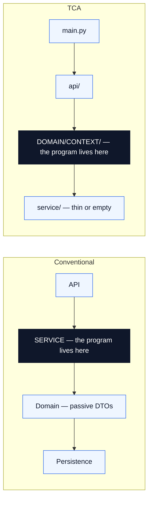
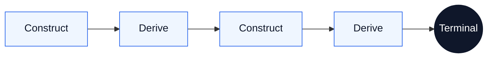
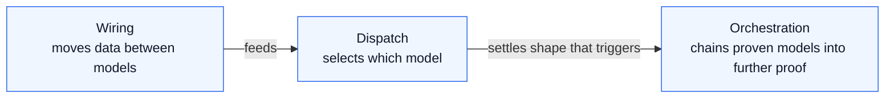
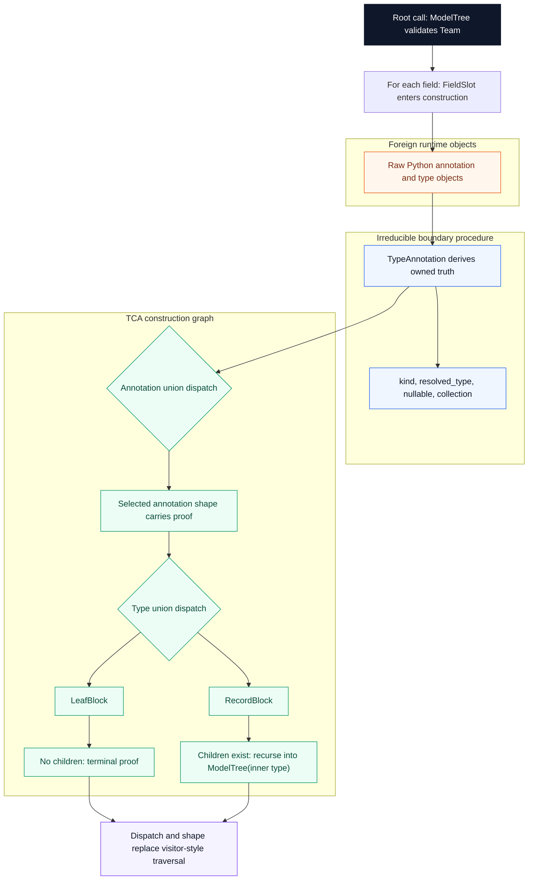

# Type Construction Architecture

[](https://www.python.org/downloads/)
[](https://docs.pydantic.dev/)
[](LICENSE)
[](https://github.com/DetachHead/basedpyright)

**Pydantic is a programming language. Python is its runtime.**

A Pydantic model is not a schema. It is a machine with a four-layer construction pipeline that fires every time data enters it. If the object exists, every constraint declared in its type was satisfied. If construction fails, no object exists. There is no third outcome.

Type Construction Architecture is the discipline of writing programs in these construction semantics. Define the types. Wire them as fields on other types. Let `model_validate` execute the graph. Construction is proof. Derivation extends proof. The program is the construction graph — not the procedural glue around it.

---

## Why TCA Exists

Most programs look like this:

| Layer | What it does |
|:---|:---|
| API | Receives raw data |
| Service | Interprets, maps, coordinates, enriches, decides |
| Domain | Passive DTOs the service operates on |
| Persistence | Stores whatever the service produced |

The service layer is where "the program" lives. It is full of mapping code, adapter functions, if/elif chains, intermediate dictionaries, and uncertain states. Domain types are bags the service fills.

TCA inverts this. The program moves from the service layer into the domain types:



What disappears when the program moves into the types:

| Conventional artifact | Why it disappears |
|:---|:---|
| Adapter classes and DTO converters | `from_attributes` and aliases are the mapping |
| `if/elif` chains that classify inputs | Discriminated unions dispatch during construction |
| Service methods that compute from model fields | Projections on the model own intrinsic derivation |
| Intermediate dictionaries and uncertain states | Frozen construction leaves no partial objects |

The domain types are not passive. They carry the construction logic. They own classification, derivation, and boundary translation. Services shrink to almost nothing because the models already did the work. The app interior is railroaded by constructed certainty.

---

## The Mental Model

**Construction is proof.** A `model_validate` call fires the full pipeline: translation, interception, coercion, integrity. If the object comes back, it satisfies every constraint its type declares. No separate validation step. No "invalid but present" state.

**Frozen snapshots.** Every TCA model is frozen. It captures one instant — the state of the world at construction time, proven and sealed. A frozen model never goes stale because it never claims to be current. It claims to be correct as of the moment it was built.

**Derivation belongs on the machine.** If a computation depends only on a model's own proven fields, it belongs on that model as a projection — `@computed_field`, `@cached_property`, or `@property`. If calling code computes an intrinsic derivation externally, that is a wiring defect.

**Construction drives further construction.** A projection that calls `model_validate` extends the proof graph. This construction-derivation loop is the evaluation model of a TCA program:



The loop is lazy (projections fire on first access), deterministic (frozen models guarantee evaluation-order independence), and compositional (each model's proof is independent of how it was demanded).

**Procedure has a proper place.** Some boundaries resist pure construction — foreign runtime objects, positional data structures, untyped external surfaces. At those boundaries, a small piece of procedure normalizes foreign input into owned truth: a wrapper derives `kind`, `nullable`, `resolved_type` from a raw annotation, and from that point forward the construction graph takes over. The discipline is that these seams must be irreducible, contained, and terminal — they bridge into the graph, never spread through it. See **[`docs/irreducible-seams.md`](docs/irreducible-seams.md)**.

---

## Three Mechanisms

Three construction mechanisms describe how types compose. Each eliminates an entire category of procedural code.



### Wiring

`from_attributes=True` lets one model read another's surface by name. Properties count. No adapter classes, no mapping layers, no intermediate dictionaries. The field names are the wiring.

```python
class DisplayReading(BaseModel, frozen=True, extra="forbid", from_attributes=True):
    temperature_fahrenheit: Fahrenheit  # reads RawSensor's @property
    pressure_kpa: PressureKPa           # reads RawSensor's stored field
```

### Dispatch

Discriminated unions route on tags. Smart enums classify inputs into their members. Instead of branching on raw data, declare a variant for each case. The variant's fields are the answer.

```python
class Shipped(BaseModel, frozen=True, extra="forbid"):
    kind: Literal["shipped"] = "shipped"
    tracking: TrackingNumber
    carrier: CarrierName

class Cancelled(BaseModel, frozen=True, extra="forbid"):
    kind: Literal["cancelled"] = "cancelled"
    reason: CancellationReason
    refund: RefundAmount

OrderStatus = Annotated[Shipped | Cancelled, Field(discriminator="kind")]
```

### Orchestration

A `@cached_property` that calls `model_validate` is a lazy construction trigger. Each step produces a proven object from a proven object. This is what makes TCA a programming paradigm, not a validation framework.

```python
@cached_property
def tree(self) -> ModelTree:
    return ModelTree.model_validate(self.model_class)

@cached_property
def report(self) -> TreeReport:
    return TreeReport.model_validate(self.tree)
```

---

## What This Looks Like In Practice

One `model_validate` at the root. The entire classification cascades through construction:

```python
tree = ModelTree.model_validate(Team)
print(TreeReport.model_validate(tree))
```

What fires inside that single call:

Read top to bottom through three zones: foreign runtime objects enter, boundary procedure normalizes them into owned truth, then the construction graph dispatches and recurses.



No `if` chains. No visitor pattern. No traversal function. Two discriminated unions fire during construction — one classifies the annotation form, one classifies the type itself. The variant's `Literal` fields carry the answer. Dispatch replaces computation.

**[`tca/building_block.py`](tca/building_block.py)** is the full implementation: a recursive Pydantic type classifier that demonstrates every TCA mechanism, works on any `BaseModel`, and serves as both a teaching resource and a practical tool.

---

## Why This Matters For LLM Systems

When the consumer of a type schema is a language model, something changes. Field names stop being addresses and become instructions. `churn_risk_tier` tells the model to assess voluntary departure risk. `x7` does not. The structural output is the same type. The semantic output diverges completely.

This is not prompt engineering. A prompt gives instruction. A type in a construction system gives instruction, constraint, and proof simultaneously:

| Artifact | Instructs | Constrains | Proves |
|:---|:---:|:---:|:---:|
| Prompt | Yes | No | No |
| Schema text alone | Sometimes | Weakly | No |
| Type in a construction system | Yes | Yes | Yes |

TCA already preserves names, descriptions, and enum members as first-class structural elements. Adding an LLM consumer activates a semantic dimension without architectural change. The same types that structure the construction graph become instructions to the model.

The tighter the type, the less room the name has to matter. The looser the type, the more the name carries. Every TCA principle that tightens the type simultaneously tightens the information bound on the LLM.

LLM output is another foreign boundary where the same seam pattern applies: structured output crosses the boundary, a `model_validate` call normalizes it into proven context, and the construction graph continues.

This phenomenon is formalized as **[Semantic Index Types](https://github.com/kylejtobin/sit)** — a companion research project that defines what happens when the compilation target reads natural language.

---

## What's In This Repo

| Path | What it is |
|:---|:---|
| **[`docs/manifesto.md`](docs/manifesto.md)** | Why TCA exists, what we believe, what we reject |
| **[`CLAUDE.md`](CLAUDE.md)** | Reusable always-on Claude charter for TCA projects |
| **[`.claude/README.md`](.claude/README.md)** | Reusable Claude architecture for resisting TCA drift during generation |
| **[`docs/`](docs/)** | The specification, split by ownership |
| **[`docs/overview.md`](docs/overview.md)** | Front door to the spec — thesis, evaluation model, navigation |
| **[`docs/program-architecture.md`](docs/program-architecture.md)** | Where the program lives — the application shape |
| **[`docs/construction-machine.md`](docs/construction-machine.md)** | The four-layer pipeline, projection surface, and trust conditions |
| **[`docs/mechanisms.md`](docs/mechanisms.md)** | Wiring, dispatch, orchestration — how types compose |
| **[`docs/roots-and-proof-obligations.md`](docs/roots-and-proof-obligations.md)** | What constitutes a root, how to find proof obligations |
| **[`docs/principles.md`](docs/principles.md)** | Governing rules — structural discipline, ownership, naming |
| **[`docs/irreducible-seams.md`](docs/irreducible-seams.md)** | Where procedure belongs — the governing test for seams |
| **[`docs/semantic-index-types.md`](docs/semantic-index-types.md)** | When the compilation target reads natural language |
| **[`docs/failure-modes.md`](docs/failure-modes.md)** | Catalog of TCA failures — every error is a design error |
| **[`docs/building-block-classifier.md`](docs/building-block-classifier.md)** | Worked example demonstrating every mechanism |
| **[`tca/building_block.py`](tca/building_block.py)** | The classifier implementation — one file, heavily annotated |

---

## Read Next

**I want the why.** Start with **[`docs/manifesto.md`](docs/manifesto.md)** — what we believe, what we reject, and what we build.

**I want the Claude scaffolding.** Read **[`CLAUDE.md`](CLAUDE.md)** for the charter, then **[`.claude/README.md`](.claude/README.md)** for the reusable anti-drift architecture.

**I want the theory.** Start with **[`docs/overview.md`](docs/overview.md)** — the front door to the specification.

**I want the architecture.** Read **[`docs/program-architecture.md`](docs/program-architecture.md)** — where the program lives and why services disappear.

**I want the code.** Read **[`tca/building_block.py`](tca/building_block.py)** — one file demonstrating every mechanism in the spec.

**I need to know where procedure belongs.** Read **[`docs/irreducible-seams.md`](docs/irreducible-seams.md)** — how to tell a real seam from a modeling failure.

**I care about LLM semantics.** Read **[`docs/semantic-index-types.md`](docs/semantic-index-types.md)** for the TCA implications, then **[Semantic Index Types](https://github.com/kylejtobin/sit)** for the formal treatment.

---

## Requirements

- Python 3.12+
- Pydantic 2.12+

## License

[MIT](LICENSE)
