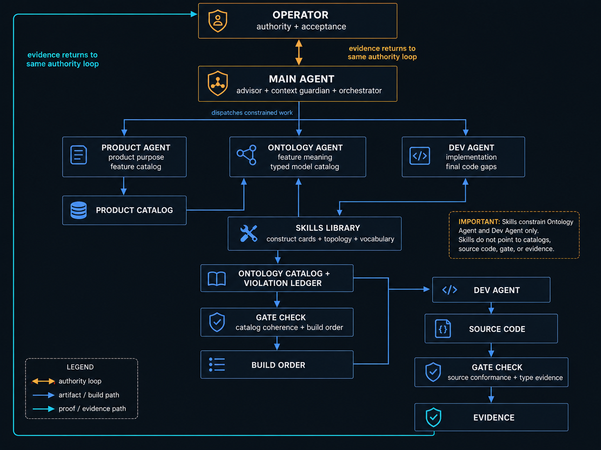

<h1 align="center">Type Construction Architecture</h1>
<p align="center"></p>

<p align="center">
<a href="https://www.python.org/downloads/"></a>
<a href="https://docs.pydantic.dev/"></a>
<a href="LICENSE"></a>
<a href="https://github.com/DetachHead/basedpyright"></a>
</p>

<p align="center"><strong>Your software's meaning lives in its types.<br>The compiler proves the meaning true.<br>You work with a crew of AI agents.<br>They help you describe features.<br>They help you model the types.<br>Then they build your program.<br>From the types you modeled.<br>No agent guessing allowed.</strong></p>

---

For decades, the best engineers argued that meaning belongs in the types:

> Model the domain, make illegal states impossible to construct, and let a value's existence prove its own correctness instead of bolting validation on after the fact.

They were right. That didn't matter. Because project management runs on one rule it rarely says out loud:

> We separate the cost of finishing the first task from the lifetime cost of what we build.

Make the first task look 75% faster, move the real cost into every month that follows, and call that delivery. That is what imperative procedural code inside a poorly typed architecture really is: not speed, but cost displacement. A loan drawn on day one and repaid for the life of the system in bug-interest toil.

AI changes that math. Radically.

Not by making the shortcut safe. By taking away the shortcut's only advantage.

The deferred-cost path had one thing to sell: visible first-day movement. It let the team arrive at "done" before the system had to prove anything. But now an LLM can read your field names, your variants, and your type structure en masse. It can help you name the domain, shape the cases, close the gaps, and build the modeled design at speed.

So the bad trade loses its cover story.

The disciplined path now gets the early movement the shortcut used to sell, without inheriting the hidden tax the shortcut always carried. You get the fast start and the durable architecture. The path they called slow and expensive becomes the one that ships cleanly, changes safely, and ages cheaply.

That is the smaller half of it.

The larger half is that a type is an instruction.

The same declaration that proves your code correct to the compiler now tells a model what is allowed to exist, and what is not. One structure carries two jobs at once:

- The constraint that stops a generator from inventing
- The context that tells it what you meant

Your types are no longer just implementation detail. They become the shared language between the compiler, the AI, and the next engineer who has to live inside the system.

That changes the center of gravity. Design, code, and documentation stop drifting apart as separate copies of intent. The domain model becomes the place intent lives. The compiler enforces it. The AI reads it. The engineer extends it.

The rigor that used to be good taste is now the thing that makes AI-built software worth trusting.

---

## The Construction Crew

The SDLC was never about building. It is a coordination protocol for multiple humans at human speed: the requirements doc, the handoffs, the standup, the roles, all of it exists to keep work split across many brains from contradicting itself. Remove the need to split the work, and the apparatus is just overhead.

<p align="center"></p>

So this drops the apparatus. You own the product. A crew of specialized agents does the labor, each one allowed a single job:

- **The main agent** orchestrates the crew, guards the context, reviews each result, and diagnoses every block. It models nothing and writes no code.
- **`tca-product`** records what the product is for. It names nothing technical, so it cannot smuggle a design into the requirements.
- **`tca-ontology`** turns that into a typed model and decides where each meaning lives. It writes no code.
- **`tca-dev`** writes the code from the model, one file at a time. It decides nothing; a choice it makes on its own is a bug.
- **The gate** proves every file matches the model. It is plain code, not another model, so the verdict never varies and costs nothing.

You make the calls only you can make. The walls the last era fought to tear down, dev from ops and the deeper one between the people who know the business and the people who build it, fall here for the same reason: one builder, holding the meaning, commands the whole line.

It works for a team, exactly as well. What it makes newly possible is one person owning a product at a scale that used to take a room, and the process to keep the room in sync.

---

## Watch It Refuse

The agent reaches for the shortcut every model reaches for:

```python
class Price(BaseModel):
    value: float
```

The gate stops it before it touches the disk:

```text
TCA gate denied this write.
- bare primitive field `value`; use a semantic scalar (line 2)
- Price is a modeled semantic scalar; the shape is class Price(RootModel[...], frozen=True) (line 1)
```

Because you had already said, in one line, what a `Price` is:

```json
{ "construct": "semantic scalar", "name": "Price", "primitive": "Decimal", "constraint": "gt=0, decimal_places=8" }
```

And from that line, one shape is legal. It is the only thing `tca-dev` is allowed to write:

```python
class Price(RootModel[Decimal], frozen=True):
    root: Decimal = Field(gt=0, decimal_places=8)
```

You say what a thing means once. The build holds to it and cannot wander off, not on the first try, not three files later when a model would have forgotten.

---

## It Proves the Build, and Stops When the Call Is Yours

Before a line is written, the gate reads your model, proves it holds together, and prints the order to build it:

```text
1. semantic scalar Price -> domain/orders/type.py
2. semantic scalar Quantity -> domain/orders/type.py
```

The crew builds in that order, and the gate checks each file the moment it lands:

```text
tca gate: 0 violation(s) across 1 file(s)
```

When a meaning will not fit, because the design needs a decision no rule can make for it, the crew does not guess past it. It hands you exactly what it could not settle, and stops:

```text
BLOCKED
row: <name and construct>
card: <the construct card it could not satisfy>
would not fit: <what the card could not express, in one sentence>
built before halt: <the rows it finished, and their files>
```

You make the call, fix the model, and the build resumes where it stopped. The machine does what is mechanical. You do what needs an architect.

---

## A Scaffold, Not a Method

You pull the repo, define your product, and run the loop. The starter app is a placeholder; the crew overwrites it with the system built from your model, so you begin from a clean shape and end with your own. What is here today scaffolds the application. Templatizing the infrastructure beneath it, at cloud scale, is the next chapter.

---

## Set Against the Alternatives

<p align="center"></p>

The spec-driven tools split the work across a pretend team, one agent each playing analyst, PM, architect, scrum master: waterfall with robots. The benchmarks show the bill, slower than writing the code yourself and more tokens spent re-reading its own rules than doing the work. TCA has no manager agents, because there is no room of humans to coordinate. The split is by authority, and the gate, not your patience, holds the line.

---

## Fifteen Shapes, No Sixteenth

You build your whole domain from fifteen constructs. There is no sixteenth, and reaching for one is the single move the system will not allow. Each carries one meaning and rejects the shapes that bury it: the bare primitive, the `if/elif` ladder, the mapper, the stray helper.

<p align="center"></p>

Every shape it rejects is one of four mistakes: a meaning with no type to hold it, the same meaning kept in two places by hand, a type that means nothing, or one type trying to mean two things. There is no fifth. That is the whole test, and it runs on every file you write.

---

## It Is Cheap to Run

- **You do not pay the model to redesign on every run.** Your design is saved as data. `tca-dev` reads a row; it does not work out what a `Price` is again.
- **The check is free.** Proving a file matches its row is plain code, not another model call. Zero tokens.
- **It stops instead of thrashing.** When a row will not build, the run ends and tells you. It cannot spin for an hour down a dead path.
- **You pay for the strong model only where it earns it.** A capable model to design with you, a cheap one to write near-mechanical files, no model at all to check.

---

## Almost None of This Is New, and That Is the Point

It is the good half of typed functional programming, domain-driven design, and a few older schools, pulled together and made to hold under one test. Two camps spent decades saying the domain's structure should come first. They were right, and ignored, because the systems that ran the work never read what they wrote. A model reads it now, and the gap they were marginalized for is the gap that costs you on every run.

---

## Start Here

```bash
git clone https://github.com/kylejtobin/tca && cd tca
uv sync
```

- **The whole idea**, the one rule and the four ways it breaks: [`docs/definition.md`](docs/definition.md)
- **Why the domain belongs in the running code now**: [`docs/executable-ontology.md`](docs/executable-ontology.md)
- **Learn it by building**: [`docs/learning-path.md`](docs/learning-path.md)
- **The crew, the gate, and the loop in full**: [`.claude/README.md`](.claude/README.md)
