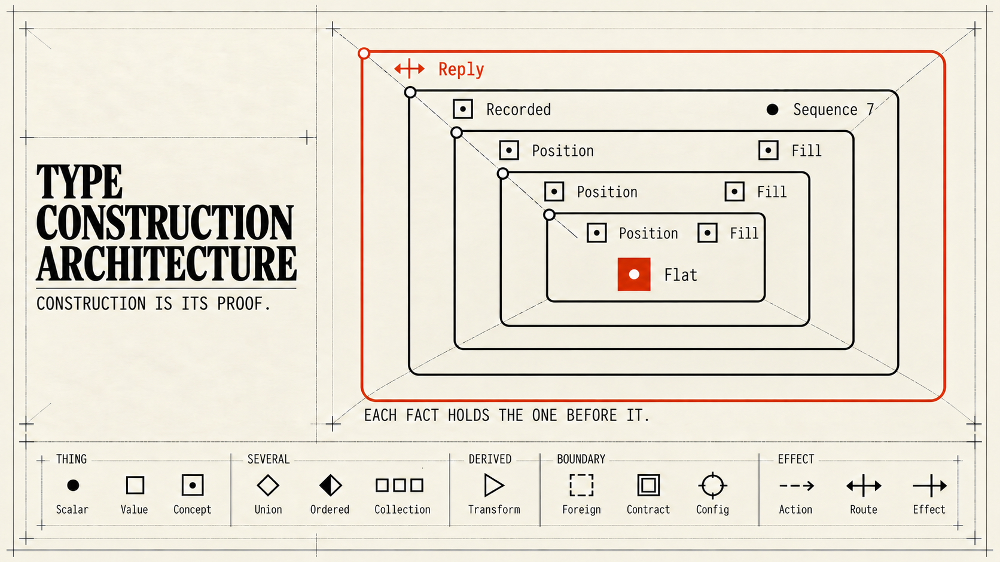

<h1 align="center">Type Construction Architecture</h1>
<p align="center"></p>

<p align="center">
<a href="https://www.python.org/downloads/"></a>
<a href="https://docs.pydantic.dev/"></a>
<a href="LICENSE"></a>
</p>

<p align="center"><strong>A program is a set of types. Constructing them is the only operation.</strong></p>

---

## The same feature, twice

A venue sends a fill. The program updates the account's position, records it with a clearing house, and replies.

Here is the version everyone writes, and every coding agent writes by default:

```python
positions = {}

def on_fill(raw):
    body = json.loads(raw)
    fill = body["data"]["payload"]
    key = (fill["account"], fill["instrument"])
    position = positions.get(key)
    if position is None:
        position = {"net": Decimal(0)}
    if fill["side"] == "buy":
        position["net"] += Decimal(fill["quantity"])
    else:
        position["net"] -= Decimal(fill["quantity"])
    try:
        reply = client.save(position)
    except ClearingError:
        return None
    positions[key] = position
    return {"sequence": reply["sequence"], "net": str(position["net"])}
```

It works on the day it is written. It also contains these, none of which a test suite will find until production does:

- `"Buy"` with a capital B is a sell.
- A halted clearing house and a bug both return `None`, and the caller cannot tell them apart.
- A restart forgets every position.
- A refused save leaves the position already changed in memory.
- A missing `quantity` is a `KeyError` three lines after the bad message was accepted.

Here is the same feature in TCA. Every class is frozen and strict; that configuration is left out here and is exact in the skill.

```python
class Position(BaseModel):
    """One account's holding in one instrument, the fold of its fills."""

    prior: "FlatPosition | Position"
    fill: Fill

    @property
    def net_quantity(self) -> NetQuantity:
        return NetQuantity(
            self.prior.net_quantity.root
            + {Side.BUY: 1, Side.SELL: -1}[self.fill.side] * self.fill.quantity.root
        )

    @property
    def persistence(self) -> "PersistPosition":
        return PersistPosition(position=self)


ClearingReply = ClearingAcknowledgement | ClearingRefusal
PositionOutcome = RecordedPosition | RefusedPosition
FillReply = FillBooked | FillDeclined
```

And this is the entire program that runs:

```python
def receive_fill(message: FillRoute) -> FillReplyRoute:
    return FillReplyRoute(
        outcome=PersistPositionInterpreter(
            action=Position(
                prior=ReadPositionInterpreter(
                    action=ReadPosition(
                        account=message.fill.account,
                        instrument=message.fill.instrument,
                    ),
                    client=client,
                ).execute(),
                fill=message.fill,
            ).persistence,
            client=client,
        ).execute(),
    )
```

One function, one returned expression. No `if`, no `try`, no `None`, no loop, no dictionary, nothing kept between messages.

## What happened to each line

| The procedural line | What it became | What can no longer be written |
|---|---|---|
| `json.loads(raw)` and `body["data"]["payload"]` | `FillRoute.receive(raw)`: the whole message given to one constructor | a half-read message; a `KeyError` downstream |
| `if fill["side"] == "buy"` | `Side`, a closed vocabulary, and a table with every member as a key | a third spelling of "buy" |
| `positions.get(key)` and `if position is None` | `FlatPosition`, the holding of an account with no fills | a forgotten `None` check |
| `position["net"] += ...` | a new `Position` that holds its `prior` and one `Fill` | a position changed before the save succeeded |
| `positions = {}` | the prior is read from the clearing house on every message | state lost on restart |
| `try` / `except` / `return None` | `ClearingRefusal`, a variant of the reply; `RefusedPosition`, a variant of the outcome | a refusal the caller cannot see |
| `return {...}` | `FillBooked` or `FillDeclined`, picked by construction | a reply shape nobody declared |

The hard cases are ordinary values:

```python
ClearingReplyConstructor.validate_json('{"sequence": 7}')        # ClearingAcknowledgement
ClearingReplyConstructor.validate_json('{"error": "halted"}')    # ClearingRefusal
PositionStateConstructor.validate_json('{"account": "A1", "instrument": "ESZ6"}')  # FlatPosition
Bids.model_validate_json("[]").top                               # NoBids
```

When the clearing house says `{"error": "halted"}`, the caller receives `{"reason":"halted"}`. Nothing was caught. The refusal was constructed, carried, and published like any other fact.

## Each fact holds the one before it

That is the picture at the top of this page, and it is the whole method.

A procedure says: do this, then that. TCA says: the later thing holds the earlier thing. A reply holds the outcome. The outcome holds the position. The position holds the fill and the position before it, down to the flat position at the start. Order is depth, and Pydantic's constructors run it. You never write the sequence, so you cannot write it wrong.

Every step you are about to type is a thing you have not named yet:

| You are about to… | You declare |
|---|---|
| do this, then that | a later fact holding the earlier fact as a field |
| check whether | a union; construction picks the variant |
| handle it failing | a refusal variant in the reply and in the outcome |
| handle there being none | a named thing for the empty case |
| handle several | a tuple held whole, or one construction for each arrival |
| read what another system sent | a route or foreign model given the raw input |
| ask another system for something | an action, one interpreter, and the raw reply given to a union |
| keep something between arrivals | a prior read on each arrival, and a successor constructed from it |

## One test

Every meaning has exactly one structural home, and every structure carries exactly one meaning. That fails in exactly four ways:

- **Escaped.** A meaning with no structure: it lives in a comment, a procedure, or a convention.
- **Duplicated.** A meaning with two structures, kept in agreement by hand.
- **Vacuous.** A structure with no meaning: a wrapper, a helper, a name that says nothing.
- **Fused.** A structure with two meanings that vary independently.

There is no fifth. Every design argument reduces to which of the four it is.

## Thirteen shapes, no fourteenth

A whole program is built from thirteen declaration forms. Each one replaces a habit.

| Construct | What it is | What it replaces |
|---|---|---|
| [Semantic scalar](.agents/skills/python-dev-tca/constructs/semantic-scalar.md) | One atomic meaning over a primitive or a closed vocabulary | The bare `str` and `Decimal` |
| [Value object](.agents/skills/python-dev-tca/constructs/value-object.md) | A frozen product with no identity, equal when its fields are equal | The tuple or dict of parts |
| [Concept model](.agents/skills/python-dev-tca/constructs/concept-model.md) | A full domain thing or durable fact; the class is the kind | The `kind` field and the registry |
| [Union](.agents/skills/python-dev-tca/constructs/union.md) | Closed alternatives, each holding its own facts | The `if/elif` ladder and the `bool` |
| [Ordered union](.agents/skills/python-dev-tca/constructs/ordered-union.md) | A strong alternative whose only failure means the fallback | `try/except` and `.get()` returning `None` |
| [Collection](.agents/skills/python-dev-tca/constructs/collection.md) | Several with a meaning of their own, as a frozen tuple | The mutable list |
| [Transformation](.agents/skills/python-dev-tca/constructs/transformation.md) | A derivation of one returned expression on the thing that holds its inputs | The helper function and the service method |
| [Foreign model](.agents/skills/python-dev-tca/constructs/foreign-model.md) | Another system's thing, lifted whole by aliases | The mapper, the adapter, the DTO |
| [Contract model](.agents/skills/python-dev-tca/constructs/contract-model.md) | This program's published request or reply | The hand-built response dict |
| [Config](.agents/skills/python-dev-tca/constructs/config.md) | Deployment input constructed once | The scattered `os.environ` read |
| [Route](.agents/skills/python-dev-tca/constructs/route.md) | One transport crossing, in or out | The handler that parses by hand |
| [Action](.agents/skills/python-dev-tca/constructs/action.md) | One intended external effect, as a value that performs nothing | The side effect performed in place |
| [Effect interpreter](.agents/skills/python-dev-tca/constructs/effect-interpreter.md) | The one place an action's external call is made | The client call inside domain code |

Succession is a [concept model](.agents/skills/python-dev-tca/constructs/concept-model.md) with a self-typed `prior`. The program's one function lives at the [composition root](.agents/skills/python-dev-tca/constructs/composition-root.md).

## Built for the agent that writes your code

A coding agent can recite all of the above and will still write the procedural version, because reciting is recall and writing code is habit. TCA is delivered as a system that works against that, not as a document to be remembered.

- **The skill meets the agent at the moment.** [`python-dev-tca`](.agents/skills/python-dev-tca/SKILL.md) is read just before the agent writes Python. Each page starts from the two procedural lines the agent was about to type and hands it the classes that replace them, including the case that fails, is empty, or is several.
- **The smell check does not negotiate.** [`smell-check`](.agents/skills/smell-check/SKILL.md) scans for the free function, `isinstance`, the loop, the conditional, the dict, and the parse method. Every hit is a violation. A build is complete when it exits 0.

  ```text
  CONDITIONAL   src/venue/position.py:12:    if position is None:
  LOOP          src/venue/bids.py:8:    for bid in bids:
  DICT          src/venue/fill.py:21:    return {"sequence": sequence}
  ```

- **The reviewer assumes bad faith.** [`code-review-tca`](.agents/agents/code-review-tca.md) reads the work as written by someone looking for a way around the standard: tests that pass by construction, exceptions used as the normal path, compliance with a rule's wording that defeats its purpose.
- **Discovery comes first.** [`domain-discovery`](.agents/skills/domain-discovery/SKILL.md) decides what the world contains from evidence before any type is written.

## Adopt it

1. Copy [`.agents/skills/`](.agents/skills/) and [`.agents/agents/`](.agents/agents/) into your repository.
2. Bind your agent to it, in `AGENTS.md`:

   ```text
   You MUST use the python-dev-tca skill to make every decision.
   Before reporting any Python build complete, run the smell-check skill; a nonzero exit is not complete.
   ```

3. Put the smell check in front of every commit, in `.pre-commit-config.yaml`:

   ```yaml
   - repo: https://github.com/kylejtobin/tca
     rev: <commit>
     hooks:
       - id: smell-check
   ```

The example world every page of the skill is written in, with every union and derivation: [`world/venue.md`](.agents/skills/python-dev-tca/world/venue.md).

## Why this, why now

The procedural version was always the cheap one on day one and the expensive one for the life of the system. Teams took that trade because modeling first looked slow.

A model that can read your field names, your variants, and your type structure removes the reason for the trade. The modeled design now arrives at the speed the shortcut used to, without the bugs listed at the top of this page.

And a type is an instruction. The same declaration that stops an invalid value from existing tells a model what is allowed to exist. One structure does both jobs, so design, code, and documentation stop being three copies of the same intent.

None of the ideas are new. This is the good half of typed functional programming and domain-driven design, held to one test and delivered in a form an agent cannot talk its way around.
