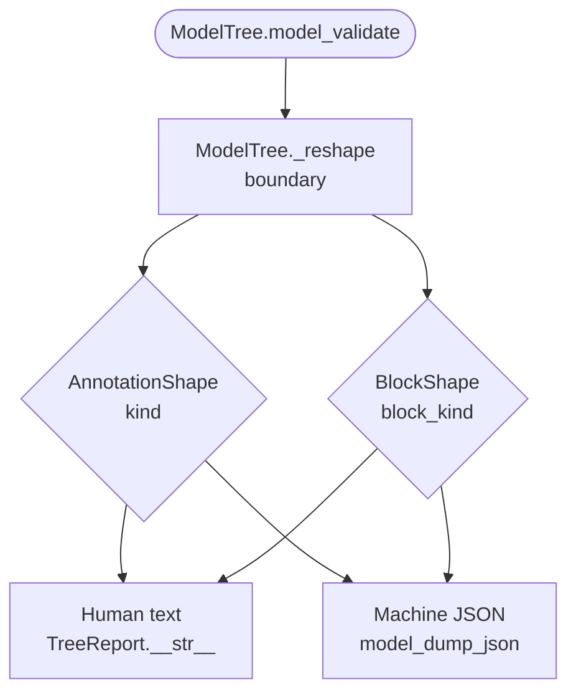
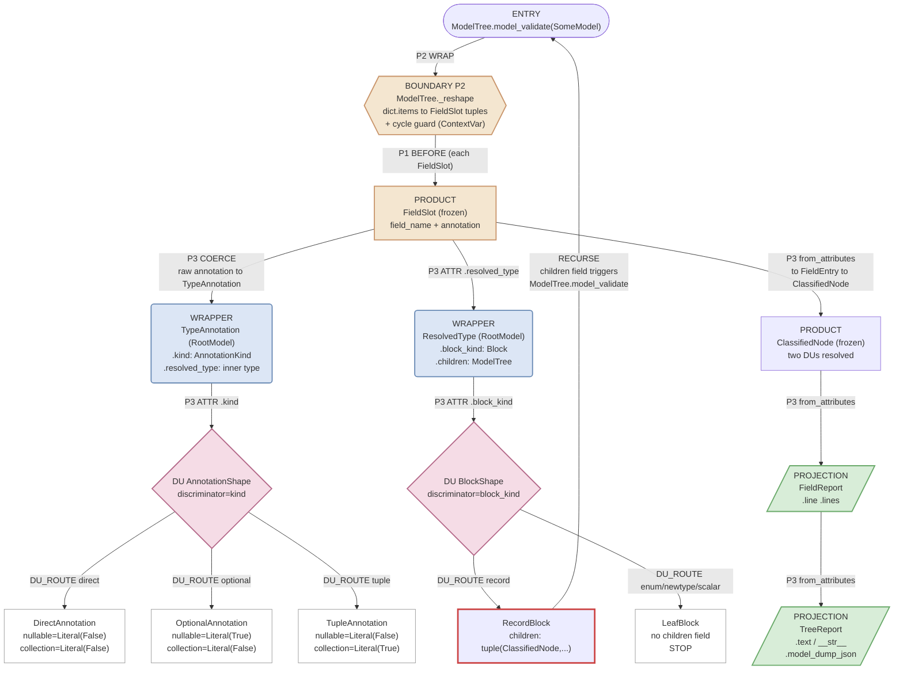

# Construction Cascade Graph (CCG)

Diagram view. The full specification (vocabulary, derivation discipline, structural integrity, invariants, deliverables, acceptance criteria) is in [ccg-spec.md](ccg-spec.md).

---

## Worked example: building_block.py

This is the CCG for the building block classifier. One `model_validate` call classifies every field on any `BaseModel` into a structural building block.

### Overview — decision structure

### Construction flow

