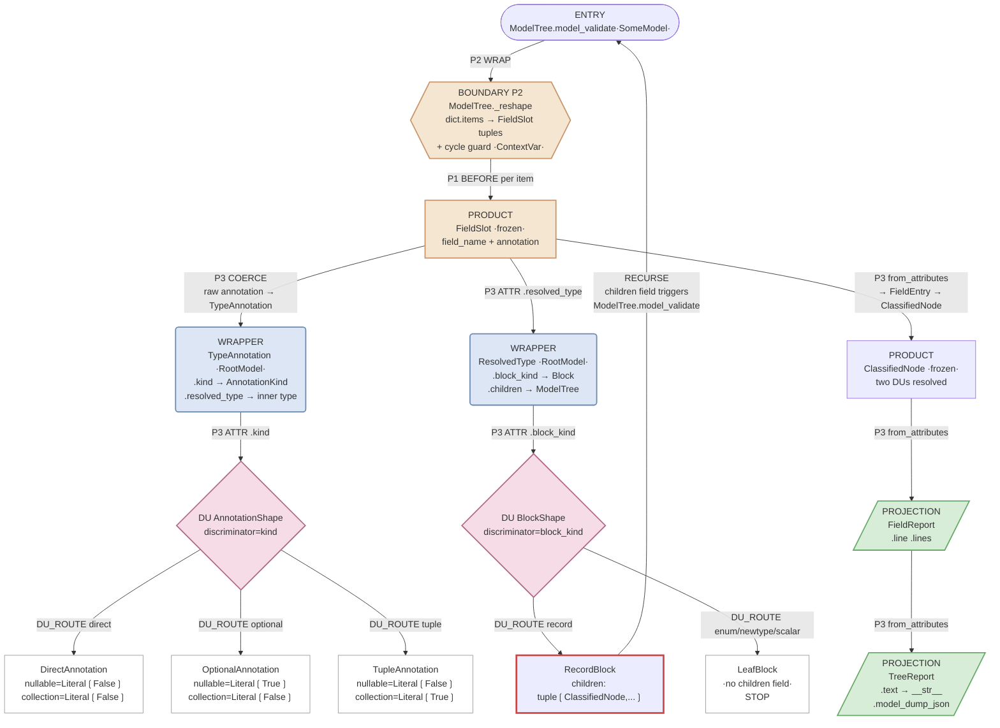

# Construction Cascade Graph (CCG)

## Specification v0.5

A diagram standard for programs whose runtime is types + Pydantic construction semantics.

---

## 1. Purpose

A Construction Cascade Graph describes a program as:

* **Wiring:** field type declarations (including aliases, discriminators, and `from_attributes` reads)
* **Evaluator:** `model_validate` (one call triggers an entire descent)
* **Dispatch:** discriminated unions and closed vocabularies (smart enums)
* **Projection:** derived views (`cached_property`, `computed_field`) over frozen products
* **Procedure:** only at explicit irreducible boundary seams
* **Effects:** explicitly quarantined and marked

CCG has two jobs. First, it is a **planning tool**: given a domain, derive the construction cascade by starting at the untyped boundary and shape-modeling inward. Second, it is a **sewage detector**: given an existing cascade, make every place where procedure leaked past the boundary visible and nameable.

CCG is not an interaction diagram. It does not model runtime performance, infra topology, service contracts, user touchpoints, or business workflows.

---

## 2. Vocabulary

These are the only building blocks CCG recognizes. The vocabulary is closed.

### 2.1 Node kinds

| Node | What it is | Identifying feature |
|------|-----------|---------------------|
| **ENTRY** | The root `model_validate(...)` call | One call cascades everything |
| **BOUNDARY** | Untyped input reshaped into named fields | P1 before or P2 wrap validator |
| **PRODUCT** | `BaseModel` record (frozen product type) | Named fields, `frozen=True` |
| **WRAPPER** | `RootModel[T]` with derived properties | Self-classifying: `.kind`, `.block_kind`, etc. |
| **DU** | Discriminated union | `Annotated[A\|B\|..., Field(discriminator="tag")]` |
| **ENUM** | Closed vocabulary | `StrEnum`, often with semantic properties |
| **PROJECTION** | Derived view over frozen fields | `@computed_field`, `@cached_property`, `__str__` |
| **EFFECT** | Construction-triggered side effect | `model_post_init` |

Nodes are declarations, not helpers. If it does work, it must be a model, projection, or effect node — not a module-level function.

### 2.2 Edge kinds

| Edge | What it connects | Direction |
|------|-----------------|-----------|
| **FIELD** | Parent → child via field type annotation | Construction dependency |
| **ALIAS** | `Field(alias="...")` boundary mapping | Rename on ingestion |
| **ATTR** | `from_attributes=True` read (properties count) | Source attribute → target field |
| **DU_ROUTE** | Discriminator selects a variant (total dispatch) | DU → selected variant |
| **RECURSE** | Demand-driven recursion via field existence | Variant with children field → root |
| **PROJECT** | Derived output from frozen fields | Model → projection |
| **EFFECT** | Side effect execution | Model → effect |

### 2.3 Node annotations

**Literal proof.** Every DU variant node must be annotated with its `Literal` field values. These are not edges — they are structural truths settled by dispatch. When the DU routes to `OptionalAnnotation`, the annotation `nullable: Literal[True]` IS the answer. The variant's constants prove what dispatch determined. Show them on the node.

### 2.4 Phase markers (required labels on edges and nodes)

| Marker | Phase | What happens |
|--------|-------|-------------|
| **P1** | Boundary Transform | `Field(alias=...)` or `mode="before"` reshapes input |
| **P2** | Sealed Boundary | `mode="wrap"` controls whether construction proceeds |
| **P3** | Field Construction | Coercion, `from_attributes`, DU routing |
| **P4** | Proof Obligation | `mode="after"` cross-field invariants |
| **P5** | Projection | `@cached_property`, `@computed_field` derive from frozen fields |

---

## 3. Deriving a CCG

This is the planning workflow. It works for both greenfield design and mapping existing code.

### 3.1 Find the boundary

Where does untyped data enter? `dict.items()`, `sys.argv`, an HTTP payload, a database row. That entry point is the ENTRY node. The first model that touches untyped data is the BOUNDARY node.

Ask: what is the minimum procedure required to get from untyped input to a named dict or attribute-bearing object? That procedure is your irreducible minimum. Everything past this point should be shape.

**Default expectation: one boundary seam.** If you have more than one, write down why each is irreducible. If the justification is weak, the seam is eliminable.

### 3.2 Name the shape on the other side

What PRODUCT should exist once the boundary is crossed? Name its fields. Each field is a construction instruction — its type tells Pydantic what to build.

For each field, ask: what is it?

* A closed set of values → **ENUM**
* A semantic wrapper around a primitive → **WRAPPER** (`RootModel[T]`)
* A named record with its own fields → **PRODUCT** (recurse: name ITS fields)
* A bare primitive with no domain meaning → **SCALAR** (ask if this is really right)

### 3.3 Find the cases

For any field where the shape varies based on a tag value, you have a DU. Declare a variant for each case. Each variant carries a `Literal` tag. The variant's fields ARE the answer for that case.

If you find yourself writing `if tag == "x":` to decide what to build, you have a DU that isn't declared yet.

### 3.4 Wire the classification

Something must determine which DU variant each input becomes. There are two patterns, and which one applies depends on the raw input.

**Self-classifying wrapper** — when the raw value has intrinsic structure a property can inspect. Wrap it in a `RootModel[T]` with properties that expose the classification. Downstream models read those properties via `from_attributes`. The wrapper knows what it is. No external classifier needed. This pattern fires when the raw value's own API provides classification (e.g., `get_origin()` on Python type annotations, `isinstance` checks on known base classes).

**Boundary-seam tagging** — when the raw input is unstructured enough that classification requires inspecting its contents (dict keys present, field combinations, format markers). Classification belongs in the boundary seam's wrap validator. The seam inspects the raw input, produces a tagged dict, and the DU routes on the tag. This is not an escape hatch — it is the irreducible classification work for inputs that cannot classify themselves.

The choice between these is not stylistic. If the raw value has a method or structural property that determines its kind, use a wrapper. If classification requires reading into the value's contents, it belongs at the boundary.

### 3.5 Apply the projection discipline

For every derived value, apply this decision in order:

1. **Can it be a single-line `@property` delegation?** → Do that.
2. **Can it be a single expression `@cached_property`?** → Do that.
3. **Does the derivation have cases?** → Move the cases into an ENUM or DU. The projection reads the result.
4. **Is the derivation complex enough to need its own fields?** → It's a new PRODUCT. Build it as a model, construct it via `from_attributes`.

If a projection requires multi-line logic that doesn't fit any of these, stop and ask: is the upstream shape wrong? A complex projection usually means an upstream model is missing.

**One exception: deterministic collection assembly.** A terminal projection that iterates a collection in fixed order, constructs a node per element, and joins the results is not a sign of missing shape. It is the irreducible minimum of rendering a sequence. The test: does the iteration contain branching? If yes, the branching should be pushed into the elements (DU variants, smart enum properties). If no — pure iteration, construction, and joining — the multi-line projection is acceptable.

**Schema participation is intentional.** `@computed_field` means "this value appears in `model_dump()` and JSON schema." Terminal derivations that are not part of the public contract must be `@cached_property` only. This prevents schema cycle amplification and "model not fully defined" failures. It is not style — it is structural.

### 3.6 Write the model schema

You now know every model. For each one, write the schema (§9.1): stored fields, Literal proofs, validators, properties with exact return expressions, computed fields with exact return expressions, and which upstream model it reads from.

This is not documentation. It is the program. In TCA, the field declaration IS the implementation. A model schema that specifies `return self.shape.nullable` leaves nothing to interpret. A schema that says "delegates to shape" leaves everything to interpret.

For LLM agent consumers, the return expressions are mandatory — without them, the agent will reimplement rather than derive. For human practitioners, they serve as the reference implementation.

### 3.7 Draw the diagram

You now have enough to draw:

* ENTRY → BOUNDARY → PRODUCT(s)
* FIELD edges from products to their children
* DU nodes with DU_ROUTE edges to variants (annotate Literal proofs on variants)
* WRAPPER nodes feeding DUs via ATTR reads
* PROJECTION nodes at the terminal end
* RECURSE edges where variant shape demands recursion
* EFFECT nodes (if any), quarantined

### 3.8 Greenfield vs. brownfield

**Greenfield (designing new types):** Work steps 3.1–3.7 in order. The diagram IS the design. Build the types to match it.

**Brownfield (mapping existing code):** Start from the code. Identify the `model_validate` entry point. Trace the cascade through field types, DU routing, and `from_attributes` reads. Where you find procedure that could be shape, mark it as sewage (§4). The diagram reveals what to refactor.

---

## 4. Sewage: forbidden moves

These are anti-patterns CCG exists to make visible. Each names a specific structural failure and its fix.

### 4.1 Import-graph sewage

Importing an aggregate union (e.g., `CommandOutcome`) into upstream layers that feed it. Patching the resulting cycles with `TYPE_CHECKING`, deferred imports, or forward-ref workarounds.

**Fix:** Move the type to the correct layer boundary. Aggregation lives at ceremony, not upstream.

### 4.2 Re-validation sewage

Constructing a base model, then calling `TypeAdapter(...).validate_python(...)` inside a projection to dispatch.

**Fix:** Make the DU a real field so routing happens in P3, not P5.

### 4.3 Serialization sewage

Using `@computed_field` for terminal derivations not part of the public schema. Hand-building JSON via `json.dumps` instead of `model_dump_json`.

**Fix:** Terminal derivations use `@cached_property`. Serialization uses Pydantic at the ceremony boundary.

### 4.4 Open-world branching sewage

Branching on strings, `None` checks as dispatch, procedural `match/case` outside enums/DUs.

**Fix:** Coerce to enum early. DU-route early. Push remaining truth into smart enum properties or DU variant constants.

### 4.5 Helper-function leakage

Module-level functions operating on model fields (the classic `_census_line` pattern).

**Fix:** Move into the owning model as a projection.

---

## 5. Invariants

A valid CCG must make these checkable.

### 5.1 One-call cascade

A single ENTRY call is sufficient to construct the terminal artifact(s). If a second `model_validate` call is required to continue construction (as opposed to projecting a finished result), the cascade has a gap.

### 5.2 Irreducible minimums only

All procedure is confined to explicitly enumerated BOUNDARY nodes. Each seam has a written justification for why shape cannot bridge that boundary.

### 5.3 Demand-driven recursion

This applies when the construction graph has recursive types.

Recursion occurs only because a selected DU variant has a field that requires a recursive value. The variant's shape IS the recursion decision:

* Variant with `children: tuple[T, ...]` → ATTR read triggers RECURSE
* Leaf variant with no `children` field → recursion cannot fire

If you cannot point to the field declaration that forces recursion, you are doing procedural recursion.

### 5.4 Closed dispatch only

All branching is structural: DU routing on discriminators, or smart enum property reads. No open-world branching on strings, ad-hoc predicates, or scattered if-chains.

### 5.5 Effects do not participate in routing

EFFECT nodes react to a proven object's existence. They must not influence which variant is selected, which branch is taken, or which type constructs. Effects extend the world. They do not direct construction.

---

## 6. Diagram notation

### 6.1 Node rendering

Each node box includes:

* Node kind (from §2.1)
* Phase markers (which phases fire on this node)
* For DU nodes: the discriminator field name
* For DU variant nodes: the `Literal` proof values (§2.3)
* For WRAPPER nodes: the key properties exposed
* `from_attributes` / `frozen` flags when relevant

### 6.2 Edge rendering

Every edge is labeled with its kind (from §2.2) and phase marker.

**Convention: edges are labeled by when they fire, not where they originate.** A `@property` on a WRAPPER is P5 (Derived Projection) from the producer's perspective. But an ATTR read that consumes that property during field construction fires during P3 on the consuming model. The edge is labeled **P3 ATTR**, because the diagram shows construction flow, and the read happens at the consumer. The property existing is necessary but inert until construction demands it.

### 6.3 Mermaid conventions

* ENTRY: stadium-shaped node `([...])`
* BOUNDARY: hexagonal node `{{...}}`
* PRODUCT: rectangle `[...]`
* WRAPPER: rounded rectangle `(...)`
* DU: diamond `{...}`
* ENUM: rectangle with double border (use `classDef` styling)
* PROJECTION: parallelogram `[/...\]` or styled rectangle
* EFFECT: dashed border (use `classDef` styling)
* RECURSE edges: thick lines with arrow back to entry or recursive root

---

## 7. Worked example: building_block.py

This is the CCG for the building block classifier. One `model_validate` call classifies every field on any `BaseModel` into a structural building block.

### 7.1 Irreducible minimum inventory

| Seam | Phase | Input | Output | Why irreducible |
|------|-------|-------|--------|-----------------|
| `ModelTree._reshape` | P2 wrap | `type[BaseModel]` | `{"fields": tuple[FieldSlot,...]}` | `dict.items()` exposes keys as positions, not attributes. Someone must iterate and pair. Also guards cycles via `ContextVar`. |
| `FieldSlot._from_tuple` | P1 before | `(str, FieldInfo)` tuple | `{"field_name": ..., "annotation": ...}` | Tuples have positions, not names. Bridges positional → named. |

Two seams. The first is the entry reshaping — a `BaseModel` class is not a dict, and `model_fields` is a dict whose keys are not attributes on the values. The second is interior reshaping — `dict.items()` produces tuples, not named objects. Both are irreducible because Python's `dict` interface does not expose keys as attributes on values.

### 7.2 Dispatch table

| DU | Discriminator | Variants | What dispatch settles |
|----|--------------|----------|----------------------|
| `AnnotationShape` | `kind: AnnotationKind` | `DirectAnnotation`, `OptionalAnnotation`, `TupleAnnotation`, `AliasAnnotation` | `nullable` and `collection` flags — `Literal` constants on each variant |
| `BlockShape` | `block_kind: Block` | `RecordBlock`, `AlgebraBlock`, `EffectBlock`, `LeafBlock` | Whether recursion fires (variant has `children` field or not) |

| Enum | Members | Semantic properties |
|------|---------|-------------------|
| `Block` | ENUM, NEWTYPE, COLLECTION, RECORD, ALGEBRA, EFFECT, SCALAR, UNION | Classification tag for display |
| `AnnotationKind` | DIRECT, OPTIONAL, TUPLE, ALIAS | DU discriminator for annotation shape |

### 7.3 Recursion contract

* **Starts:** `RecordBlock.children` field typed `tuple[ClassifiedNode, ...]` — Pydantic reads `ResolvedType.children` property during P3 construction, which calls `ModelTree.model_validate(inner_type)`.
* **Stops:** `LeafBlock` has no `children` stored field. `ResolvedType.children` is never read. Leaf variant's shape IS the stop condition.
* **Cycle guard:** `ModelTree._seen: ClassVar[ContextVar[frozenset[type]]]`. Each recursive level sees parent's set plus current type. Already-seen types produce empty fields. `frozenset | {data}` creates new sets per level — no mutation.

### 7.4 Effects inventory

None. The building block classifier is a pure construction graph with no side effects.

### 7.5 Terminals

| Terminal | Kind | Mechanism |
|----------|------|-----------|
| Human text | `TreeReport.__str__` → `.text` | `@computed_field` + `@cached_property` — indented tree rendering |
| Machine JSON | `TreeReport.model_dump_json()` | Pydantic serialization including all `@computed_field` values |

Both outputs come from the same `TreeReport` model. No separate formatter.

### 7.6 CCG diagram

### 7.7 Import purity

| Module | Status |
|--------|--------|
| `tca.building_block` | Import-pure — no I/O, no filesystem, no env reads |

No aggregate union exists in the classifier. No import purity boundary is needed because there is only one module with no effectful dependencies.

### 7.8 Model schema

**Enums**

| Enum | Members |
|------|---------|
| `Block` | `ENUM`, `NEWTYPE`, `COLLECTION`, `RECORD`, `ALGEBRA`, `EFFECT`, `SCALAR`, `UNION` |
| `AnnotationKind` | `DIRECT`, `OPTIONAL`, `TUPLE`, `ALIAS` |

**TypeAnnotation** — `RootModel[object]`, `frozen=True`

| Surface | Declaration | Expression |
|---------|------------|------------|
| stored | `root: object` | (the raw annotation) |
| @property | `kind → AnnotationKind` | `get_origin(self.root)` dispatch (see below) |
| @property | `resolved_type → object` | Unwraps structural wrapper (see below) |

`kind` mapping:

| `get_origin(self.root)` | Result |
|--------------------------|--------|
| `types.UnionType` | `AnnotationKind.OPTIONAL` |
| `tuple` | `AnnotationKind.TUPLE` |
| (not generic, `isinstance(self.root, TypeAliasType)`) | `AnnotationKind.ALIAS` |
| (otherwise) | `AnnotationKind.DIRECT` |

`resolved_type` unwrapping:

| Annotation form | Expression |
|----------------|------------|
| `X \| None` | `next(a for a in get_args(self.root) if a is not type(None))` |
| `tuple[X, ...]` | `get_args(self.root)[0]` |
| `TypeAliasType` | `self.root.__value__` |
| (direct) | `self.root` |

**ResolvedType** — `RootModel[object]`, `frozen=True`

| Surface | Declaration | Expression |
|---------|------------|------------|
| stored | `root: object` | (the unwrapped inner type) |
| ClassVar | `_BLOCK_MAP` | Predicate table (see below) |
| @property | `block_kind → Block` | `next((b for pred, b in _BLOCK_MAP if isinstance(self.root, type) and pred(self.root)), Block.SCALAR)` |
| @property | `children → tuple[ClassifiedNode, ...]` | `ModelTree.model_validate(self.root).fields` |

`_BLOCK_MAP` predicate table (checked in priority order):

| Predicate | Block |
|-----------|-------|
| `issubclass(t, StrEnum)` | `ENUM` |
| `issubclass(t, RootModel)` | `NEWTYPE` |
| `issubclass(t, BaseModel) and bool(t.model_computed_fields)` | `ALGEBRA` |
| `issubclass(t, BaseModel) and "model_post_init" in vars(t)` | `EFFECT` |
| `issubclass(t, BaseModel)` | `RECORD` |
| (no predicate matches) | `SCALAR` |

**FieldSlot** — `BaseModel`, `frozen=True`, `from_attributes=True`, `populate_by_name=True`

| Surface | Declaration | Expression |
|---------|------------|------------|
| stored | `field_name: str` | `Field(alias="name")` |
| stored | `annotation: TypeAnnotation` | Pydantic coerces raw annotation → TypeAnnotation |
| validator | P1 before `_from_tuple` | `(str, FieldInfo)` → `{"field_name": data[0], "annotation": data[1].annotation}` |
| @property | `resolved_type → ResolvedType` | `ResolvedType(self.annotation.resolved_type)` |

**DirectAnnotation** — `BaseModel`, `frozen=True`, `from_attributes=True` — reads from: `TypeAnnotation`

| Surface | Declaration |
|---------|------------|
| Literal proof | `kind: Literal[AnnotationKind.DIRECT]` |
| stored | `resolved_type: object` |
| Literal proof | `nullable: Literal[False]` |
| Literal proof | `collection: Literal[False]` |

**OptionalAnnotation** — same structure, `nullable: Literal[True]`, `collection: Literal[False]`

**TupleAnnotation** — same structure, `nullable: Literal[False]`, `collection: Literal[True]`

**AliasAnnotation** — same structure, `nullable: bool`, `collection: bool` (not Literal — depends on alias target)

**FieldEntry** — `BaseModel`, `frozen=True`, `from_attributes=True` — reads from: `FieldSlot`

| Surface | Declaration | Expression |
|---------|------------|------------|
| stored | `field_name: str` | |
| stored | `shape: AnnotationShape` | `Field(alias="annotation")` — DU routes on `.kind` |
| @property | `resolved_type → object` | `self.shape.resolved_type` |
| @property | `nullable → bool` | `self.shape.nullable` |
| @property | `collection → bool` | `self.shape.collection` |

**ClassifiedNode** — inherits `FieldEntry`, `frozen=True`, `from_attributes=True` — reads from: `FieldSlot`

| Surface | Declaration | Expression |
|---------|------------|------------|
| (inherited) | field_name, shape, resolved_type, nullable, collection | (see FieldEntry) |
| stored | `block_shape: BlockShape` | `Field(alias="resolved_type")` — DU routes on `.block_kind` |
| @property | `block → Block` | `self.block_shape.block_kind` |
| @property | `children → tuple[ClassifiedNode, ...]` | `self.block_shape.children` |

**RecordBlock** — `BaseModel`, `frozen=True`, `from_attributes=True` — reads from: `ResolvedType`

| Surface | Declaration |
|---------|------------|
| Literal proof | `block_kind: Literal[Block.RECORD]` |
| stored | `children: tuple[ClassifiedNode, ...]` |

**AlgebraBlock** — same, `block_kind: Literal[Block.ALGEBRA]`

**EffectBlock** — same, `block_kind: Literal[Block.EFFECT]`

**LeafBlock** — `BaseModel`, `frozen=True`, `from_attributes=True` — reads from: `ResolvedType`

| Surface | Declaration | Expression |
|---------|------------|------------|
| stored | `block_kind: Literal[Block.ENUM, Block.NEWTYPE, Block.COLLECTION, Block.SCALAR, Block.UNION]` | |
| @property | `children → tuple[ClassifiedNode, ...]` | `()` |

**ModelTree** — `BaseModel`, `frozen=True`, `from_attributes=True`, `populate_by_name=True`

| Surface | Declaration | Expression |
|---------|------------|------------|
| ClassVar | `_seen: ContextVar[frozenset[type]]` | Cycle guard |
| stored | `fields: tuple[ClassifiedNode, ...]` | `Field(alias="fields")` |
| validator | P2 wrap `_reshape` | Iterates `data.model_fields.items()`, constructs `FieldSlot` per item, cycle guard via `_seen` |

**FieldReport** — `BaseModel`, `frozen=True`, `from_attributes=True` — reads from: `ClassifiedNode`

| Surface | Declaration | Expression |
|---------|------------|------------|
| stored | `field_name: str` | |
| stored | `block: Block` | |
| stored | `nullable: bool` | |
| stored | `collection: bool` | |
| stored | `children: tuple[FieldReport, ...]` | `default=()` — recursive |
| @computed_field | `line → str` | `f"{self.field_name}: {self.block.value} (nullable={self.nullable}, collection={self.collection})"` |
| @computed_field | `lines → tuple[str, ...]` | `(self.line, *(line for child in self.children for line in child.lines))` |

**TreeReport** — `BaseModel`, `frozen=True`, `from_attributes=True` — reads from: `ModelTree`

| Surface | Declaration | Expression |
|---------|------------|------------|
| stored | `reports: tuple[FieldReport, ...]` | `Field(alias="fields")` |
| @computed_field | `text → str` | `_indent` recursive walk, `"  " * depth` prefix per line |
| `__str__` | | `return self.text` |

**ClassifierRun** — `BaseModel`, `frozen=True`

| Surface | Declaration | Expression |
|---------|------------|------------|
| stored | `target: str` | `"module:ClassName"` format |
| stored | `json_output: bool` | `default=False` |
| @cached_property | `model_class → type[BaseModel]` | `importlib.import_module` + `getattr` |
| @cached_property | `tree → ModelTree` | `ModelTree.model_validate(self.model_class)` |
| @cached_property | `report → TreeReport` | `TreeReport.model_validate(self.tree)` |
| `__str__` | | `self.report.model_dump_json(indent=2) if self.json_output else self.report.text` |

---

## 8. Cascade protection

Construction-first architecture requires one constraint beyond construction semantics: the import graph must not contaminate the cascade.

### 8.1 Aggregation boundary

If the program has terminal rendering that aggregates multiple outcome types into a single union, there must be a single aggregation module (often ceremony) that:

* Defines the closed union(s)
* Imports outcome types downward (from results into the union)
* Performs no domain I/O

Upstream layers must not import the aggregated union. Importing the aggregate upstream creates cycles that force `TYPE_CHECKING` hacks — which are import-graph sewage (§4.1).

### 8.2 Purity declaration

Each module participating in the cascade declares whether it is:

* **Import-pure** — safe to import anywhere; no filesystem, network, env, or git access
* **Effectful** — may touch external state; must be quarantined from type roots and schema emitters

---

## 9. Deliverables

Every CCG diagram includes:

1. **The Mermaid CCG diagram** — visual cascade from ENTRY to TERMINALS
2. **Irreducible minimum inventory** — each seam, its phase, its justification
3. **Dispatch table** — all DUs (discriminator + variants + what dispatch settles) and all enums (members + semantic properties)
4. **Recursion contract** — where recursion starts, stops, and where cycle guards live (if applicable)
5. **Effects inventory** — all effects, confirmation they don't participate in routing
6. **Terminals** — every output artifact, whether it's human text, machine JSON, or schema
7. **Import purity cut** — aggregation boundary statement + per-module purity declaration
8. **Model schema** — every model with its complete field/property/projection surface (see §9.1)

### 9.1 Model schema format

For each model in the cascade, list:

| Column | What to write |
|--------|--------------|
| **Model** | Class name, base class, config flags (`frozen`, `from_attributes`, `populate_by_name`) |
| **Stored fields** | `field_name: Type` — include `Field(alias=..., discriminator=...)` when present |
| **Literal proofs** | `field_name: Literal[value]` — constants settled by DU dispatch |
| **Validators** | Phase + mode + one-line description of what it does |
| **Properties** | `name → return Type` — the exact return expression, not a description of it. For predicate-table properties (self-classifying wrappers), use a mapping table: input condition → output value. The table IS the expression in a more direct form than the code. |
| **Computed fields** | `name → return Type` — the exact return expression; note whether `@computed_field` (schema-participating) or bare `@cached_property` (not) |
| **Reads from** | Which upstream model this constructs from via `from_attributes`, and which attributes it reads |

The return expressions matter. A projection spec that says "derives the display string" leaves the agent free to invent. A spec that says `return f"{self.field_name}: {self.block.value}"` does not. For LLM consumers, the expression IS the instruction. For human practitioners, it's the reference implementation.

**What to omit:** inherited fields (reference the parent model), `__repr__`/`__hash__` (Pydantic handles these), any method that isn't part of the construction or projection surface.

---

## 10. Acceptance criteria

A CCG-based architecture is accepted when:

* One ENTRY call cascades to all terminals without a second `model_validate` to continue construction.
* Every procedural seam is an explicitly listed BOUNDARY node with a written irreducibility justification.
* No aggregate union is imported into upstream layers.
* No `@computed_field` is used for terminal derivations outside the public schema contract.
* No `getattr` / pyright ignores exist outside boundary seams.
* All branching is DU routing or smart enum property reads.
* All effects are quarantined and do not participate in routing.
* Every DU variant node is annotated with its `Literal` proof values.
* Every model in the cascade has a model schema entry with exact return expressions for all projections.
