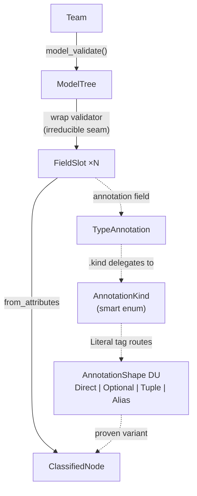

# Building Block Classifier

The building block classifier is a recursive Pydantic type tree walker that classifies every field on any `BaseModel` into its structural building block. It is a pure TCA program: no LLM, no external services, one `model_validate` at the root cascades the entire classification.

This is an advanced worked example, not the first teaching example a new reader should see. If you are new to TCA, start with the README and [build patterns](build-patterns.md). Come here once you already know the pattern language and want to watch those moves execute in a dense recursive program.

The full implementation is in [`tca/building_block.py`](../tca/building_block.py).

---

## Why This Example Matters

This is not just a handy tool. It is proof that a non-trivial recursive program can live almost entirely in frozen models, self-classifying wrappers, discriminated unions, and projections. The calling code does almost nothing. The type tree wires itself. That is the TCA claim made concrete.

It matters for a second reason too: it shows that the broader pattern language is not just for transport edges or business APIs. The same construction moves still work in a recursive structural analysis program. Once you can recognize wiring, dispatch, orchestration, recursive unfolding, and the irreducible seam here, you know the ideas are genuinely general.

Every type in a Pydantic program is one of eight building blocks:

| Block | What it is | Pydantic construct |
|:---|:---|:---|
| ENUM | Closed vocabulary | StrEnum |
| NEWTYPE | Semantic scalar wrapper | RootModel[scalar] |
| COLLECTION | Immutable sequence wrapper | RootModel[tuple[T, ...]] |
| RECORD | Frozen product with named fields | BaseModel, frozen=True |
| ALGEBRA | Record + derived fields | Record + @computed_field |
| EFFECT | Record + side effects on construction | Record + model_post_init |
| SCALAR | Primitive (str, int, bool, etc.) | bare Python types |
| UNION | Multi-member union (A \| B) | any union, 2+ non-None members |

The classifier determines which block a type is through pure construction — not through if/elif chains or visitor patterns.

---

## What The Root Proves

```python
tree = ModelTree.model_validate(Team)
```

`ModelTree` is the root. Its construction discharges one proof obligation: every field on `Team` has been classified into a structural building block. If `tree` exists, classification succeeded for every field, recursively.

The orchestration root `ClassifierRun` wraps this with lazy projections that extend the proof into report and text output:

```python
class ClassifierRun(BaseModel, frozen=True, extra="forbid"):
    target: ImportPath

    @cached_property
    def model_class(self) -> type[BaseModel]:
        return self.target.resolve()

    @cached_property
    def tree(self) -> ModelTree:
        return ModelTree.model_validate(self.model_class)

    @cached_property
    def report(self) -> TreeReport:
        return TreeReport.model_validate(self.tree)

    @cached_property
    def text(self) -> str:
        return self.report.text
```

One stored field. Four derivations. The chain fires lazily on first access. `ClassifierRun` is itself a construction machine — the CLI is not a script that calls functions, it is a frozen model whose projections are the program.

---

## The Cascade



| Step | Input | Mechanism | Output |
|:---|:---|:---|:---|
| 1 | `Team` (BaseModel class) | `model_validate` | `ModelTree` construction begins |
| 2 | `model_fields.items()` | wrap validator (irreducible seam) | `tuple[FieldSlot, ...]` |
| 3 | each `FieldSlot` | `from_attributes` (wiring) | `ClassifiedNode` construction begins |
| 4 | `FieldSlot.annotation` (`TypeAnnotation`) | `.kind` property delegates to `AnnotationKind` | enum member |
| 5 | `AnnotationKind` member | `Field(discriminator="kind")` routes DU | proven `AnnotationShape` variant |
| 6 | all fields of `ClassifiedNode` | coercion completes | proven `ClassifiedNode` |
| 7 | all `ClassifiedNode` instances | field assembly | proven `ModelTree` |

---

## Dispatch As Owned Classification

The classifier demonstrates dispatch twice: once for annotation form, once for type role.

**Annotation form.** `AnnotationKind` is a smart enum that classifies the structural form of a Python annotation. `TypeAnnotation` is a `RootModel[object]` wrapper that delegates to the enum via a `@property`:

```python
class TypeAnnotation(RootModel[object], frozen=True):
    @property
    def kind(self) -> AnnotationKind:
        return AnnotationKind.from_annotation(self.root)
```

The enum knows how to classify. The wrapper exposes the result. Downstream models read `.kind` via `from_attributes`. The discriminated union routes on it and the variant's `Literal` fields settle the answer:

```python
class DirectAnnotation(BaseModel, frozen=True, extra="forbid", from_attributes=True):
    kind: Literal[AnnotationKind.DIRECT] = AnnotationKind.DIRECT
    nullable: Literal[False]      # selecting this variant IS the answer
    collection: Literal[False]    # no computation needed
```

Selecting `OptionalAnnotation` IS the determination that `nullable=True`. This is the same move as "declare cases instead of branching," just in a more abstract domain. Construction replaces classification code.

**Type role.** `ResolvedType` is a second `RootModel[object]` wrapper that classifies the inner type into one of the eight building blocks. Same pattern, different domain.

---

## Wiring And Construction Chaining

The classifier chains three models: `FieldSlot` → `FieldEntry` → `ClassifiedNode`. Each reads from the previous via `from_attributes`:

```python
class FieldEntry(BaseModel, frozen=True, from_attributes=True):
    field_name: FieldName
    shape: AnnotationShape = Field(alias="annotation")

    @property
    def resolved_type(self) -> object:
        return self.shape.resolved_type

    @property
    def nullable(self) -> bool:
        return self.shape.nullable

class ClassifiedNode(FieldEntry, extra="forbid"):
    block_shape: BlockShape = Field(alias="resolved_type")
```

No intermediate dictionaries. No extraction functions. No adapter code. The models read from each other through name agreement and property delegation. The type tree wires itself.

This section is easy to underestimate because the domain is abstract. The common-sense architectural point is simple: one model exposes a surface, the next model reads it, and the mapping layer disappears.

---

## Recursion By Shape

`RecordBlock` has a `children` field. `LeafBlock` does not.

When Pydantic constructs `RecordBlock` from a `ResolvedType` via `from_attributes`, it reads `.children` — which fires `ModelTree.model_validate` on the inner type, producing more `ClassifiedNode` instances. When Pydantic constructs `LeafBlock`, it never reads `.children` because the field does not exist on the variant.

Nobody writes "if record: descend." The variant's shape IS the recursion decision. The DU selects the variant. The variant's field declarations determine whether recursion happens. This is the same move the README teaches as "unfold composite inputs": some variants are complete now, some are only complete once they construct more of their own kind.

---

## The Irreducible Seam

The entire cascade has one procedural seam: the wrap validator on `ModelTree` that iterates `model_fields.items()` and constructs `FieldSlot` instances from the `(key, value)` tuples. This is irreducible because Python's `dict` exposes keys as positional data in tuples, not as attributes on values. Someone must bridge that boundary.

The seam also handles cycle detection via a `ContextVar[frozenset[type]]` that tracks visited types. Each recursive call sees the parent's frozenset plus the current type. If a type was already seen, construction short-circuits with `cycle=True` and empty fields.

Everything else in the cascade — coercion, DU routing, construction chaining, property delegation, recursive descent — is pure construction. The seam is tiny, explicit, and justified.

That matters because this is exactly how TCA wants procedure to behave: small, named, local, and terminal. The seam does one thing the type system cannot naturally express, and then construction resumes.

---

## Orchestration And Projection

Rendering in the classifier is not a separate formatter. It is another construction/projection stage:

```python
report = TreeReport.model_validate(tree)
print(report)
```

`TreeReport` reads `ModelTree.fields` via `from_attributes`. Pydantic coerces each `ClassifiedNode` into a `FieldReport` by reading properties. Children coerce recursively. `@computed_field` projections derive display strings. `__str__` delegates to `.text`.

Two audiences, zero extra code: for humans, `__str__` returns indented text. For bots, `model_dump_json()` serializes the full recursive tree. The projection model IS the API.

This is the same architectural move as "render the final shape" in the README. Output is not rebuilt in a presenter layer. It emerges from owned truth already proven upstream.

---

## What This Example Still Leaves Open

The classifier is outstanding but not perfect. Some boundaries are still weakly modeled: bare `object` types where domain types could be tighter, `pyright: ignore` comments at the boundaries where the typing is not yet fully owned, and `ClassifierRun.target` as a bare `str` where a domain type could constrain it. The predicate table in `ResolvedType._BLOCK_MAP` is elegant but still closer to procedural classification than fully owned modeled classification.

These are not criticisms of the example. They are the frontier where the classifier itself could become more TCA — and they demonstrate that progressive hardening is an ongoing discipline, not a one-time achievement.
