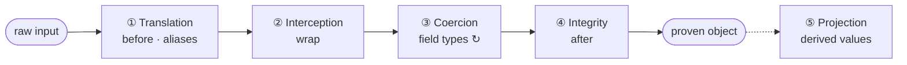

# The Construction Machine

Every Pydantic model is a machine with four eager construction layers and a lazy projection surface. You do not orchestrate these layers manually. You declare fields, aliases, validators, and projections, and the runtime executes the machine. When `model_validate(raw)` fires, the four construction layers execute eagerly. Projection fires on first access, extending the proof graph on demand.

To keep the story concrete, the examples below stay in one world: stock exchange data entering a trading domain.



---

## What The Machine Guarantees

If the machine constructs an object, that object satisfies every obligation declared in the type. If a `VenueQuote` object exists, you know: every field has the correct type, prices are non-negative, `bid` does not exceed `ask`, and all nested types constructed successfully. There is no separate validation step. There is no "invalid but present" state.

When construction fails, the failure is itself structured: `ValidationError` preserves the field path through the construction graph, the error type, and the rejected input. A failed proof diagnoses exactly where in the construction tree the obligation was not met.

---

## Translation

`mode="before"` validators and field-level aliases reshape raw input before field construction begins. Foreign structure becomes owned structure. Translation is the machine's ingestion preprocessor, not an adapter layer living somewhere else.

`Field(alias="sym")` maps external vocabulary to owned vocabulary at the declaration. A `mode="before"` validator can flatten a payload wrapper or restructure a mismatched transport shape once, at the boundary:

```python
class NasdaqTradeWire(BaseModel, frozen=True, extra="forbid", populate_by_name=True):
    symbol: Symbol = Field(alias="sym")
    price: Price = Field(alias="px")
    quantity: Quantity = Field(alias="qty")

    @model_validator(mode="before")
    @classmethod
    def unwrap_payload(cls, data: dict[str, object]) -> dict[str, object]:
        return data["payload"] if "payload" in data else data
```

Translation replaces the reflex to unpack raw blobs in transport code or helper functions. Normalize once, then let construction continue.

---

## Interception

`mode="wrap"` validators receive the raw input and the inner constructor as a callable. They alone control whether and how construction proceeds. A wrap validator can inspect the input, decide if construction should happen at all, reshape the input, and call the inner constructor exactly once.

This is how abstract base types seal themselves so only concrete variants construct:

```python
class TradeInstruction(BaseModel, frozen=True):
    @model_validator(mode="wrap")
    @classmethod
    def _seal(
        cls,
        data: object,
        handler: Callable[..., TradeInstruction],
    ) -> TradeInstruction:
        result = handler(data)
        if type(result) is TradeInstruction:
            raise TypeError("Construct MarketOrder or BasketOrder directly")
        return result

class MarketOrder(TradeInstruction, extra="forbid"):
    symbol: Symbol
    quantity: Quantity
```

Wrap also handles reshape patterns where a `mode="before"` validator would cause infinite recursion by re-triggering itself. Use it when you truly need control over whether the machine proceeds and how often the inner constructor is called.

---

## Coercion

Every field's type annotation is a construction instruction. Pydantic reads the incoming data and constructs each field value through the type's own pipeline. Nested models fire their own construction machines recursively. This is not type checking — the runtime is constructing the field value, not asking "is this already the right type?"

```python
class DomainTrade(BaseModel, frozen=True, extra="forbid", from_attributes=True):
    symbol: Symbol
    price: Price
    quantity: Quantity

class CrossVenueContext(BaseModel, frozen=True, extra="forbid"):
    nasdaq_trade: DomainTrade
    nyse_trade: DomainTrade
    nasdaq_quote: VenueQuote
    nyse_quote: VenueQuote
```

Not every domain type needs a full model. `Annotated` types with Pydantic constraints are construction instructions at the field level:

```python
Symbol = Annotated[str, MinLen(1), MaxLen(8)]
Price = Annotated[Decimal, Ge(0)]
Quantity = Annotated[int, Ge(1)]
VenueName = Annotated[str, MinLen(1)]
Spread = Annotated[Decimal, Ge(0)]
```

When `from_attributes=True` is set, Pydantic reads attributes from the input object by name — properties included — so one model's projection surface feeds another model's construction. When a field is a discriminated union, Pydantic reads the tag and routes to the correct variant automatically. This is where the [core mechanisms](mechanisms.md) execute: wiring reads attributes by name, dispatch routes on tags, and the types constructed here may themselves trigger further construction through their projections.

Coercion is the heart of the construction machine. If construction isn't working, the fix is almost always a missing intermediary model, a smarter alias, or a discriminated union — not a validator.

Pydantic's default is lax mode, where coercion IS construction: a string becomes an int, a dict becomes a model. `strict=True` requires exact type matches without coercion, appropriate at proven-to-proven boundaries where data has already been constructed upstream and re-coercion would mask type errors.

`TypeAdapter` extends construction beyond models: `TypeAdapter(list[DomainTrade]).validate_python(raw)` fires the construction machine on any type annotation, making standalone validation of unions, collections, and constrained types a first-class operation.

---

## Integrity

`mode="after"` validators exist for one reason: cross-field constraints that type annotations alone cannot express. If a single field's validity can be captured by its type — an enum, a constrained primitive, a nested model — no validator is needed. Construction of the type IS the proof.

After-validators appear only when the relationship between two or more already-constructed fields must be checked:

```python
class VenueQuote(BaseModel, frozen=True, extra="forbid"):
    venue: VenueName
    symbol: Symbol
    bid: Price
    ask: Price

    @model_validator(mode="after")
    def bid_must_not_exceed_ask(self) -> Self:
        if self.bid > self.ask:
            raise ValueError("bid must not exceed ask")
        return self
```

A `VenueQuote` whose `bid > ask` does not "fail validation." It fails to construct. The machine will not produce it.

---

## Projection

Derived values live on the machine that owns the fields they derive from. If calling code computes an intrinsic derivation from a machine's fields externally, that computation is a wiring defect: it belongs on the machine's projection surface.

Projection is also the mechanism by which proven machines trigger further construction. A `@cached_property` that calls `model_validate` extends the proof graph. Projection has three forms, distinguished by their API contract:

| Form | Cached | Serialized | Use |
|:---|:---:|:---:|:---|
| `@computed_field` + `@cached_property` | Yes | Yes | Public contract: appears in `model_dump()` and JSON |
| Bare `@cached_property` | Yes | No | Expensive internal derivations, indexes |
| Bare `@property` | No | No | Delegation to downstream `from_attributes` readers |

When a projection has cases, the cases belong in an enum and the projection delegates:

```python
class SpreadSignal(StrEnum):
    NORMAL = "normal"
    WIDE = "wide"

    @classmethod
    def from_spread(cls, spread: Spread) -> SpreadSignal:
        if spread >= Spread("0.50"):
            return cls.WIDE
        return cls.NORMAL
```

```python
@computed_field
@cached_property
def widest_offer_gap(self) -> Spread:
    return Spread(self.nyse_quote.ask - self.nasdaq_quote.bid)

@computed_field
@cached_property
def signal(self) -> SpreadSignal:
    return SpreadSignal.from_spread(self.widest_offer_gap)
```

Bare `@property` is how wrappers and models expose derived attributes for downstream `from_attributes` reads, and how models flatten nested structure for consumption by other models. Projection is where a model starts to feel like an active semantic world rather than a passive record.

---

## Trust Conditions

Construction is proof only if the construction pipeline is trustworthy. Two model configs and three rules make it so.

**`frozen=True`** means proof does not decay. Immutability makes projections referentially transparent and construction a permanent proof. A `@cached_property` on a frozen model computes once and never goes stale. Without `frozen=True`, fields can change after construction, cached projections diverge from current state, and "the object exists therefore it's valid" stops being true the moment someone mutates a field.

`frozen=True` protects the model's own field bindings, not the internals of field values. The guarantee holds fully only when field types are themselves immutable: frozen models, enums, tuples, and constrained primitives. A bare `list` or `dict` as a field type allows mutation behind the frozen surface.

**`extra="forbid"`** means the machine rejects what it does not declare. Without it, unknown fields pass silently through the boundary. A model that accepts `{"name": "Kyle", "ssn": "123-45-6789"}` when it only declares `name` has not proven its input. It has discarded data it never examined. That is data loss, not proof.

`extra="forbid"` is the default for internal model-to-model boundaries. At loose ingestion boundaries (third-party APIs, user input with evolving schemas), permissive acceptance may be a deliberate transitional choice; the discipline is to tighten toward `forbid` as the domain stabilizes.

**Rule 1: Validators must be total and side-effect free.** They must always return or raise. Never hang, never diverge. They must not perform I/O, mutate external state, or depend on anything outside the data they receive. A validator that reads a database has smuggled an ambient dependency into the proof.

Validation context (`model_validate(data, context={...})`) is the sanctioned mechanism for validators that genuinely need ambient read-only information: locale, feature flags, request-scoped config. The context is explicitly passed at the call site, not smuggled through global state.

```python
class ListedSymbol(BaseModel, frozen=True, extra="forbid"):
    symbol: Symbol
    primary_venue: VenueName

class QuoteRequest(BaseModel, frozen=True, extra="forbid"):
    listed_symbol: ListedSymbol
    venue: VenueName

    @model_validator(mode="before")
    @classmethod
    def resolve_symbol(cls, data: dict, info: ValidationInfo) -> dict:
        return {
            **data,
            "listed_symbol": info.context["symbol_index"][data["symbol"]],
        }

symbol_index = load_symbol_index(db)
request = QuoteRequest.model_validate(raw, context={"symbol_index": symbol_index})
```

The before-validator translates a raw symbol token into a proven `ListedSymbol` from a pre-fetched index. If anything is wrong, construction fails. The request emerges carrying a proven `ListedSymbol`, not a bare string. Testing passes a dict literal.

**Rule 2: Properties consumed by `from_attributes` must be pure and terminating.** When Pydantic reads a property via `from_attributes` during coercion, that property is participating in construction. It must be a pure function of the object's own frozen fields. This is the one place where the construction machine can be silently undermined, because a property masquerades as data access while executing arbitrary code.

**Rule 3: Construction must remain pure; effects belong after proof.** The four construction layers must be free of side effects. `model_post_init` is one legitimate post-proof hook for effects that must fire immediately upon construction, but many effects belong outside the model lifecycle entirely. The model is frozen by the time `model_post_init` fires; it may change the world, but it must not change the object.

Given this discipline, three properties hold:

1. **No invalid states.** If a value exists, its invariants hold. Immutability ensures the proof doesn't decay.
2. **Compositionality.** Each model's proof is independent. Adding a child type does not change the parent's proof obligations.
3. **Refactor stability.** Moving a derivation between projection forms does not change the model's meaning — only its serialization surface.
