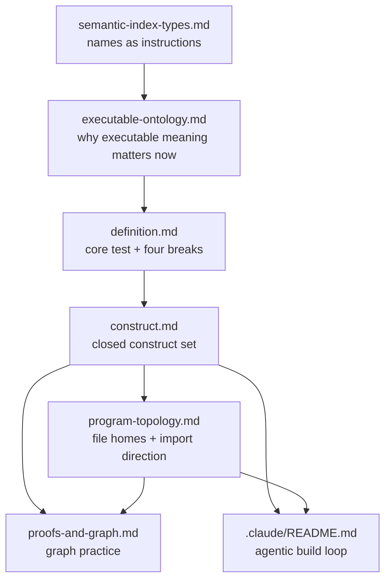

# Learning TCA

This is the guide through the TCA doctrine. The main [`README.md`](../README.md) explains what this repository gives you. This document teaches how the docs fit together, what to read first, and how to use the doctrine while designing, auditing, or building.

You do not need to read everything before you can start. You do need one mental model:

> Meaning lives in the structure of the type, and construction is its proof.

A value exists only when the fact it represents has been proven. A validation you would write later is a type you have not written yet. A mapper that copies fields is a sign that one meaning has been split across places. A service method that computes a fact from a model's own fields is a derivation that escaped its owner.

## The Fast Path

Read these in order if you are new:

1. [`definition.md`](definition.md): the core test and the four breaks.
2. [`executable-ontology.md`](executable-ontology.md): why the old split between ontology and runtime now has execution cost.
3. [`construct.md`](construct.md): the closed set of legal program shapes.
4. [`program-topology.md`](program-topology.md): where those shapes live and which direction dependencies flow.
5. [`proofs-and-graph.md`](proofs-and-graph.md): how to start from proof obligations and read the construction graph.
6. [`.claude/README.md`](../.claude/README.md): how this repo turns the doctrine into a human-directed agentic build loop.

That order is deliberate. First learn the test, then the reason it matters now, then the legal homes, then the program graph, then the practice of using the graph, then the build machinery that keeps agents inside it.

## The Whole Map

Read the arrows as dependencies of understanding. You can enter from the problem you have, but the docs are strongest when each one keeps its own job.

## What Each Doc Teaches

[`definition.md`](definition.md) is the doctrine in its smallest form. It gives the one-to-one correspondence between meanings and structures, then names the four ways that correspondence breaks: escaped, duplicated, vacuous, and fused. Use it when a design argument feels subjective. The question is not "which shape do I prefer?" The question is "does this meaning have exactly one structural home, and does this structure carry exactly one meaning?"

[`executable-ontology.md`](executable-ontology.md) is the why-now argument. It explains the event: a neural reader now consumes the program's semantic surface at the application's execution surface. That makes every mismatch between semantic structure and runtime mechanism more expensive. It also places TCA beside knowledge graphs and type-driven traditions as kin, not competitors.

[`construct.md`](construct.md) is the rulebook. It is not background reading. It is the source every legal source shape derives from: definitions, required forms, sorting rules, replaced forms, allowed patterns, forbidden patterns, and substrate claims. If a structure feels missing, read this before inventing a helper, mapper, validator, service, branch, or fallback.

[`program-topology.md`](program-topology.md) is the ownership map. TCA is not only a set of model shapes; it is a dependency graph. Scalars sit at the root, values compose scalars, concepts compose declared types, the consistency model is the one live node, and edge files wire transport and startup without owning domain meaning.

[`proofs-and-graph.md`](proofs-and-graph.md) is the practice guide. It teaches how to start from a proof obligation instead of a class shape, how to recover the hidden construction graph from procedural code, and how to decide whether a shared leaf is honest reuse or a fused meaning.

[`semantic-index-types.md`](semantic-index-types.md) explains why names are not inert when AI is in the loop. Traditional runtimes treat names as identity keys; language models read names, field descriptions, and variant labels as meaning. Use it when a schema, rename, field description, or exposed type surface can change model behavior.

## How To Use The Docs

If you are trying to understand TCA, read [`definition.md`](definition.md), then [`executable-ontology.md`](executable-ontology.md). The first gives the test. The second explains why the test matters more now.

If you are modeling a feature, start with [`definition.md`](definition.md) for the four breaks, use [`proofs-and-graph.md`](proofs-and-graph.md) to name the proof obligation, use [`construct.md`](construct.md) to choose the legal home, and use [`program-topology.md`](program-topology.md) to place it.

If you are auditing existing code, start with [`proofs-and-graph.md`](proofs-and-graph.md). Find terminals, trace them to leaves, then use [`construct.md`](construct.md) to classify escaped meanings and [`program-topology.md`](program-topology.md) to find ownership and import violations.

If you are reviewing AI-facing surfaces, read [`semantic-index-types.md`](semantic-index-types.md) with [`executable-ontology.md`](executable-ontology.md). The key question is whether the same structure that constrains the machine also gives the model the right semantic instruction.

If you are using this repository's agentic workflow, read [`.claude/README.md`](../.claude/README.md) after the doctrine spine. The build system is not a second doctrine. It is a constrained way to make agents consume the doctrine without drifting back into procedural Python.

## The Build Loop In One Paragraph

Product intent goes into the target's `spec/product.json`. Program meanings go into the target's `spec/ontology.json`. The ontology rows choose construct homes and file homes before source is built. The builder renders rows through construct cards. The gate checks catalog coherence and source conformance. Human review decides whether the product judgment, ontology, ledger, generated files, and proof runs actually satisfy the work.

The docs feed that loop:

- [`definition.md`](definition.md) supplies the break taxonomy used in ontology review and violation ledgers.
- [`construct.md`](construct.md) is mirrored into construct cards in [`../.claude/skills/`](../.claude/skills/).
- [`program-topology.md`](program-topology.md) is distilled into [`../.claude/skills/tca-topology/SKILL.md`](../.claude/skills/tca-topology/SKILL.md) and checked by the gate.
- [`proofs-and-graph.md`](proofs-and-graph.md) gives the human reviewer a way to reason from obligations to graph shape.
- [`semantic-index-types.md`](semantic-index-types.md) explains why exposed names and descriptions are part of the AI behavior surface.

## Check Yourself

You are starting to read TCA correctly when these questions become automatic:

1. What meaning is this structure the one home for?
2. What construction proves this fact exists?
3. If I want to write a step, what object is that step trying to prove?
4. If I want a helper, which model owns the fact it computes?
5. If I want a branch on a kind, where should the union have constructed the case?
6. If I want to copy a field across a boundary, which structure already owns that meaning?
7. If a type is shared, does the leaf carry the intrinsic meaning and the edge carry the role?
8. If a name changes, have I changed an instruction a language model reads?

## The Rule Of Thumb

Do not start from code shape. Start from the obligation. Name the value whose existence proves it. Find the construct that carries that meaning. Put it where the topology says it belongs. Then let construction do the work.
