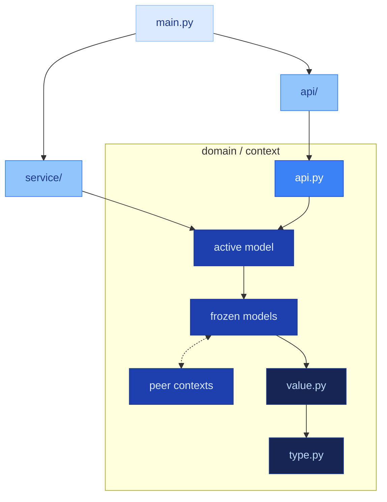

# TCA Program Topology

The structural companion to TCA's doctrine — [the authority](type-construction-architecture.md) and [build patterns](build-patterns.md) taken together. The doctrine defines what the constructs are and how to build them; this document defines where that code belongs. One without the other is incomplete: well-constructed code in the wrong place, or correctly placed code written as procedure.

---

## The Dependency Graph

A TCA program has gravitational structure. The densest layer — the scalars — sits at the bottom. Everything above composes from below. Nothing below depends on what is above.

`main.py` is the composition root — it reaches across to both `service/` and `api/` to wire the program together. Service and route both reach inward to `domain/`. Inside `domain/`, a strict layered dependency descends from the active model down to `type.py`. The arrow means "imports from."

Peer domain contexts compose freely at the frozen model layer. `domain/catalog/type.py` may be imported by `domain/inventory/stock.py`. Domains are primitives, forged to be combined.

---

## File Roles

### `main.py`

**Is:** The composition root.
**Contains:** Dependency construction, service startup, route registration.
**Imports from:** `config.py`, `service/*.py`, `api/*.py`.
**Imported by:** Nothing.

This is the outermost shell. It builds the clients, passes them to services, and registers routes with the framework. The only file that reaches across both service and route layers.

### `config.py`

**Is:** Typed configuration.
**Contains:** Pydantic `BaseSettings` models.
**Imports from:** Standard library, third-party only.
**Imported by:** `main.py`, services.

Configuration is a constructed model. A `BaseSettings` object that exists is proven valid — environment variables are typed, constrained, and owned, not scattered as bare `os.environ` reads.

### `api/context.py`

**Is:** A route file. One per domain context with an API surface.
**Contains:** Route definitions using framework decorators. Request and response types are imported, not defined here.
**Imports from:** `domain/context/api.py` for contracts. Framework imports for routing.
**Imported by:** `main.py` for route registration.

The route is a membrane. It maps transport (HTTP, websocket) to domain contracts. Every route file has the same shape: import contracts, declare endpoints, defer to domain types. When a route file grows interesting, meaning has escaped from the domain.

### `service/context.py`

**Is:** A transport shim. One per domain context with a transport dependency.
**Contains:** A class with a single connect function. The connect function accepts a client (message bus, database, HTTP) and binds it to the context's active model.
**Imports from:** `domain/context/[active_model].py`.
**Imported by:** `main.py` for service startup.

The connect function may include transport-level setup: connection, authentication, channel subscription. It contains no domain logic, no derivation, no classification, no computation. Every service file has the same boring shape. If a service becomes interesting, it is doing work that belongs on the active model.

---

## Domain Structure

Everything that matters lives in `domain/`. Each context is a subdirectory named for the domain concept it represents — not for a technology, not for a framework role, not for an architectural pattern.

Inside each context, files have a strict layered dependency. Each layer composes from the layers below it and is composed by the layers above.

### `type.py`

**Is:** The dependency root. The atomic vocabulary.
**Contains:** `RootModel` subclasses with `frozen=True` and `Field()` constraints.
**Imports from:** Standard library and third-party only. Nothing from the program.
**Imported by:** Everything. Every file in this context and every peer context may import from `type.py`.

Each scalar owns a single value with identity, constraints, and semantic distinction. `LineNumber` is not `int`, it carries `ge=1` and is a different type than `ColumnOffset`, which is also `int` with `ge=0`. The type system distinguishes them. Bare primitives do not.

### `value.py`

**Is:** The second layer. Composed value objects.
**Contains:** `BaseModel` subclasses with `frozen=True` that compose scalars into richer structures.
**Imports from:** `type.py` in its own context. Nothing else from the program.
**Imported by:** Frozen domain models, the active model, `api.py` in this context.

A `SourceLocation` composes `LineNumber` with optional `ClassName` and `MethodName`. A `Smell` composes `InvariantName`, `Message`, and `SourceLocation`. These are small proven compositions, richer than a single scalar and simpler than a full domain model.

### `[concept].py` — Frozen Domain Models

**Is:** A domain concept, named for what it represents. `product.py`, `order.py`, `inventory.py`, `customer.py`.
**Contains:** `BaseModel` subclasses with `frozen=True`. Derivations as `@cached_property`, `@computed_field`, or `@property`.
**Imports from:** `type.py` and `value.py` in this context. Scalars, values, and frozen models from peer contexts.
**Imported by:** The active model, `api.py`, other frozen models in this context or peer contexts.

Each frozen model is a proven snapshot — correct as of the moment it was built. Its derivations extend that proof. A `@cached_property` that computes from the model's own proven fields is an intrinsic fact that belongs to this model and no other.

Cross-context imports at this layer are natural. Domains are primitives, not sealed bounded contexts. A frozen model in `domain/order/` composing with a scalar from `domain/catalog/type.py` is expected — the dependency graph permits peer-level composition.

### `[active_model].py`

**Is:** The convergence point. One per context.
**Contains:** A `BaseModel` that composes all layers below it. Domain logic as construction, derivation, and projection. May hold a transport client as a field.
**Imports from:** `type.py`, `value.py`, frozen domain models in this context, peer context types.
**Imported by:** `service/context.py` for transport binding. `api.py` for contract composition.

Named for the domain concept it represents: `catalog.py`, `cart.py`, `session.py`. Not `active_model.py`, not `state_manager.py`, not `orchestrator.py`.

**The single frozen exception.** The active model may be unfrozen — the only model in the program permitted to be. It represents live state of a bounded context that evolves through model operations on this single object. The mutability is contained:

- One unfrozen model per context. A second unfrozen model means the context is two contexts, or mutability has escaped its container.
- State evolves through model operations — construction, field-level updates through model methods, derivation. Not through external code reaching in to set attributes.
- The unfrozen exception is earned by being the convergence point, not granted to any model that finds freezing inconvenient.

### `api.py`

**Is:** Route contracts. Domain-owned boundary types.
**Contains:** `BaseModel` subclasses defining what crosses the API surface. Request models, response models, contract types.
**Imports from:** `type.py`, `value.py`, frozen domain models in this context.
**Imported by:** `api/context.py` route files.

The contracts live in the domain because the domain owns what crosses the boundary. Route files are consumers of these contracts. Types flow outward — domain defines, edge imports. Never the reverse.

---

## The Naming Principle

Every file in `domain/` is named for a concept the domain contains. This is a consequence of the types owning the program: if the types are the program, and each type represents a domain concept, then the files that contain those types are the domain vocabulary made visible as directory structure.

**Domain-concept names** describe what the program contains: `product`, `order`, `event`, `inventory`, `session`, `customer`, `invoice`. They differ between projects because domains differ.

**Technology-pattern names** describe what frameworks do: `store`, `repository`, `handler`, `controller`, `manager`, `processor`, `router`, `crud`. They appear in every project regardless of domain.

**Dumping-ground names** admit that code has no domain owner: `utils`, `helpers`, `common`, `misc`, `shared`. In a TCA program every piece of logic belongs to a domain concept. If the concept cannot be named, the logic belongs on an existing model as a derivation.

A domain concept may exist in multiple contexts independently. `event.py` in every context that has domain events is correct — each context owns its own event types. A technology name in every context (`store.py` in each one) is the opposite signal: files are named for the pattern, not the domain.

The test: does this filename describe something the domain *contains*, or something the technology *does*?

---

## Cross-Context Composition

Domains compose freely across context boundaries at the frozen model layer and below. A model in `domain/order/` may import scalars from `domain/catalog/type.py` and frozen models from `domain/catalog/product.py`. The dependency graph permits this — frozen models see their own type and value layers plus peer context types.

The constraints:

- **Direction is always inward.** Domain modules never import from services, routes, or infrastructure. Cross-context imports flow between domain peers only.
- **Ownership follows the domain.** When a model serves multiple contexts, it lives in the context whose domain concept it most directly represents. When one context already depends on another, the shared model lives in the depended-upon context.

---

## Structural Properties

These properties hold for every TCA program. They are the invariants of the topology itself.

**Every model is frozen except the active model.** Frozen means proven and sealed. The active model earns its exception by being the single convergence point of live context state. One exception per context.

**`type.py` imports nothing from the program.** It is the root. If it looks upward, the entire dependency hierarchy is compromised — every file that imports from `type.py` now transitively depends on whatever `type.py` imported.

**`value.py` imports only from `type.py` in its context.** It is the second layer. It composes scalars and nothing else.

**Types flow from domain toward edge.** Domain defines types. Services, routes, and `main.py` import them. No edge file defines a type that a domain file imports.

**Every file in `domain/` is named for a domain concept.** Technology-pattern names and dumping-ground names are structural violations, not style preferences.

**Services have one shape.** A class with a connect function that accepts a client. Transport binding only. If the shape varies, domain logic has escaped.

**Routes import contracts from `domain/context/api.py`.** They do not define their own request or response models. The domain owns its boundary types.

---

## Reading The Program

The topology is self-documenting. Each layer answers a specific question:

| Layer | Answers |
|:---|:---|
| `main.py` | What services and routes compose this program? |
| `config.py` | What does the program require from its environment? |
| `service/` | What transport connections does the program hold? |
| `api/` | What surfaces does the program expose? |
| `domain/context/type.py` | What are the atomic values? |
| `domain/context/value.py` | How do those values compose? |
| `domain/context/[concept].py` | What concepts does the domain contain? |
| `domain/context/[active_model].py` | Where does live state converge? |
| `domain/context/api.py` | What crosses the boundary? |

Open the domain directory and read the domain. The file listing is the vocabulary. The import graph is the dependency structure. The active model is where the context comes alive. No file is mysterious. No file requires reading other files to understand its role.
