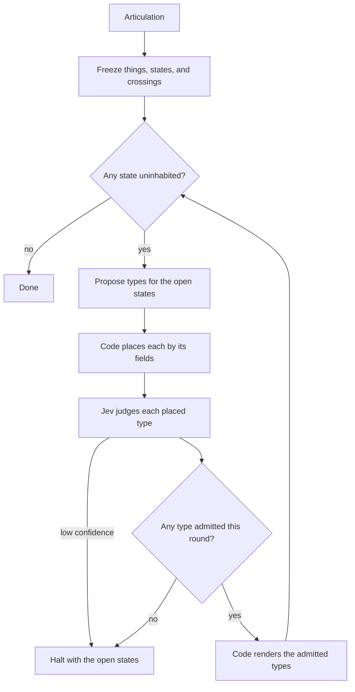

# TCA agent

The build starts once a domain is articulated. It runs unattended until that domain has been built correctly.

## Why this build fails

Usually agents fail at this kind of build because their context is a plan of the run, so the types they write are the stages of that run. We made the model keep a complete list of the domain's nouns and rethink that list before every write. That succeeded because the only thing in front of it was the domain, and a gap came back as a missing noun instead of a next step.

## What a System One model is for

A System One model is valuable because it returns a calibrated probability over an answer you already declared, so software can act or stop without the model writing what happens next. In a dev agent that is a judge on a proposal the agent already made: it can reject a type that is a stage of a run, and it cannot turn the rejection into the next step.

## The worklist

At go, the articulation is frozen into a domain record: the things, the states of those things, and the crossings. That record is what correct is checked against. Each round, an LLM proposes types only for states that still have no inhabitant, and a proposal may name only types already admitted. Code places each proposal by its fields. The fields must be types from a level above. A proposal that refers to a type not yet admitted, or that cannot be placed, is not admitted. Jev then judges each placed proposal on what a parser cannot see: whether its name is a stage of a run, whether it names a thing of its own, whether it inhabits the state it claims, and whether that thing is in the articulation. A low-confidence answer halts the build and leaves the open states open. Code renders every admitted type into its file. The model never writes the file. A round that admits nothing halts the same way. The build is done when every state is inhabited and every crossing is admitted.

## Flow

