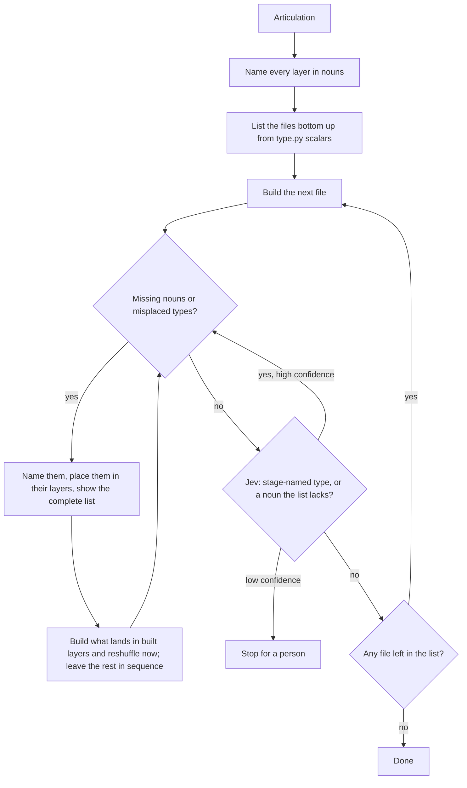

# TCA agent

The build starts once a domain is articulated. It runs until every layer of that domain is built and nothing is missing from the model.

## Why this build fails

The model plans by simulating the run. Left alone, it decides what happens next, and it writes the stages of that run as types. What corrected it was one question about the domain, asked after every file: "Now that you built that, are we missing any nouns?" A file just built shows what it needed and did not have, so the answer comes back as missing nouns and misplaced types, never as a next step.

## The list

Before any file is written, the model names every layer of the domain in nouns, then lists the files that will hold them in dependency order, bottom up from the scalars in `type.py`. That list is the only state the build keeps. Whenever it changes, it is shown whole, never as a change, so the whole domain stays in front of the model.

## The loop

Build the next file, then ask whether any nouns are missing or any types are in the wrong place. The model's no is not taken on its word. Jev is given the file, the complete list and the articulation, and asked whether any type is named for a stage of the run and whether the file needed a noun the list does not have. If Jev says yes with high confidence, the noun question is asked again. If its confidence is low, the build stops for a person. If Jev agrees with the no, build the next file in the list. If the answer is yes, name each one, place it in its layer, and show the complete updated list. A noun that belongs in a layer already built, and any reshuffle of built types, goes into the very next build, because the built layers must stay a complete and correct model before anything is built on them. A noun that belongs in a layer not yet built waits in its place until the sequence reaches it. The build is done when the last file in the list is built and the question comes back no.

## Flow

