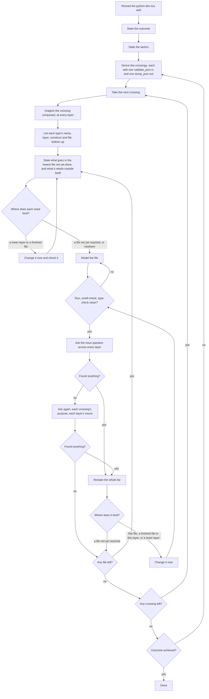

# TCA agent

The TCA agent models a domain to an outcome, one crossing at a time. It is done when every crossing is modeled, no layer has a noun missing or misplaced, and the outcome is achieved.

## Why modeling fails

Left alone, the model simulates the run: it decides what happens next and writes each stage as a type. What corrects it is the noun question, asked after every file: what is missing, named twice, named for an act, stored instead of derived, tagged instead of structured, or on the wrong layer. A file just modeled shows what it needed and did not have, so the answer comes back as nouns, never as a next step. A "no" is asked again from another angle, because the next question usually finds what the last "no" missed.

## The list

The list is the only state the work keeps: every type the domain needs, with its name, layer, construct and file, ordered bottom up by its file's dependencies. It holds no fields; a type's fields are decided when its file is the next one modeled. Whenever the list changes, it is shown whole, never as a change.

```jsonc
// The modeling list. Keep exactly one list for the work, and reprint it whole every
// time it changes, never as a diff. Add one row for every type the domain needs, named
// in the domain's own words. Order the rows bottom up, by the dependency order of their
// files, so the next file to model is always the lowest one not yet done. Put no fields
// here: decide a type's fields only when its file is the next one modeled.
{
  "$schema": "https://json-schema.org/draft/2020-12/schema",
  "title": "ModelingList",
  "type": "array",
  "items": {
    "type": "object",
    "additionalProperties": false,
    "required": ["name", "layer", "construct", "file"],
    "properties": {
      // Name the type with the noun the domain uses for this thing. Never name it for a
      // step, a stage of the run, or a mechanism ("Handler", "Processor", "Validated...").
      // If no domain word fits, the thing is not a noun yet: remodel before adding the row.
      "name": {
        "type": "string",
        "pattern": "^[A-Z][A-Za-z0-9]*$"
      },
      // Place the type on the one layer its fields allow: a type holds only types from
      // the layers above it. If no layer fits, the type is procedure: remove the row.
      "layer": {
        "enum": ["Scalar", "Value", "Thing", "Alternative", "Crossing"]
      },
      // Choose the construct from the skill's pages that this type is. Let the construct
      // agree with the layer; if they disagree, one of them is wrong: fix it now.
      "construct": {
        "enum": [
          "semantic scalar",
          "ordered union",
          "collection",
          "foreign model",
          "value object",
          "prompt template",
          "skill",
          "union",
          "concept model",
          "action",
          "contract model",
          "config",
          "transformation",
          "effect interpreter",
          "route",
          "composition root"
        ]
      },
      // Derive the file from the construct's page ("Lives in ..."): fill in only the
      // context or system name. Never choose a file the construct does not allow.
      "file": {
        "type": "string"
      }
    }
  }
}
```

## Flow

**Stage 1. Frame the work (once)**
1. **Reread the `python-dev-tca` skill.** Reason with it throughout, not from memory.
2. **State the outcome:** what the domain must be able to do when the work is finished.
3. **State the tactics:** at a high level, how the outcome is reached.
4. **Derive the crossings.** List every boundary crossing the tactics require, and mark each as new or changed. For each one, name its single `model_validate_json` coming in and its single `model_dump_json` going out.
5. **Order the crossings,** so that any crossing another depends on comes first.

**Stage 2. Model one crossing (repeat for each crossing, in order)**

6. **Imagine the crossing composed,** before writing anything: its model and every type it needs at every layer, Scalar, Value, Thing, Alternative and Crossing.
7. **Make the list.** Write each type's name, layer, construct and file, with the files ordered bottom up. The list is the whole state of the work. Put no fields in it.
8. **State what goes in the lowest file not yet done:** its types, each type's fields, and anything it needs that lives outside this file.
9. **Route those needs:**
   - A need in a lower layer, or in a file already done: change that file now, check it (step 11), then return to 8.
   - A need in a file not yet reached: add it to the list.
10. **Model the file.**
11. **Check the file:** run it, smell-check it, type-check it.
    - Issues found: fix them in this file, then return to 11.
    - Clean: continue to 12.
12. **Ask the noun question across every layer,** given everything built so far. Is there:
    - a noun missing
    - one thing under two names
    - a name for an act or a stage instead of a thing
    - a stored value that should be derived
    - a tag carrying what structure should
    - a type on the wrong layer
13. **Decision: did the question find anything?**
    - Yes: restate the whole list, then go to 14.
    - No: ask it once more, from another angle: each crossing's purpose, then each layer's nouns.
      - That finds something: restate the whole list, then go to 14.
      - Still nothing: go to 15.
14. **Route each finding by where it lands:**
    - In the file just modeled, in a file already done in this layer, or in a lower layer: change it now, then return to 11.
    - In a file not yet reached: leave it in the list, to be built when the sequence gets there.

    Everything at or below the current position stays complete before anything is built on it.
15. **Decision: is any file left in the list?**
    - Yes: return to 8.
    - No: the crossing is complete.

**Stage 3. Close the work**

16. **Decision: is any crossing left?**
    - Yes: return to 6 with the next crossing.
    - No: continue to 17.
17. **Verify against the outcome** from step 2:
    - Achieved: done.
    - Not achieved: a crossing is missing or wrong. Return to 4.


