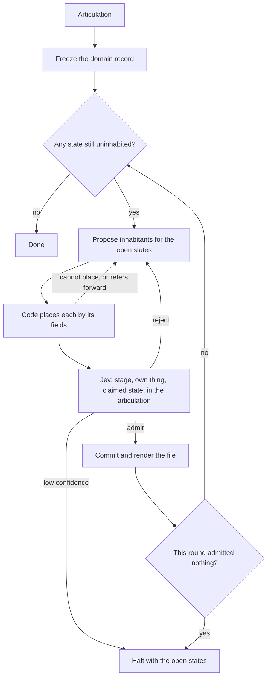

# TCA agent

## Why this build fails

Usually agents fail at this kind of build because their context is a plan of the run, so the types they write are the stages of that run. We made the model keep a complete list of the domain's nouns and rethink that list before every write. That succeeded because the only thing in front of it was the domain, and a gap came back as a missing noun instead of a next step.

## What a System One model is for

A System One model is valuable because it returns a calibrated probability over an answer you already declared, so software can act or stop without the model writing what happens next. In a dev agent that is a judge on a proposal the agent already made: it can reject a type that is a stage of a run, and it cannot turn the rejection into the next step.

## The worklist

The machine is a worklist. At go, the articulation is frozen as a domain record: the things, the states of those things, and the crossings. Code then repeats a round. An LLM proposes types only for states that are still uninhabited, and it may name only types already admitted. Code places each proposal by its fields and rejects anything it cannot place or that refers forward. Jev rules on what a parser will bless. Admitted types are rendered into files by code. A round that admits nothing halts with the states still open. Done is every state inhabited and every crossing admitted.

## Flow

