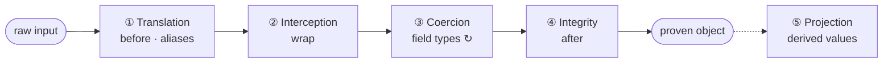
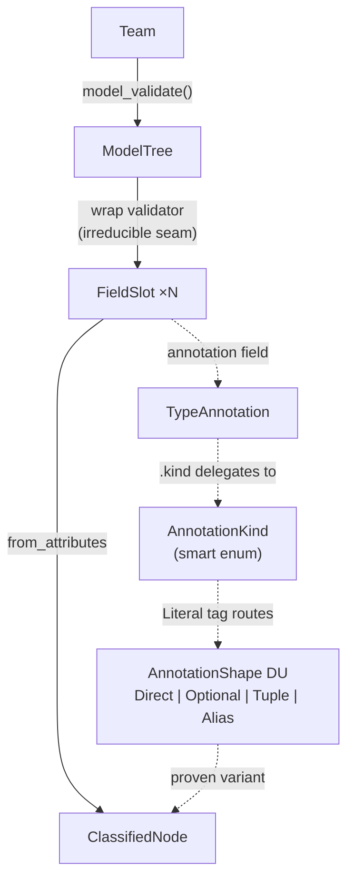

# Type Construction Architecture

## Technical Specification v0.4

**Runtime:** Python 3.12+
**Construction Language:** Pydantic v2

---

## 1. Core Thesis

Pydantic is a programming language. Python is its runtime.

```python
class Customer(BaseModel, frozen=True, extra="forbid"):
    id: CustomerId           # Annotated[str, MinLen(1), MaxLen(36)]
    name: CustomerName       # Annotated[str, MinLen(1)]
    risk: RiskProfile        # nested model, fires its own construction pipeline
    segment: CustomerSegment # StrEnum, closed vocabulary

customer = Customer.model_validate(raw)  # exists = proven. no exceptions = valid.
```

```python
class Shipped(BaseModel, frozen=True, extra="forbid"):
    kind: Literal["shipped"] = "shipped"
    tracking: TrackingNumber # proven on construction
    carrier: CarrierName

class Cancelled(BaseModel, frozen=True, extra="forbid"):
    kind: Literal["cancelled"] = "cancelled"
    reason: CancellationReason
    refund: RefundAmount

OrderStatus = Annotated[Shipped | Cancelled, Field(discriminator="kind")]
status = TypeAdapter(OrderStatus).validate_python(raw)  # no if/elif. routed and proven.
```

```python
tree = ModelTree.model_validate(Team)
# one call fires: Team -> ModelTree -> FieldSlot x N -> ClassifiedNode x N
# each FieldSlot routes through a discriminated union, classifies the annotation
# zero domain knowledge. works on any model.
```

This document explains the architecture behind these patterns.

This is not analogy. A Pydantic model is an active machine with a four-layer construction pipeline (and a lazy projection surface) that fires every time data enters it. Construction is proof: if the object exists, it satisfies every constraint declared in its type. If construction fails, no object exists. There is no third outcome. The proof is relative to what the type declares. A type that declares more proves more.

Much of the behavior in schema-rich systems emerges from sufficiently precise construction. Model the domain through type shape and the functionality follows from the construction graph.

Type Construction Architecture is the discipline of writing programs in these construction semantics. Three mechanisms compose them. **Wiring**: `from_attributes` lets one model read another's surface by name. **Dispatch**: discriminated unions route on tags; smart enums classify inputs into their members. **Orchestration**: projections on proven models construct new proven models via `@cached_property` + `model_validate`.

Orchestration is what makes this a programming paradigm. Construction drives derivation. Derivation drives further construction. This construction-derivation loop is the evaluation model of a TCA program. The loop is lazy (projections fire on first access), deterministic (frozen models guarantee evaluation-order independence), and compositional (each model's proof is independent of how it was demanded).

A TCA program is a set of proof obligations, each discharged by a root type. A classifier has one root. A service typically has three: context, input, output. A pipeline may have more. The number follows from the domain, not from a template.

Everything else (services, routes, event loops) is plumbing that hands raw data to a construction machine and receives a proven object. Many programs are far more construction-dominant than their architecture admits. The dominant alternative is strings in and strings out: untyped, unproven, unconstrained. TCA replaces hope with proof.

---

## 2. The Construction Machine

Every Pydantic model is a machine with four construction layers and a projection surface. You do not call these layers in sequence. You wire logic into them by declaring fields, aliases, validators, and computed fields. When `model_validate(raw)` fires, the machine executes the four construction layers eagerly. Projection is lazy: it fires on first access, extending the proof graph on demand.



**Translation.** `mode="before"` validators and field-level aliases reshape raw input before field construction begins. Foreign structure becomes domain structure. `Field(alias="cp_id")` maps external vocabulary to domain vocabulary at the field declaration. A `mode="before"` validator flattens nested payloads or restructures mismatched shapes. Translation is the machine's ingestion preprocessor, as native to the model as its fields, not an escape hatch for messy data.

```python
class Trade(BaseModel, frozen=True, extra="forbid"):
    counterparty: CounterpartyID = Field(alias="cp_id")
    notional: Notional = Field(alias="notional_usd")
    trade_date: date = Field(alias="trd_dt")
    maturity: date = Field(alias="mat_dt")

    @model_validator(mode="before")
    @classmethod
    def flatten_wire_format(cls, data: dict) -> dict:
        return {k: v for k, v in data.items() if k != "trade_details"} | data["trade_details"]
```

**Interception.** `mode="wrap"` validators receive the raw input and the inner constructor as a callable. They alone control whether and how construction proceeds. A wrap validator can inspect the input, decide if construction should happen at all, reshape the input, and call the inner constructor exactly once. This is how abstract base types seal themselves so only concrete variants construct, and how machines reshape input when a `mode="before"` validator would cause infinite recursion by re-triggering itself.

```python
class Instrument(BaseModel, frozen=True):
    @model_validator(mode="wrap")
    @classmethod
    def _seal(cls, data: object, handler: Callable[..., Instrument]) -> Instrument:
        result = handler(data)
        if type(result) is Instrument:
            raise TypeError("Construct Bond, Swap, or Option directly")
        return result

class Bond(Instrument, extra="forbid"):
    face_value: FaceValue
    coupon_rate: CouponRate
    maturity: date
```

`handler(data)` fires the full construction pipeline. The wrap validator inspects the result: if the concrete type is `Instrument` itself, construction fails. `Bond(...)` passes through because its concrete type is `Bond`, not `Instrument`. The wrap validator decides what may exist. In the building block classifier (Section 7), `ModelTree` uses a wrap validator for a different purpose: reshaping a `BaseModel` class into a dict of classified fields. A `mode="before"` validator would recurse infinitely because returning a `ModelTree` instance re-triggers the validator. Wrap avoids this because the handler is called exactly once.

**Coercion.** Every field's type annotation is a construction instruction. Pydantic reads the incoming data and constructs each field value through the type's own pipeline. Nested models fire their own construction machines recursively. This is not type checking. The runtime is not asking "is this already the right type?" It is constructing the field value through the type's own construction pipeline. This describes lax mode (Pydantic's default), where coercion IS construction: a string becomes an int, a dict becomes a model. Pydantic also supports `strict=True`, which requires exact type matches without coercion. Strict mode is appropriate at proven-to-proven boundaries where data has already been constructed upstream and re-coercion would mask type errors.

```python
class Customer(BaseModel, frozen=True, extra="forbid"):
    id: CustomerId           # coerces raw string through CustomerId's pipeline
    name: CustomerName       # coerces raw string through CustomerName's pipeline
    risk: RiskProfile        # constructs from nested dict (fires its own pipeline)
    segment: CustomerSegment # validates against closed StrEnum vocabulary
```

Not every domain type needs a full model. `Annotated` types with Pydantic constraints are construction instructions at the field level:

```python
CustomerId = Annotated[str, MinLen(1), MaxLen(36)]
CustomerName = Annotated[str, MinLen(1)]
Confidence = Annotated[float, Ge(0.0), Le(1.0)]
DaysToMaturity = Annotated[int, Ge(0)]
Notional = Annotated[Decimal, Ge(0)]
```

These fire during coercion like any other type. They are the lightweight alternative to `RootModel` for domain types that are constrained primitives rather than composite structures with projections.

When `from_attributes=True` is set, Pydantic reads attributes from the input object by name (properties included), so one model's projection surface feeds another model's construction. When a field is a discriminated union, Pydantic reads the tag and routes to the correct variant automatically. This is where the three mechanisms (Section 4) execute: wiring reads attributes by name, dispatch routes on tags, and the types constructed here may themselves trigger further construction through their projections. Coercion is the heart of the construction machine. If construction isn't working, the fix is almost always a missing intermediary model, a smarter alias, or a discriminated union, not a validator.

**Integrity.** `mode="after"` validators exist for one reason: cross-field constraints that type annotations alone cannot express. If a single field's validity can be captured by its type (an enum, a constrained primitive, a nested model), no validator is needed. Construction of the type IS the proof. After-validators appear only when the relationship between two or more already-constructed fields must be checked. A `DateRange` whose `start >= end` does not "fail validation." It fails to construct. The machine will not produce it. When construction fails, the failure is itself structured: `ValidationError` preserves the field path through the construction graph, the error type, and the rejected input. A failed proof diagnoses exactly where in the construction tree the obligation was not met.

```python
class DateRange(BaseModel, frozen=True, extra="forbid"):
    start: date
    end: date

    @model_validator(mode="after")
    def start_precedes_end(self) -> Self:
        if self.start >= self.end:
            raise ValueError("start must precede end")
        return self
```

**Projection.** Derived values live on the machine that owns the fields they derive from. If calling code computes an intrinsic derivation from a machine's fields externally, that computation is a wiring defect: it belongs on the machine's projection surface. Projection is also the mechanism by which proven machines trigger further construction. A projection that calls `model_validate` extends the proof graph (Section 4.3). Projection has three forms:

`@computed_field` with `@cached_property`: derived, cached, and serialized. These appear in `model_dump()` and JSON output. Use when the projection is part of the model's public contract. When a projection has cases, the cases belong in an enum and the projection delegates:

```python
class TenorBucket(StrEnum):
    SHORT = "short"
    MEDIUM = "medium"
    LONG = "long"

    @classmethod
    def from_days(cls, days: DaysToMaturity) -> TenorBucket:
        if days <= 90: return cls.SHORT
        if days <= 365: return cls.MEDIUM
        return cls.LONG
```

```python
@computed_field
@cached_property
def days_to_maturity(self) -> DaysToMaturity:
    return (self.maturity - self.trade_date).days

@computed_field
@cached_property
def tenor_bucket(self) -> TenorBucket:
    return TenorBucket.from_days(self.days_to_maturity)
```

| Form | Cached | Serialized | Use |
|:---|:---:|:---:|:---|
| `@computed_field` + `@cached_property` | Yes | Yes | Public contract: appears in `model_dump()` and JSON |
| Bare `@cached_property` | Yes | No | Expensive internal derivations, indexes |
| Bare `@property` | No | No | Delegation to downstream `from_attributes` readers |

Bare `@property` is how wrappers and models expose derived attributes that downstream models read via `from_attributes`, and how models flatten nested structure for consumption by other models. The worked example (Section 7) demonstrates: a smart enum owns classification via a classmethod, a wrapper's `@property` delegates to the enum, Pydantic reads the property during coercion, a discriminated union routes on it, and the variant's `Literal` fields settle the answer. The property bridges a wrapped value to the construction machinery that consumes it.

One `model_validate` call ignites the entire pipeline. A proven object emerges, or a construction failure is raised. The calling code does not participate in construction. It ignites the machine with raw input and receives a proven result. The proven object is not necessarily terminal: its projections can trigger further construction (Section 4.3), extending the proof graph through the construction-derivation loop. `TypeAdapter` extends construction beyond models: `TypeAdapter(list[Customer]).validate_python(raw)` fires the construction machine on any type annotation, making standalone validation of unions, collections, and constrained types a first-class operation.

---

## 3. Construction Guarantees

### Construction as Proof

The machine's existence is proof that its declared obligations were discharged. If a `Trade` object exists, you know: every field has the correct type, the notional is non-negative, the maturity follows the trade date, and all nested types constructed successfully. There is no separate validation step. There is no "invalid but present" state.

### The Snapshot Principle

Every TCA model is frozen. It captures one instant: the state of the world at construction time, proven and sealed. A frozen model never goes stale because it never claims to be current. It claims to be correct *as of the moment it was built*.

Change means re-constructing from new input. A program's evolution is a sequence of independent proofs, each a snapshot. The current state of a system is the most recent construction. The history of a system is the sequence of constructions. TCA models snapshots; transitions between them are plumbing.

This is why frozen models and pure projections guarantee determinism regardless of evaluation order. The snapshot is fixed. Every derivation from it produces the same result, whether demanded immediately or hours later. The object is a fact about the past, and facts do not change.

### The Purity Discipline

Construction is proof only if the construction pipeline is trustworthy. Two model configs and three rules make it so.

**The foundational configs: `frozen=True` and `extra='forbid'`.** These are the two guarantees that make construction a closed proof.

`frozen=True` means proof does not decay. Immutability is what makes projections referentially transparent and construction a permanent proof. A `@cached_property` on a frozen model computes once and never goes stale. A `@property` returns the same value on every access. The object you constructed is the object you have, now and forever. Without `frozen=True`, these guarantees collapse: fields can change after construction, cached projections diverge from current state, and "the object exists therefore it's valid" stops being true the moment someone mutates a field.

`extra='forbid'` means the machine rejects what it does not declare. Without it, unknown fields pass silently through the boundary. A model that accepts `{"name": "Kyle", "ssn": "123-45-6789"}` when it only declares `name` has not proven its input. It has discarded data it never examined. That is data loss, not proof. `extra='forbid'` is the default for internal model-to-model boundaries. At loose ingestion boundaries (third-party APIs, user input with evolving schemas), permissive acceptance may be a deliberate transitional choice; the discipline is to tighten toward `forbid` as the domain stabilizes.

`frozen=True` protects the model's own field bindings, not the internals of field values. The guarantee holds fully only when field types are themselves immutable: frozen models, enums, tuples, and constrained primitives. A bare `list` or `dict` as a field type would allow mutation behind the frozen surface. The domain-typed-fields principle (Section 8) prevents this in practice: every field carries a domain type, and domain types are frozen.

**Rule 1: Validators must be total and side-effect free.** `mode="before"`, `mode="wrap"`, and `mode="after"` validators must always return or raise. Never hang, never diverge. They must not perform I/O, mutate external state, or depend on anything outside the data they receive. A validator that reads a database, writes to a log, or checks a global flag has smuggled an ambient dependency into the proof. The proof is no longer self-contained.

Validation context (`model_validate(data, context={...})`) is the sanctioned mechanism for the narrow case where validators genuinely need ambient read-only information: locale, feature flags, request-scoped config. The context is explicitly passed at the call site, not smuggled through global state. It must be treated with the same discipline as every other input to the pipeline: read-only, no mutation, no I/O. This does not violate Rule 1 because the dependency is declared, not hidden.

The practical pain of this boundary is real. Consider an order that must resolve a customer ID:

```python
# WRONG: validator performs I/O, order carries a bare ID
class Order(BaseModel, frozen=True, extra="forbid"):
    customer_id: CustomerId
    items: tuple[LineItem, ...]

    @model_validator(mode="after")
    def customer_must_exist(self) -> Order:
        if not db.customers.exists(self.customer_id):  # I/O inside proof
            raise ValueError("unknown customer")
        return self
```

The proof depends on database state. Testing requires a mock. The order carries a bare ID.

```python
# RIGHT: translation resolves the ID; the order carries a proven Customer
class Order(BaseModel, frozen=True, extra="forbid"):
    customer: Customer              # proven domain object, not a bare ID
    items: tuple[LineItem, ...]

    @model_validator(mode="before")
    @classmethod
    def resolve_customer(cls, data: dict, info: ValidationInfo) -> dict:
        return {**data, "customer": info.context["customer_index"][data["customer_id"]]}

customers = load_customer_index(db)
order = Order.model_validate(raw, context={"customer_index": customers})
```

One line. No branching. The before-validator translates `customer_id` into a proven `Customer` from the pre-fetched index. If anything is wrong, construction fails. The order emerges carrying a proven `Customer`, not a string. Testing passes a dict literal.

**Rule 2: Properties consumed by `from_attributes` must be pure and terminating.** When Pydantic reads a property via `from_attributes` during coercion, that property is participating in construction. It must be a pure function of the object's own frozen fields: no I/O, no side effects, no unbounded computation. This is the one place where the construction machine can be silently undermined, because a property masquerades as data access while executing arbitrary code. The discipline is explicit: if a property feeds construction, it must be as trustworthy as a stored field.

**Rule 3: Construction must remain pure; effects belong after proof.** The four construction layers must be free of side effects. `model_post_init` is one legitimate post-proof hook for effects that must fire immediately upon construction (registration, indexing, notification), but many effects belong outside the model lifecycle entirely: service orchestration, I/O, external commands are plumbing that runs after the proven object is returned. The model is frozen by the time `model_post_init` fires; it may change the world, but it must not change the object. The principle is: proof first, then effect.

Given this discipline, three properties hold:

1. **No invalid states.** If a value exists, its invariants hold. The types constrained every field, cross-field constraints (if any) were discharged, and immutability ensures the proof doesn't decay. There is no moment after construction where the object is "valid but stale."

2. **Compositionality.** If a model's children all construct successfully, the parent's construction is purely structural (field assembly) plus any cross-field constraints it declares. You can reason about each model locally. Adding a child type does not change the parent's proof obligations. It adds a new one that the child discharges independently.

3. **Refactor stability.** Moving a pure derivation between projection forms (`@computed_field` to `@cached_property` to `@property`) does not change the model's meaning. It changes only the serialization surface (whether the value appears in `model_dump()`). This is because all three forms are referentially transparent under the frozen assumption. The choice between them is an API decision, not a semantic one.

---

## 4. Three Mechanisms

Three construction mechanisms describe how types compose through the pipeline. Each eliminates an entire category of procedural code.

| Mechanism | Pydantic feature | What it replaces |
|:---|:---|:---|
| **Wiring** | `from_attributes`, aliases | Adapter classes, DTO converters, mapping layers |
| **Dispatch** | Discriminated unions, smart enums | `if/elif` chains, `match/case` blocks |
| **Orchestration** | `@cached_property` + `model_validate` | Service-layer orchestration code |

### 4.1 Wiring: `from_attributes`

When a model declares `from_attributes=True`, it constructs by reading attributes from another object by name. Field names are the wiring. Properties count: Pydantic reads them via `getattr`. No mapping code, no adapter functions, no intermediate dictionaries. One object's surface becomes another object's input.

```python
Celsius = Annotated[float, Ge(-273.15)]
Fahrenheit = Annotated[float, Ge(-459.67)]
PressureKPa = Annotated[float, Gt(0)]

class RawSensor(BaseModel, frozen=True, extra="forbid"):
    temperature_celsius: Celsius
    pressure_kpa: PressureKPa

    @property
    def temperature_fahrenheit(self) -> Fahrenheit:  # projection surface
        return self.temperature_celsius * 9/5 + 32

class DisplayReading(BaseModel, frozen=True, extra="forbid", from_attributes=True):
    temperature_fahrenheit: Fahrenheit  # reads RawSensor's property via getattr
    pressure_kpa: PressureKPa           # reads RawSensor's stored field
```

`DisplayReading.model_validate(raw_sensor)` reads attributes by name. Properties and stored fields are both read via `getattr`. Name agreement IS the wiring.

Wiring is how data gets INTO machines. External data arrives with external names and external structure. `from_attributes` lets a machine read what it needs from any object whose attributes match its field names. Combined with aliases, this subsumes the entire category of "data mapping" code that proliferates in conventional architectures: adapter classes, DTO converters, serialization layers. In TCA, the field declaration is the mapping. Where bounded contexts maintain deliberately distinct vocabularies, aliases and before-validators declare the translation on the model itself rather than in an external adapter layer.

### 4.2 Dispatch: Discriminated Unions and Smart Enums

Instead of branching on raw data to decide which type to construct, declare a variant for each case. Each variant carries a `Literal` tag. Pydantic reads the tag and routes to the correct variant automatically. The variant's fields ARE the result.

```python
class Shipped(BaseModel, frozen=True, extra="forbid"):
    kind: Literal["shipped"] = "shipped"
    tracking: TrackingNumber
    carrier: CarrierName

class Cancelled(BaseModel, frozen=True, extra="forbid"):
    kind: Literal["cancelled"] = "cancelled"
    reason: CancellationReason
    refund: RefundAmount

OrderStatus = Annotated[
    Shipped | Cancelled,
    Field(discriminator="kind")
]

status = TypeAdapter(OrderStatus).validate_python(raw)  # reads kind, routes, proves
```

**Enum-first classification.** When classification produces a member of a closed vocabulary, the enum owns the classification logic. A smart enum (`StrEnum` with classmethods and properties) classifies inputs into its members. The enum is the authority on which of its members an input belongs to. Wrappers expose the result via a property that delegates to the enum. Boundary validators call the enum's classmethod. Consumers ask the enum; they do not replicate its logic.

`TenorBucket.from_days` (Section 2) is a simple case: the enum classifies a number into a bucket, and a computed field delegates. `AnnotationKind.from_annotation` (Section 7) is the structural case: the enum classifies a type annotation, a wrapper exposes the result as a property, and a discriminated union routes on it. Both are dispatch. The construction pipeline selects the correct case and the answer is baked into the type.

### 4.3 Orchestration: Projection-Driven Construction

The first two mechanisms describe how values flow between models (wiring) and how the correct type is selected (dispatch). The third mechanism describes how proven objects drive further proof.

A `@cached_property` that calls `model_validate` is a lazy construction trigger. The projection fires on first access, constructs a new proven object, and caches it permanently on the frozen model. This is orchestration: the construction-derivation loop made concrete. Each step produces a proven object from a proven object. The chain is: construction, derivation, construction, derivation, terminal.

The building block classifier (Section 7, "The Construction-Derivation Loop") demonstrates orchestration end-to-end: `ClassifierRun.tree` constructs a `ModelTree`, `ClassifierRun.report` constructs a `TreeReport` from the tree, and `ClassifierRun.text` derives the final output. Nothing fires until something demands it.

Orchestration is what separates TCA from a validation framework. Without it, TCA proves individual objects. With it, TCA composes proofs into programs. The three mechanisms together (wiring for data flow, dispatch for type selection, orchestration for proof chaining) cover the full space of how construction composes.

---

## 5. The Construction Graph

The construction graph has two kinds of edges:

**Field edges** are eager. A field annotation creates a dependency that must be satisfied at construction time. If the child fails, the parent cannot exist. These edges form the construction graph in the strict sense: the directed acyclic graph of what must succeed for a root to construct.

**Derivation edges** are lazy. A `@cached_property` that calls `model_validate` creates a dependency that fires on first access, not at construction time. The parent exists whether or not the derivation is ever demanded. These edges extend the proof graph on demand.

Inheritance is not a graph edge in this operational sense. When `Bond` inherits from `Instrument`, Bond's construction pipeline includes Instrument's fields, validators, and projections, but Bond does not depend on an Instrument instance. Inheritance defines machine families: related types that share construction logic. The type families from which discriminated unions select.

The following diagram shows field edges (the eager construction graph) for a service with three roots:

```
AppEnvironment
├── DatabaseConnection
├── FeatureFlags
├── CustomerIndex
│   └── Customer
│       ├── CustomerId
│       ├── RiskProfile
│       │   ├── RiskTier
│       │   ├── BehavioralSignal
│       │   └── Confidence
│       └── Segment

AnalyzeRetention
├── Customer (shared node)
├── AnalysisContext
└── AnalysisDepth

RetentionAnalysis
├── CustomerId (shared node)
├── RiskTier (shared node)
├── Intervention
├── ConfidenceFactor
└── AnalysisMetadata
```

Every type that is not a root exists because some root's field annotation references it, directly or transitively. Shared nodes appear under multiple roots. `Customer` appears under both `AppEnvironment` and `AnalyzeRetention`, but the positional meaning differs. Under `AppEnvironment`, a `Customer` is "who this system serves." Under `AnalyzeRetention`, a `Customer` is "whose retention is being analyzed." The field path from root to leaf is a sentence in the domain's language.

Derivation edges form a separate layer. In the building block classifier, `ClassifierRun.tree` is a derivation edge from `ClassifierRun` to `ModelTree`. `ClassifierRun.report` is a derivation edge from `ClassifierRun` to `TreeReport`. These edges are lazy: the objects they produce exist only when something demands them. The full proof graph is the union of field edges and derivation edges.

For the eager field graph, roots are computable. Collect all `BaseModel` subclasses in a codebase, subtract every type that appears in another type's field annotations, and the remainder are the roots. This works in both directions: forward in greenfield development (name the roots, define their fields, everything cascades), and backward in existing code (compute roots, follow annotations, discover the construction graph).

Pydantic generic models (`class Envelope(BaseModel, Generic[T])`) create parametric construction machines. `Envelope[Customer]` and `Envelope[Trade]` are different nodes in the construction graph generated from the same template. This is parametric polymorphism applied to construction: define the proof structure once, instantiate it for any payload type. Generic models compose with all three mechanisms: their fields can wire, dispatch, and orchestrate like any other model.

---

## 6. Proof Obligations and Roots

If construction is proof, then ask: what needs to be proven? A TCA program is a set of proof obligations, each discharged by a root type. The number of roots follows from the domain, not from a template.

### One root: a classifier

The building block classifier (Section 7) has one proof obligation: that a model's fields are structurally classified. One root discharges it:

```python
tree = ModelTree.model_validate(Team)
```

`ModelTree` is the root. Its construction proves that every field on `Team` has been classified into a structural building block. The orchestration root `ClassifierRun` wraps this with lazy projections (Section 7, "The Construction-Derivation Loop"), but the core proof obligation is singular: classify the fields.

### Three roots: a service

A service that takes typed input and produces typed output within a typed context has three proof obligations:

**That the preconditions hold.** The program can only act if its context is valid: connections live, configuration resolved, reference data indexed. The root that discharges it is the **Environment**: the type whose fields name everything the program knows before it acts. An Environment is stable. Its fields describe what holds before the action begins.

```python
class AppEnvironment(BaseModel, frozen=True, extra="forbid"):
    """If this constructs, the app can start."""
    database: DatabaseConnection
    feature_flags: FeatureFlags
    customer_index: CustomerIndex
```

**That the request is expressible.** The program can only act on requests its vocabulary can represent. A retention analysis request for a customer that doesn't parse into a `Customer`, with an analysis depth that isn't a valid `AnalysisDepth`, isn't a request the system can process. The root that discharges it is the **Action**: the type whose fields name what the program is being asked to do. An Action is volatile. Its fields describe what ARRIVES.

```python
class AnalyzeRetention(BaseModel, frozen=True, extra="forbid"):
    customer: Customer
    context: AnalysisContext
    depth: AnalysisDepth
```

**That the output is complete and consistent.** The program's result must satisfy its own invariants: all required fields present, cross-field constraints holding, derived values coherent. The root that discharges it is the **Result**: the type whose fields name what the program produced. A Result is derived. Its fields describe what WAS PRODUCED.

```python
class RetentionAnalysis(BaseModel, frozen=True, extra="forbid"):
    customer_id: CustomerId
    risk_tier: RiskTier
    interventions: tuple[Intervention, ...]
    confidence_factors: tuple[ConfidenceFactor, ...]
    metadata: AnalysisMetadata
```

Three roots because three distinct proof obligations. The service that connects Environment + Action to Result is plumbing.

### More roots: a pipeline

A data pipeline may have five or ten proof obligations: source schema, transformation rules, intermediate checkpoints, destination schema, reconciliation report. Each is a root. The number is not fixed. It follows from asking: what must be proven for this program to be correct? Each answer is a root type whose construction discharges that obligation.

---

## 7. Worked Example: A Building Block Classifier

The following program classifies every field on any Pydantic `BaseModel` into a structural building block: what role that type plays in a Pydantic program (enum, newtype, record, collection, scalar, etc.). It does this with zero domain knowledge. It works on any model, anywhere.

It is a pure TCA program. No LLM. No external services. One `model_validate` at the root cascades the entire classification. It demonstrates every mechanism described in this specification.

### The Cascade

```python
tree = ModelTree.model_validate(Team)
```

One call. The machine fires:



1. `ModelTree`'s wrap validator iterates `Team.model_fields.items()`, the one irreducible procedural seam in the entire cascade, because `dict` keys are not attributes and someone must pair them with values.
2. Each `(name, FieldInfo)` pair constructs a `FieldSlot` via its `mode="before"` validator, which bridges positional data (tuple) into named data (dict).
3. Pydantic coerces each `FieldSlot` into a `ClassifiedNode` via `from_attributes=True`. This is construction chaining: `FieldSlot`'s attributes become `ClassifiedNode`'s inputs through name agreement alone.
4. During that coercion, the `annotation` field (a `TypeAnnotation` wrapper) routes through a discriminated union (`AnnotationShape`) that classifies the annotation's structural form (direct, optional, tuple, or alias) without a single `if` statement.
5. The result: a tuple of `ClassifiedNode` instances, each carrying the field's name, its structural shape, and all classification flags.

| Step | Input | Mechanism | Output |
|:---|:---|:---|:---|
| 1 | `Team` (BaseModel class) | `model_validate` | `ModelTree` construction begins |
| 2 | `model_fields.items()` | wrap validator (irreducible seam) | `tuple[FieldSlot, ...]` |
| 3 | each `FieldSlot` | `from_attributes` (structural matching) | `ClassifiedNode` construction begins |
| 4 | `FieldSlot.annotation` (`TypeAnnotation`) | `.kind` property delegates to `AnnotationKind` | enum member |
| 5 | `AnnotationKind` member | `Field(discriminator="kind")` routes DU | proven `AnnotationShape` variant |
| 6 | all fields of `ClassifiedNode` | coercion completes | proven `ClassifiedNode` |
| 7 | all `ClassifiedNode` instances | field assembly | proven `ModelTree` |

### Enum-First Classification

`AnnotationKind` is a smart enum. It owns the classification logic that determines which of its members a raw type annotation belongs to. `TypeAnnotation` is a `RootModel[object]` wrapper that delegates classification to the enum:

```python
class AnnotationKind(StrEnum):
    DIRECT = "direct"
    OPTIONAL = "optional"
    TUPLE = "tuple"
    ALIAS = "alias"

    @classmethod
    def from_annotation(cls, annotation: object) -> AnnotationKind:
        o = get_origin(annotation)
        if o is types.UnionType: return cls.OPTIONAL
        if o is tuple: return cls.TUPLE
        if isinstance(annotation, TypeAliasType): return cls.ALIAS
        return cls.DIRECT

class TypeAnnotation(RootModel[object], frozen=True):
    @property
    def kind(self) -> AnnotationKind:
        return AnnotationKind.from_annotation(self.root)

    @property
    def resolved_type(self) -> object:
        return self.root
```

The enum knows how to classify. The wrapper exposes the result as a property that downstream models read via `from_attributes`. The `.kind` property fires during downstream construction when the discriminated union reads it to select a variant. Classification lives on the type whose members it produces (the enum), and the wrapper delegates.

### Discriminated Union as the Answer

The `AnnotationShape` union is the core of the classifier. Each variant represents one structural form a Python annotation can take:

```python
class DirectAnnotation(BaseModel, frozen=True, extra="forbid", from_attributes=True):
    kind: Literal[AnnotationKind.DIRECT] = AnnotationKind.DIRECT
    nullable: Literal[False] = False    # not computed; baked into the variant
    collection: Literal[False] = False  # selecting this variant IS the answer

class OptionalAnnotation(BaseModel, frozen=True, extra="forbid", from_attributes=True):
    kind: Literal[AnnotationKind.OPTIONAL] = AnnotationKind.OPTIONAL
    nullable: Literal[True] = True
    collection: Literal[False] = False

class TupleAnnotation(BaseModel, frozen=True, extra="forbid", from_attributes=True):
    kind: Literal[AnnotationKind.TUPLE] = AnnotationKind.TUPLE
    nullable: Literal[False] = False
    collection: Literal[True] = True

AnnotationShape = Annotated[
    DirectAnnotation | OptionalAnnotation | TupleAnnotation | AliasAnnotation,
    Field(discriminator="kind"),
]
```

A discriminated union dispatches INTO a type whose fields already contain the answer. A `match/case` block dispatches and then you write the logic for each case. Here, selecting `OptionalAnnotation` IS the determination that `nullable=True`. Construction replaces computation.

### Construction Chaining Through `from_attributes`

The classifier chains three models: `FieldSlot` → `FieldEntry` → `ClassifiedNode`. Each reads from the previous via `from_attributes`:

```python
class FieldEntry(BaseModel, frozen=True, from_attributes=True):
    field_name: FieldName
    shape: AnnotationShape = Field(alias="annotation")  # reads FieldSlot.annotation

    @property
    def resolved_type(self) -> object:  # flattens nested shape for downstream
        return self.shape.resolved_type

    @property
    def nullable(self) -> bool:         # flattens nested shape for downstream
        return self.shape.nullable

class ClassifiedNode(FieldEntry, extra="forbid"):  # leaf: inherits fields + properties
    ...
```

No intermediate dictionaries. No extraction functions. No adapter code. The models read from each other through name agreement and property delegation. The type tree wires itself.

### The Irreducible Minimum

The entire cascade has one procedural seam: the wrap validator on `ModelTree` that iterates `model_fields.items()` and constructs `FieldSlot` instances from the `(key, value)` tuples. This is irreducible because Python's `dict` exposes keys as positional data in tuples, not as attributes on values. Someone must bridge that boundary. Everything else in the cascade (coercion, DU routing, construction chaining, property delegation) is pure construction.

Identifying the irreducible procedural minimum is a TCA discipline. In any program, some boundaries cannot be crossed with pure construction. Those boundaries get one small validator. Everything else is wired into the type tree.

### The Construction-Derivation Loop

The building block classifier as described above fires from a single `model_validate` call. But a real classifier does more: it takes a target, constructs the tree, derives a report from the tree, and derives text from the report. This is the construction-derivation loop in action.

`ClassifierRun` is the orchestration root. Its fields are eager (they must succeed for the object to exist). Its projections are lazy (they fire on first access):

```python
class ClassifierRun(BaseModel, frozen=True, extra="forbid"):
    target: ImportPath                          # eager: must succeed to exist

    @cached_property
    def model_class(self) -> type[BaseModel]:   # lazy: fires on first access
        return self.target.resolve()

    @cached_property
    def tree(self) -> ModelTree:                # construction from proven object
        return ModelTree.model_validate(self.model_class)

    @cached_property
    def report(self) -> TreeReport:             # construction from proven object
        return TreeReport.model_validate(self.tree)

    @cached_property
    def text(self) -> str:                      # terminal derivation
        return self.report.text

# run.text forces report, which forces tree, which forces model_class.
# Accessing any @computed_field or serializing with model_dump() triggers
# the lazy chain up to that point. Nothing fires until demanded.
```

Each `@cached_property` that calls `model_validate` begins the next cascade.

---

## 8. Principles

These principles follow from the thesis. They are not design preferences. They are consequences of treating construction as proof.

### Structural

**Types at the entry.** Types constrain computation from the start. Raw data enters a construction machine at the boundary and emerges as proven objects. The types are present at every layer.

**Focused types.** Each type represents one coherent domain concept in one context. A customer as-analyzed is a different type from a customer as-indexed. Fields that belong together in every context share a type. Fields that don't, don't.

**Domain-typed fields.** Every field carries domain meaning through its type. Closed vocabularies are enums. Bounded values are constrained types. Structured formats are pattern-validated. A bare primitive must justify why it has no domain type.

**Domain types are the primary bearer of program semantics.** The domain directory (types, enums, constrained primitives, computed fields) carries the logic. Service layers wire plumbing. API layers expose projections. Neither contains domain logic. If domain logic lives outside the types, it is in the wrong place.

Types compose through composition (field annotations require the child to construct before the parent), inheritance (a child's machine includes the parent's fields, validators, and projections), and structural matching (`from_attributes` reads any object whose attributes match field names). The choice follows from the domain: does this type contain another, share construction with another, or read another's surface? All three fire through the same construction pipeline.

**Derivation belongs on the machine, if it is intrinsic.** A derivation is intrinsic when it depends only on the object's own proven fields. Intrinsic derivations are projections: they belong on the machine, and if calling code computes one externally, that is a wiring defect. A derivation is contextual when it depends on external state: user locale, request time, feature flags, another model's fields. Contextual derivations do not belong on the type. They are computations in a larger environment, and forcing them onto the machine creates god models with ambient context leaks. The distinction is fundamental. The machine owns its intrinsic knowledge. External code owns contextual interpretation.

### Development

**Shapes first.** Define the types before writing any procedural code. The types are the specification. If you cannot express the domain as types, you do not yet understand the domain. Development proceeds: domain types, then vocabularies (enums), then plumbing (services, routes). If you are reaching for a validator, ask first: can a better shape solve it? An intermediate model, a smarter alias, a constrained type, or a discriminated union almost always can. Validators exist only at irreducible boundaries: cross-field constraints that types cannot express, or translation seams where foreign structure must be reshaped. The worked example (Section 7) has exactly one procedural seam in the entire cascade.

**Name precisely.** Field names are the interface between domain knowledge and computation. Use domain vocabulary, not programmer vocabulary: `churn_risk_tier`, not `risk_level`. Disambiguate with docstrings: if two terms could be confused, the docstring resolves it. Enum members are a closed vocabulary, and each member carries meaning. Treat renames as you would changing a function's logic, because that is what they are. When the consumer is a language model, field names are not just documentation. They are the semantic signal that guides the model's output within the structural constraints of the type (Section 10).

**Progressively harden.** Start with contracts as field names and docstrings. Observe where soft compliance is insufficient. Promote those specific contracts to structural guarantees: tighter types, constrained primitives, enums, discriminated unions. The construction pipeline grows by observation, not by speculation. Do not over-constrain prematurely.

**Minimize translation layers.** Every layer between domain knowledge and executable code is a source of information loss. In TCA, the domain expert names the fields, the docstrings are the specification, the construction pipeline is the logic, and construction is validation. The number of translation steps between "what the domain means" and "what the code does" is the primary metric of architectural quality. TCA drives it toward one.

### Failure Modes

| Failure | Symptom | Cause | Fix |
|:---|:---|:---|:---|
| Circular construction | `RecursionError` during `model_validate` | Model A has a field of type B, B has a field of type A | Break the cycle: make one side lazy (`@cached_property`), introduce a reference/ID type, or decompose the domain differently |
| `from_attributes` name mismatch | Unexpected default value or `ValidationError` on a required field | Source object's attribute name does not match the target model's field name | Check attribute names match, or use `Field(alias=...)` |
| Bare `list` on frozen model | Proof decays silently; list contents mutated after construction | `list` is mutable behind the frozen surface | Use `tuple[X, ...]` for immutable sequences |
| Missing discriminator | Wrong variant selected or confusing multi-error `ValidationError` | DU without `Field(discriminator=...)` tries each variant in declaration order | Always declare `Field(discriminator="tag_field")` on unions |
| Validator that mutates | Different results on repeated access; `@cached_property` diverges from fields | Validator modifies input dict or external state instead of returning new values | Validators must return new values, never mutate inputs |

---

## 9. Relationship to Existing Work

TCA draws on and extends several traditions in programming language theory and software architecture.

**Parse, Don't Validate** (Alexis King, 2019): TCA is a direct realization of this principle. Construction is parsing. If it constructs, it's valid. There is no unvalidated representation. The unconstructed data is not a value in the system. TCA extends the principle from a design heuristic into a full programming paradigm with a concrete construction language.

**Domain-Driven Design** (Eric Evans, 2003): TCA shares DDD's emphasis on ubiquitous language, bounded contexts, and making the domain model central. TCA diverges in that the domain model is not a separate representation that application code operates on; it carries the construction logic directly. Orchestration is a construction machine: `ClassifierRun` (Section 7) chains proofs through projections on a frozen model, not through method calls on a service class.

**Algebraic Data Types:** TCA's structural foundation is algebraic. Product types are `BaseModel` with multiple fields. Sum types are discriminated unions with `Literal` tags. Identity types are `NewType` and constrained primitives. Type families use an abstract base class to define shared construction, concrete subclasses carry `Literal` tags for discrimination, and a discriminated union over the subclasses dispatches on the tag. `Instrument` with `Bond`, `Swap`, and `Option` variants is a type family. So is every discriminated union whose variants share inherited fields. These building blocks compose into construction graphs. The algebraic structure provides the hard guarantees that bound all other computation.

**Type-Driven Development:** TCA shares the commitment to using types as the primary design tool. TCA extends it by treating types not merely as constraints on computation but as computation itself. The construction pipeline is the program, not a safety net around it.

**Lazy Evaluation:** TCA's construction-derivation loop is demand-driven evaluation over a directed graph of proven values. `@cached_property` is the laziness primitive: it defers construction until first access, then caches the result permanently on the frozen object. `model_dump()` is the forcing function that makes the full lazy graph eager. This connects TCA to the lazy evaluation tradition (Haskell, call-by-need), with one distinction: TCA's thunks produce proven objects, not arbitrary values. Each forced property extends the proof graph.

**Event Sourcing / CQRS:** The service pattern (Environment, Action, Result) is structurally similar to State-Command-Event. TCA does not require event sourcing but is compatible with it. The distinction is that TCA's roots are derived from the proof obligations inherent in construction rather than from an architectural decision to separate reads from writes.

---

## 10. Semantic Index Types: When the Consumer Is a Language Model

TCA does not require an LLM consumer. The building block classifier demonstrates a complete TCA program with no LLM anywhere. TCA is valuable whenever programs benefit from construction-as-proof, composition through types, and derivation owned by the objects that hold the data.

However, something unexpected happens when the consumer of a type schema is a language model. Pydantic preserves field names and descriptions through `model_json_schema()` because Samuel Colvin kept them in JSON serialization for APIs. That design decision, made for human-readable APIs, turned Pydantic into the foundation for LLM structured output. And it revealed a phenomenon: the names that programmers write for readability become instructions that the model follows. Rename `churn_risk_tier` to `x` and the construction machine behaves identically, but the LLM produces different, worse output. The type constrains what the model can output structurally. The names guide what it outputs semantically. For language-model consumers, names are part of the computation.

This phenomenon has a precise definition:

> A **Semantic Index Type** is a type declaration in which natural-language tokens (field names, docstrings, enum member names) function as computational indices that constrain the semantic content of generated values, because the consumer of the type interprets those tokens as natural-language instructions rather than as structurally inert identifiers.
>
> A type system exhibits semantic indexing when alpha equivalence no longer holds: renaming a binding changes the computational output, not because the structural semantics changed, but because the natural-language index changed and the consumer interpreted the new name as a different instruction.

A semantically-indexed type operates through two reinforcing layers. The **structural layer** (algebraic type constraints, product types, sum types, primitive type restrictions) bounds the space of valid outputs. These provide hard guarantees: the consumer cannot produce values that violate the schema. The **semantic layer** (natural-language tokens embedded in the type declaration) constrains the meaning of values within the structurally valid space. These provide soft guarantees: compliance depends on the precision of the language, the capability of the consumer, and the degree to which structural constraints narrow the interpretation space.

The information bound makes this precise. For any field f with vocabulary Vf, the mutual information between the name N and the field output Yf is bounded:

> `I(N; Yf) <= H(Yf) <= log2|Vf|`

Tighter types (smaller |Vf|) leave less room for the name to matter and more room for structure alone to determine the answer. An enum with 3 members has at most ~1.58 bits of entropy; the name only needs to select among 3 options. A bare `str` field has unbounded entropy; the name must do all the work. Every TCA principle that tightens the type (domain-typed fields, enum-first classification, constrained primitives) simultaneously tightens the information bound on the LLM.

Type declarations generate the schema via `model_json_schema()`. The schema instructs the LLM. The LLM's output feeds `model_validate`. Construction proves the result. The proven object can trigger further construction (orchestration), which may involve another LLM call with a more focused type. Build the box out of types. Narrow it until only valid outputs remain. Field names and descriptions are the gravity inside that box.
