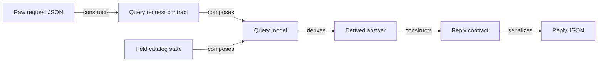
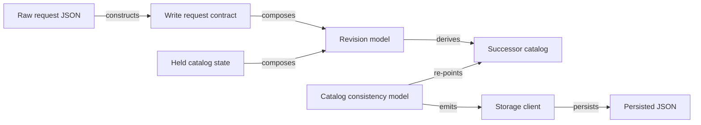
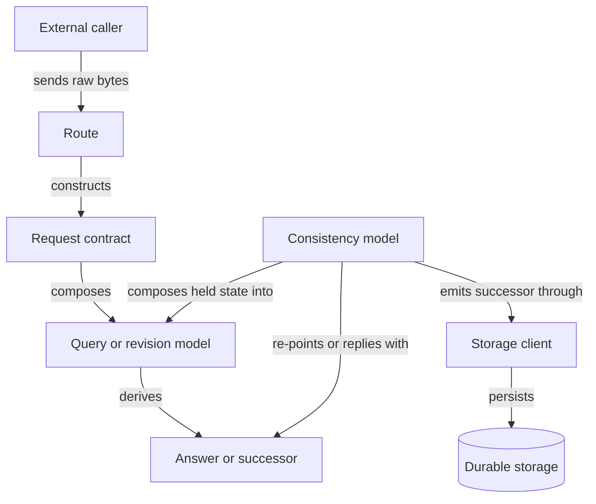

# Construct Graphs

## Purpose

A **Construct Graph** is a TCA architecture artifact that shows how declared facts come into existence.

It is not a deployment diagram, component diagram, sequence diagram, workflow diagram, or dataflow diagram. It does not show “what calls what” as its primary concern. It shows **what must already be constructed before another domain value can exist**, where derivations are owned, and where live context re-points to a newly constructed successor.

A Construct Graph exists to make the core TCA claim visible:

> The program does not process data through steps. It constructs declared facts in dependency order. A value that fails construction does not exist as a domain value.

Use a Construct Graph when the architectural question is not “where does this live?” but “how does this fact become real?”

## Relationship to Other Diagrams

A Construct Graph does not replace C4, sequence diagrams, deployment diagrams, or flowcharts.

Use each diagram for the job it is built to carry:

| Diagram type           | Use it to show                                                              | Do not use it to show                         |
| ---------------------- | --------------------------------------------------------------------------- | --------------------------------------------- |
| C4 Context / Container | system boundary, deployment shape, external callers, major runtime surfaces | construction-as-proof                         |
| Sequence diagram       | temporal message order between participants                                 | domain fact ownership                         |
| Flowchart              | control flow and branching                                                  | TCA construction doctrine                     |
| Entity / class diagram | static shape and association                                                | runtime construction order                    |
| Construct Graph        | construction dependency, derivation ownership, live re-pointing             | deployment, orchestration, agent choreography |

A TCA system usually needs at least two views:

1. **C4 Container View** — where the system lives, what calls it, what surfaces it exposes.
2. **Construct Graph** — how declared values are constructed, derived, admitted, re-pointed, emitted, or serialized.

The C4 view carries topology. The Construct Graph carries doctrine.

## Definition

A **Construct Graph** is a typed dependency graph over TCA constructs.

Its nodes are declared facts, construct owners, or live boundary nodes.

Its edges are construction relations.

A Construct Graph is valid only if every node and edge belongs to the allowed grammar below. Vague procedural arrows are forbidden.

## Core Principle

Every edge must answer one of these questions:

* What constructs this value?
* What declared values compose this model?
* What model owns this derivation?
* What successor value is produced?
* Where does live state re-point?
* Where does a constructed fact cross a boundary?

If an arrow answers only “what happens next,” the diagram is not yet a Construct Graph. It is a flowchart.

## Node Kinds

### Frozen fact nodes

Frozen fact nodes represent constructed values. They do not mutate.

| Node kind          | Meaning                                                                                |
| ------------------ | -------------------------------------------------------------------------------------- |
| `semantic scalar`  | A named frozen scalar carrying one primitive or closed value space                     |
| `value object`     | A frozen composition of semantic scalars or other declared values                      |
| `concept model`    | A frozen domain fact or domain thing                                                   |
| `collection`       | A named frozen sequence with domain meaning                                            |
| `keyed collection` | A named frozen namespace backed by `RootModel[dict[Key, Value]]`                       |
| `union`            | A closed set of frozen variants over one domain axis                                   |
| `ordered union`    | A left-to-right construction surface for foreign or uncertain input                    |
| `foreign model`    | A frozen model of another system’s shape                                               |
| `contract model`   | A frozen API request or reply model in this program’s vocabulary                       |
| `query model`      | A frozen model holding input plus queried value, deriving an answer                    |
| `revision model`   | A frozen model holding current state plus a requested change, deriving successor state |
| `derived answer`   | A constructed reply fact produced by a query model                                     |
| `successor state`  | A constructed next version of a catalog or held state                                  |

### Live boundary nodes

Live boundary nodes mark the few places where TCA admits time, clients, or external effects.

| Node kind           | Meaning                                                                    |
| ------------------- | -------------------------------------------------------------------------- |
| `consistency model` | The single live node for a context; holds clients and current proven state |
| `verb`              | State-transition method on a consistency model                             |
| `route`             | Transport ingress/egress; constructs contracts and serializes replies      |
| `binding`           | Connects constructed clients and opening state to a consistency model      |
| `client`            | Live external edge, such as storage, SDK, or service client                |

## Edge Kinds

A Construct Graph uses only construction-bearing edges.

| Edge kind    | Meaning                                                                         |
| ------------ | ------------------------------------------------------------------------------- |
| `constructs` | A declared value comes into existence from raw input or lower constructed facts |
| `composes`   | A larger declared value is composed from already-constructed values             |
| `derives`    | A pure fact is produced from the owning model’s proven fields                   |
| `queries`    | A query model composes an input and a queried value to derive an answer         |
| `revises`    | A revision model composes held state and requested change to derive a successor |
| `re-points`  | A consistency model replaces a held field with a constructed successor          |
| `emits`      | A live boundary sends a constructed fact to a client                            |
| `persists`   | A storage client writes a constructed fact to durable storage                   |
| `serializes` | A constructed reply crosses the transport boundary                              |
| `loads`      | A binding or composition root constructs opening state from durable storage     |

## Forbidden Edges

A Construct Graph must not use vague procedural edge labels.

Forbidden labels include:

* handles
* processes
* manages
* orchestrates
* coordinates
* updates
* mutates
* validates
* maps
* transforms
* enriches
* normalizes
* sends data to
* talks to
* uses

These words hide the construction relation. They belong to procedural architecture, not TCA architecture.

When one of these labels feels necessary, replace it with the real construction relation. For example:

| Procedural phrase         | Construct Graph replacement                                                  |
| ------------------------- | ---------------------------------------------------------------------------- |
| “route handles request”   | raw JSON constructs request contract; route dispatches constructed contract  |
| “service updates catalog” | revision derives successor catalog; verb re-points held state                |
| “mapper transforms input” | foreign model constructs from foreign shape; contract model constructs reply |
| “validator checks data”   | construction succeeds or the value does not exist                            |
| “manager persists state”  | consistency model emits constructed successor through storage client         |

## State Boundary Rule

A Construct Graph must distinguish frozen facts from live boundaries.

Frozen nodes can construct, compose, and derive.

Live nodes can re-point, emit, persist, or serialize.

This distinction is mandatory. TCA’s architecture depends on not confusing these two worlds.

A frozen catalog does not update itself.
A revision model does not mutate state.
A consistency model does not compute hidden domain facts.
A route does not own domain logic.
A client does not decide.

## Canonical Shape: Catalog Read

A catalog read constructs a query answer. It is not a retrieval method.

The route constructs a request contract from raw JSON. The query model composes the caller’s input with held catalog state. The answer is derived from the query model. The reply contract is constructed and serialized.



Read path invariant:

> A read is not a verb. It is a query model composed over held state whose answer is derived.

## Canonical Shape: Catalog Write

A catalog write constructs a successor. It is not an update.

The route constructs a write contract from raw JSON. The revision model composes the requested change with held state. The revision derives a successor catalog. The consistency-model verb re-points the held state to that successor and emits the constructed successor through the storage client.



Write path invariant:

> A write composes a revision, derives a successor, re-points live state, and emits the constructed successor. Nothing mutates in place.

## Canonical Shape: A Context Behind a Transport Surface

The most common deployed shape is a live context behind a transport surface. A surface (HTTP, MCP, a message queue) routes request contracts into a consistency-model context that holds its clients and current state as proven values. Reads compose a query model over that held state and derive an answer; writes compose a revision model and derive a successor the context re-points to and emits.

The context contains no agents and no orchestration. Callers are external. The context owns constructed state and named verbs; the transport owns only construction in and serialization out.



This view is deliberately narrower than C4. It does not show every caller or deployed component. It shows the construction truth inside one live context.

## How an Architect Should Use a Construct Graph

Use a Construct Graph when designing or reviewing a TCA context.

The architect should use it to answer:

1. What facts exist?
2. Which facts are frozen?
3. Which facts are live?
4. What constructs each fact?
5. Which model owns each derivation?
6. Where is successor state derived?
7. Where does live state re-point?
8. Where does transport enter and leave?
9. Where does a client or external effect occur?
10. Which procedural terms are still hiding in the design?

A good Construct Graph should make illegal architecture visible.

If the diagram needs a “manager,” the design is probably hiding a consistency model, binding, route, or derivation.

If the diagram needs “update,” it probably needs a revision model and successor.

If the diagram needs “validate,” it probably needs construction.

If the diagram needs “mapper,” it probably needs a foreign model, contract model, or derivation.

If the diagram needs “processor,” it probably has not named the domain fact being constructed.

## Review Checklist

A Construct Graph is acceptable when all of the following are true:

* Every box is a declared TCA construct, live boundary, or external substrate.
* Every arrow is an allowed construction relation.
* No arrow is labeled with a vague procedural verb.
* Frozen facts and live boundaries are visually distinguishable.
* Every derived fact has an owning model.
* Every state change is shown as successor construction plus re-pointing.
* Every transport boundary constructs or serializes a contract.
* Every persistence boundary emits or persists a constructed fact.
* No agent owns domain facts inside the diagram.
* No catalog is treated as a passive bag of JSON.
* No read is modeled as a verb.
* No write is modeled as mutation.

## Minimal Notation

A Construct Graph can be drawn in Mermaid using plain `flowchart`.

Recommended direction:

* `LR` for a single construction path.
* `TB` for a context-level view.
* Use subgraphs only when separating frozen construction from live boundary.
* Prefer short labels.
* Put doctrine in the document text, not in giant node labels.

Recommended node labels:

```text
Raw JSON
Request Contract
Held Catalog State
Query Model
Revision Model
Derived Answer
Successor Catalog
Consistency Model
Storage Client
Reply JSON
```

Recommended edge labels:

```text
constructs
composes
derives
revises
admits
re-points
emits
persists
serializes
loads
```

## Anti-Patterns

### The procedural flowchart

```text
Request -> Handler -> Processor -> Manager -> Database
```

This is not a Construct Graph. It names stages of activity, not facts coming into existence.

### The CRUD catalog

```text
Tool -> Catalog -> JSON
```

This hides the live context, the contract, the revision model, and the successor.

### The fake derivation

```text
Service -> computes -> result
```

A derivation must be owned by a declared model and return a declared type. If the owner is not named, the diagram is not TCA-complete.

### The hidden mutation

```text
Catalog -> updates -> Catalog
```

A TCA write must show the revision and the successor. The live model re-points to the successor. The catalog does not update itself.

## Naming Guidance

Prefer names that describe the domain fact or construct role:

* `ProductIntentRevision`
* `OntologyGraphRevision`
* `MissingGapQuery`
* `NodeQuery`
* `CatalogConvergence`
* `GraphIntegrity`
* `SuccessorCatalog`
* `CatalogContext`

Avoid names that describe activity without fact ownership:

* `CatalogManager`
* `CatalogProcessor`
* `RequestHandler`
* `StateUpdater`
* `DataMapper`
* `ValidationService`

## Status

Construct Graph is a TCA architecture artifact.

It is not a universal software diagram. It exists because TCA requires a view that ordinary architecture diagrams do not provide: a view where construction order, derivation ownership, and live re-pointing are first-class.

Use C4 to show where the machine lives.

Use Construct Graphs to show why the machine is correct.
