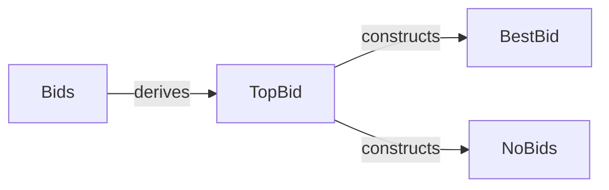

# Construct Graphs

## Purpose

A Construct Graph is a TCA architecture artifact that shows how declared facts come into existence. It is not a deployment diagram, component diagram, sequence diagram, workflow diagram, or dataflow diagram. It does not show what calls what. It shows what must already be constructed before another domain value can exist, which model owns each derivation, which fact authorizes each effect, and where a capability is executed at the edge.

A Construct Graph makes the core claim visible: the program does not process data through steps. It constructs declared facts in dependency order, and a value that fails construction does not exist as a domain value.

## Relationship to Other Diagrams

| Diagram type | Use it to show | Do not use it to show |
|---|---|---|
| C4 Context / Container | system boundary, deployment shape, external callers, runtime surfaces | construction-as-proof |
| Sequence diagram | temporal message order between participants | domain fact ownership |
| Flowchart | control flow and branching | TCA construction doctrine |
| Entity / class diagram | static shape and association | runtime construction order |
| Construct Graph | construction dependency, derivation ownership, effect authorization and execution | deployment, orchestration, agent choreography |

The C4 view carries topology. The Construct Graph carries doctrine.

## Node Kinds

Every node is a declared form, the state-transition shape, the composition-root site, or an imported capability.

| Node kind | Meaning |
|---|---|
| `semantic scalar` | One atomic meaning over a primitive or closed value space |
| `value object` | A frozen identityless product |
| `concept model` | A frozen domain thing, durable fact, or refinement |
| `successor fact` | The state-transition shape: a concept model containing its prior |
| `union` | A closed sum on one semantic axis |
| `ordered union` | Attempt-order construction where the sole failure is the declared fallback |
| `collection` | A frozen typed sequence with meaning of its own |
| `transformation` | A pure implication, on its owner or as a model holding several inputs |
| `foreign model` | Another system's shape lifted whole |
| `contract model` | This program's published request or reply |
| `config` | The frozen settings model |
| `route` | One transport crossing, ingress or egress |
| `action` | An intended external effect as a value |
| `effect interpreter` | Execution of one action through one capability |
| `capability` | The imported client bound at the composition-root site |

## Edge Kinds

| Edge kind | Meaning |
|---|---|
| `constructs` | A declared value comes into existence from raw input or lower constructed facts |
| `composes` | A larger declared value is composed from already-constructed values |
| `derives` | A pure fact is produced from the owning model's proven fields |
| `authorizes` | A fact derives the action for an effect it authorizes |
| `executes` | An interpreter performs its action through its capability |
| `observes` | An interpreter constructs the outcome fact from the capability's reply |
| `projects` | An egress route constructs the outbound contract from the fact it holds |
| `serializes` | A contract crosses the transport boundary |

## Forbidden Edges

Vague procedural labels hide the construction relation: handles, processes, manages, orchestrates, coordinates, updates, mutates, validates, maps, transforms, enriches, normalizes, sends data to, talks to, uses. Each is replaced by the relation it hides:

| Procedural phrase | Construct Graph replacement |
|---|---|
| "route handles request" | raw JSON constructs the route; the route's field is the ingress fact |
| "service updates position" | fill and prior compose the successor position |
| "mapper transforms input" | foreign model constructs from the foreign shape; annotations construct the domain type |
| "validator checks data" | construction succeeds or the value does not exist |
| "manager persists state" | successor authorizes PersistPosition; interpreter executes it and observes PositionRecorded |

## Canonical Shape: Booking a Fill

The framework hands one raw message to the registered callback. The route constructs the fill. The read interpreter executes `ReadPosition` and observes the prior position. The successor composes prior and fill, derives its net quantity, and authorizes its persistence. The persist interpreter executes and observes `PositionRecorded`. The reply route projects `FillBooked` and serializes it.

```mermaid
flowchart LR
    raw[Raw message]
    route[FillRoute]
    read[ReadPosition]
    reader[ReadPositionInterpreter]
    prior[Prior PositionState]
    position[Position]
    persist[PersistPosition]
    writer[PersistPositionInterpreter]
    recorded[PositionRecorded]
    reply[FillReplyRoute]
    booked[FillBooked]
    json[Reply JSON]

    raw -->|constructs| route
    route -->|composes| read
    read -->|composes| reader
    reader -->|observes| prior
    prior -->|composes| position
    route -->|composes| position
    position -->|authorizes| persist
    persist -->|composes| writer
    writer -->|observes| recorded
    recorded -->|composes| reply
    reply -->|projects| booked
    booked -->|serializes| json
```

Invariant: nothing is re-pointed. The prior is read, the successor is constructed, the record is observed. No node holds current state.

## Canonical Shape: A Question Over a Collection

A question over a proven collection is a transformation whose answer is a constructed choice. `Bids` derives its `top`, which constructs `BestBid` or `NoBids` through the admitted ordered union. There is no query method and no branch.

```mermaid
flowchart LR
    bids[Bids]
    top[TopBid]
    best[BestBid]
    none[NoBids]

    bids -->|derives| top
    top -->|constructs| best
    top -->|constructs| none
```

## Reviewing a Construct Graph

The architect uses the graph to answer:

1. What facts exist, and which thing in the world is each one?
2. What constructs each fact?
3. Which model owns each derivation?
4. Which fact authorizes each effect, and which interpreter executes it?
5. Where does transport enter and leave?
6. Which procedural terms are still hiding in the design?

A Construct Graph is acceptable when every box is a declared form, shape, site, or capability; every arrow is an allowed relation; every derived fact has an owning model; every effect has an authorizing fact and one interpreter; every transport boundary constructs or projects a contract; no node holds current state; and no read is drawn as a method.

If the diagram needs a "manager", the design is hiding a successor fact, an action, or an interpreter. If it needs "update", it needs a successor. If it needs "validate", it needs construction. If it needs "mapper", it needs a foreign model or a contract model. If it needs "processor", it has not named the fact being constructed.

## Notation

Plain Mermaid `flowchart`, `LR` for one construction path and `TB` for a context view. Short labels; doctrine in the document text, not in node labels.

## Status

Construct Graph is a TCA architecture artifact. It exists because TCA requires a view ordinary architecture diagrams do not provide: construction order, derivation ownership, and effect authorization as first-class. Use C4 to show where the machine lives. Use Construct Graphs to show why the machine is correct.
